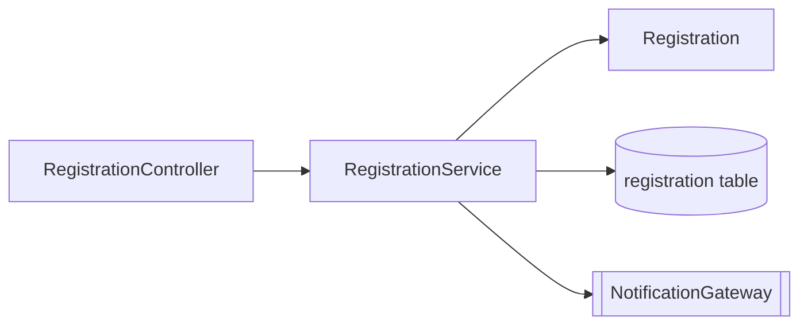

# /codemap

## Objective

Produce a **service-level code map** that complements `plan.md`: while `plan.md`
answers "why," the code map answers "where" and "what touches what." Quality bar:
a newcomer can locate any component, its direct dependencies, its REQ-ID coverage,
and its legacy lineage in under ten minutes, without reading the source tree.

## When to Invoke

After the team has created a service under `backend/`, `frontend/`, or `infra/`
in Stage 3 and there is enough structure to map. Re-run it after any addition,
rename, or deletion in the service.

## Preconditions

- The service folder exists (the team created it — there is no inherited prototype)
- `specs/<NNN>-<feature>/spec.md` exists and its REQ-IDs are known
- The layering rules in [`../instructions/modular-monolith.instructions.md`](../instructions/modular-monolith.instructions.md) are the reference for direction-of-dependency smells

## Inputs the Team Must Provide

- The service to map
- The root path the team created (for example, `backend/src/main/java/<pkg>/<service>/`)
- The linked specification folder (`specs/<NNN>-<feature>/spec.md`)
- Whether to include or exclude `test/` paths
- A previous code map for this service, if one exists

Ask the user for anything that is missing.

## What I Will Do

- List the main packages and types, grouping Java by `controller`, `service`, `domain`, `repository`, `infrastructure`, and `config`, and TypeScript by `app/`, `components/`, `lib/`, and `server/`
- Capture each component's role in one line, using only the responsibility confirmed in the code
- Map direct inbound and outbound dependencies (transitive analysis stays in `plan.md`), marking shared types and ports that are stable contracts
- Cross-reference `@implements REQ-NNN` annotations (flagging any component with no REQ-ID) and note which Natural program the team confirmed a component replaces (legacy lineage)
- Expose architecture smells against the modular-monolith layering rules
- Render both a Mermaid diagram and a grep-friendly table
- Delegate business-capability grouping to [`../skills/capability-map/SKILL.md`](../skills/capability-map/SKILL.md) when bounded-context boundaries are unclear

## What I Will NOT Do

- Auto-generate the map from imports — imports misrepresent intent, so the map stays curated
- Assert what any Natural program or DDM field contains — legacy lineage records only what the team confirmed with evidence
- List transitive dependencies or every class — I map components, not lines
- Invent REQ-IDs, endpoints, or responsibilities that are not present in the code
- Decide bounded contexts or record architecture decisions — that is redirected to `/impl-plan` and the [`../skills/adr-draft/SKILL.md`](../skills/adr-draft/SKILL.md) skill

## Output Format

A Markdown document at `docs/codemap-<service>.md`. Example (illustrative — the
team fills it from its own code):

````markdown
# Code map — registration

> Last reviewed: 2026-05-04 — owner: @sam — service-level map.

## 1. Component diagram



## 2. Components

| Type | FQN | Role | REQ-IDs | Inbound | Outbound |
|------|-----|------|---------|---------|----------|
| Controller | app.registration.RegistrationController | Accepts registration requests | REQ-014 | (HTTP) | RegistrationService |
| Service | app.registration.RegistrationService | Applies registration rules | REQ-014, REQ-015 | RegistrationController | RegistrationRepository, NotificationGateway |

## 3. API, state, and legacy lineage

- **API**: `POST /api/v1/registrations` — tested by `RegistrationControllerTest`
- **State**: table `registration` (`V3__registration.sql`), linked to REQ-015
- **Lineage**: `RegistrationService` replaces `<program>.NSP` — evidence: `business-rules-catalog.md` Rule #7 (team-confirmed)

## 4. Observed smells

- `RegistrationService` has 4 outbound dependencies (watch for growth toward a god class)
````

## Definition of Done

- [ ] The Mermaid diagram renders and reflects the real components
- [ ] The component table covers every component in the service folder
- [ ] The REQ-ID column is populated; components with no REQ-ID are explicitly noted
- [ ] Inbound and outbound dependencies are direct only
- [ ] Persistent state lists tables and queues linked to REQ-IDs
- [ ] Legacy lineage names only Natural programs the team confirmed with evidence
- [ ] Observed smells include near-god classes and missing REQ-ID annotations
- [ ] The document is linked from the team's `docs/CODEMAP.md`

## Prompt Body

You are the `@software-architect`. The team asked for a service-level code map a
newcomer can read in ten minutes.

**Step 1 — Scope the service.**
Confirm the service name, its root path, and whether `test/` is in scope. If any
is missing, ask before proceeding. Read a previous code map if one exists so the
update stays incremental.

**Step 2 — List components by layer.**
Group Java by `controller`, `service`, `domain`, `repository`, `infrastructure`,
and `config`; group TypeScript by `app/`, `components/`, `lib/`, and `server/`.
Record each component's one-line role using only what the code confirms.

**Step 3 — Map direct dependencies.**
For each component, record who calls it (inbound) and what it calls (outbound).
Stop at direct edges. Identify shared interfaces in `domain/`, ports in
`application/`, and gateways in `infrastructure/`, marking stable contracts.

**Step 4 — Cross-reference REQ-IDs.**
For each public method or component, find its `@implements REQ-NNN` annotation.
List any component with no requirement as "no REQ-ID found" for team review. Do
not invent a REQ-ID to close the gap.

**Step 5 — Record legacy lineage.**
Name only the Natural program under `01-archaeology/legacy-sifap/natural-programs/`
the team confirmed a component replaces, citing the evidence (for example, a rule
in `business-rules-catalog.md`). If unconfirmed, write "unmapped" — never guess.

**Step 6 — Expose smells.**
Against the modular-monolith layering rules, flag wrong-direction dependencies
(service calling controller, domain depending on infrastructure), god classes
(more than five outbound dependencies), and possible dead code (no inbound edges).

**Step 7 — Render and link.**
Write the Mermaid diagram and the tables to `docs/codemap-<service>.md`, then link
it from the team's `docs/CODEMAP.md`.

Keep the map curated, not generated. If a component's purpose is unclear from the
code, record the open question rather than inventing a responsibility.

## Invocation Example

```
/codemap service=registration path=backend/src/main/java/app/registration spec=specs/014-registration/spec.md
```
