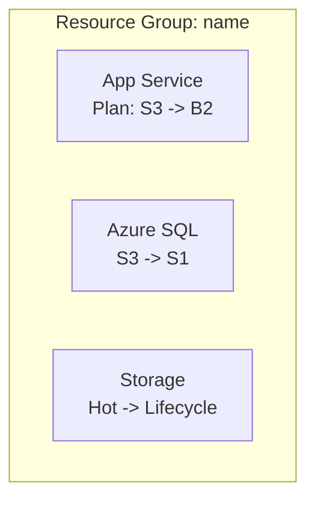

# Azure Cost Optimize

Analyze Infrastructure-as-Code files and deployed Azure resources to generate cost-optimization recommendations, then create individual GitHub issues for each opportunity plus one EPIC issue to coordinate implementation.

> [!NOTE]
> This skill depends on the **Azure MCP server** and the **GitHub MCP server** (or `gh`) being authenticated. This kit's IaC is **Terraform**, so `.tf` files are the primary source of truth; treat other repository files as non-authoritative. Prefer Azure MCP tools (`azmcp-*`) over direct Azure CLI when available.

## When to invoke

- "Reduce our Azure spend for the SIFAP workload."
- "Right-size these over-provisioned resources and track the work."
- "Open GitHub issues for our Azure cost-optimization opportunities."
- "Where are we wasting money in this resource group?"

## Prerequisites

- Azure MCP server configured and authenticated.
- GitHub MCP server (or `gh`) configured and authenticated.
- Target GitHub repository identified.
- Azure resources deployed (IaC files optional but helpful).

## Workflow steps

### Step 1: Get Azure best practices

Run `azmcp-bestpractices-get` to load current Azure optimization guidelines, and use them to inform the analysis and recommendations. Reference the relevant best practice in each recommendation.

### Step 2: Discover Azure infrastructure

1. **Resource discovery**:
   - `azmcp-subscription-list` to find subscriptions.
   - `azmcp-group-list --subscription <id>` to find resource groups.
   - `az resource list --subscription <id> --resource-group <name>` for a full inventory.
   - Prefer MCP tools per resource type, with CLI fallback: `azmcp-cosmos-account-list`, `azmcp-storage-account-list`, `azmcp-monitor-workspace-list`, `azmcp-keyvault-key-list`; and `az webapp list`, `az appservice plan list`, `az functionapp list`, `az sql server list`, `az redis list` where no MCP tool exists.
2. **IaC detection**:
   - Scan for IaC files: `**/*.tf` (primary for this kit), plus `**/*.bicep`, `**/main.json`, `**/*template*.json`.
   - Parse resource definitions and compare against discovered resources.
   - Use only IaC files as a source of truth — no other repository files.
   - If no IaC files are found, stop and report that to the user.
3. **Configuration analysis**: extract current SKUs, tiers, and settings; map dependencies and utilization patterns.

### Step 3: Collect usage metrics and validate current costs

1. **Find monitoring sources**: `azmcp-monitor-workspace-list`, then `azmcp-monitor-table-list` to discover tables.
2. **Execute usage queries** with `azmcp-monitor-log-query` (predefined `recent`, `errors`) or custom KQL:

```kql
AppServiceAppLogs
| where TimeGenerated > ago(7d)
| summarize avg(CpuTime) by Resource, bin(TimeGenerated, 1h)
```

```kql
AzureDiagnostics
| where ResourceProvider == "MICROSOFT.DOCUMENTDB"
| where TimeGenerated > ago(7d)
| summarize avg(RequestCharge) by Resource
```

3. **Calculate baseline metrics**: CPU/memory averages, database throughput, storage access frequency, function execution rates.
4. **Validate current costs**: using the discovered SKUs/tiers, look up current Azure pricing (or use the `azure-pricing` skill) and document Resource → Current SKU → Estimated monthly cost before recommending changes.

### Step 4: Generate cost-optimization recommendations

1. **Apply optimization patterns**:

| Area | Pattern |
|---|---|
| Compute | Right-size App Service plans; move low-use Functions from Premium to Consumption; scale down oversized VMs |
| Databases | Cosmos DB provisioned to serverless for variable load; right-size RU/s; right-size SQL tiers by DTU |
| Storage | Lifecycle policies (Hot to Cool to Archive); consolidate redundant accounts; right-size tiers |
| Infrastructure | Remove unused resources; add autoscaling; schedule non-production shutdown |

2. **Calculate evidence-based savings**: current validated cost minus target cost, documenting the pricing source for both.
3. **Calculate a priority score** for each recommendation:

```text
Priority Score = (Value Score x Monthly Savings) / (Risk Score x Implementation Days)

High Priority:   Score > 20
Medium Priority: Score 5-20
Low Priority:    Score < 5
```

4. **Validate recommendations**: verify CLI commands, confirm savings math, and assess risks and prerequisites — every saving must have supporting evidence.

### Step 5: User confirmation

Present the summary and gate issue creation on explicit approval:

```text
Azure Cost Optimization Summary

Analysis Results:
- Total Resources Analyzed: X
- Current Monthly Cost: $X
- Potential Monthly Savings: $Y
- Optimization Opportunities: Z
- High Priority Items: N

Recommendations:
1. [Resource]: [Current SKU] -> [Target SKU] = $X/month - [Risk] | [Effort]
2. [Resource]: [Current] -> [Target] = $Y/month - [Risk] | [Effort]

This will create Z individual GitHub issues plus 1 EPIC issue.

Proceed with creating GitHub issues? (y/n)
```

> [!IMPORTANT]
> Only create GitHub issues after an explicit affirmative response. On a negative, ambiguous, or missing response, print the recommendations to the console and stop.

### Step 6: Create individual optimization issues

Create one GitHub issue per opportunity, labelled `cost-optimization` and `azure`, using the individual-issue template in [Output template](#output-template). Title format: `[COST-OPT] [Resource Type] - [Brief Description] - $X/month savings`.

### Step 7: Create the EPIC coordinating issue

Create one EPIC issue, labelled `cost-optimization`, `azure`, and `epic`, using the EPIC template in [Output template](#output-template). Verify any Mermaid diagram is syntactically valid and accessible (styling, colors). Title format: `[EPIC] Azure Cost Optimization Initiative - $X/month potential savings`.

## Error handling

| Situation | Action |
|---|---|
| Savings estimates lack evidence | Re-verify configurations and pricing sources before proceeding |
| Azure authentication failure | Provide manual Azure CLI setup steps |
| No resources found | Create an informational issue about resource deployment |
| GitHub creation failure | Output the formatted recommendations to the console |
| Insufficient usage data | Note the limitation and give configuration-based recommendations only |

## Output template

Individual optimization issue:

````markdown
## Cost Optimization: <Brief Title>

**Monthly Savings**: $X | **Risk Level**: <Low/Medium/High> | **Implementation Effort**: X days

### Description
<Clear explanation of the optimization and why it is needed>

### Implementation

IaC files detected: <Yes/No>

When IaC files are found, apply the Terraform change (for example, in `infra/app_service.tf` change `sku_name = "S3"` to `sku_name = "B2"`):

```bash
terraform -chdir=infra apply
```

When no IaC files are found, use the Azure CLI directly and warn that an authoritative IaC file may exist elsewhere:

```bash
az appservice plan update --name <plan> --sku B2
```

### Evidence
- Current configuration: <details>
- Usage pattern: <evidence from monitoring data>
- Cost impact: $X/month -> $Y/month
- Best-practice alignment: <reference>

### Validation Steps
- [ ] Test in a non-production environment
- [ ] Verify no performance degradation
- [ ] Confirm cost reduction in Azure Cost Management
- [ ] Update monitoring and alerts if needed

### Risks and Considerations
- <Risk and mitigation>

**Priority Score**: X | **Value**: X/10 | **Risk**: X/10
````

EPIC coordinating issue:

````markdown
## Azure Cost Optimization EPIC

**Total Potential Savings**: $X/month | **Implementation Timeline**: X weeks

### Executive Summary
- Resources Analyzed: X
- Optimization Opportunities: Y
- Total Monthly Savings Potential: $X
- High Priority Items: N

### Current Architecture Overview



### Implementation Tracking

High priority (implement first):
- [ ] #<issue>: <Title> - $X/month savings

Medium priority:
- [ ] #<issue>: <Title> - $X/month savings

Low priority:
- [ ] #<issue>: <Title> - $X/month savings

### Progress Tracking
- Completed: 0 of Y optimizations
- Savings Realized: $0 of $X/month

### Success Criteria
- [ ] All high-priority optimizations implemented
- [ ] Over 80% of estimated savings realized
- [ ] No performance degradation observed
- [ ] Cost monitoring dashboard updated
````

## Quality gate

- [ ] Every cost estimate is verified against actual resource configuration and Azure pricing.
- [ ] Recommendations are derived only from IaC source-of-truth files, or the run stops when none are found.
- [ ] Each recommendation carries evidence, a priority score, and specific executable commands.
- [ ] One trackable GitHub issue is created per opportunity, plus one coordinating EPIC.
- [ ] Issues are created only after explicit user confirmation.
- [ ] Any architecture diagram is valid Mermaid and represents the current state accurately.
