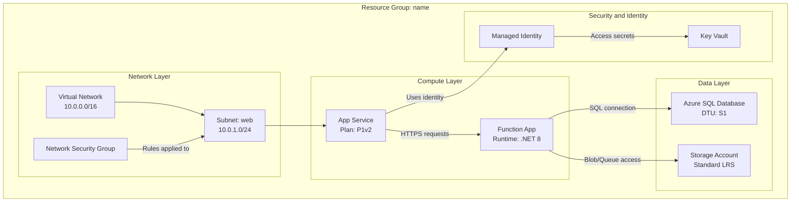
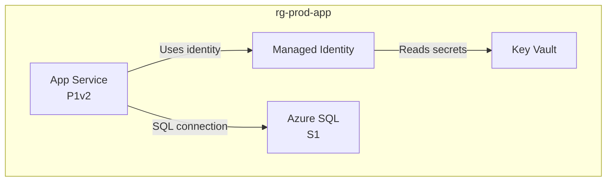

# Azure Resource Visualizer

Examine Azure resource groups, understand their structure and relationships, and generate comprehensive Mermaid diagrams that clearly illustrate the architecture. This is a **read-only** analysis skill; it never modifies or deletes Azure resources.

> [!NOTE]
> This skill depends on the **Azure MCP server** (or the `az` CLI) to list and describe resources. If neither is available, say so and request an exported resource inventory instead.

## When to invoke

- "Draw a Mermaid diagram of my production resource group."
- "Help me understand how the resources in rg-sifap connect."
- "Visualize the network and data flows in this subscription."
- "Document the architecture of our deployed Azure environment."

## Core responsibilities

1. **Resource group discovery**: list available resource groups when one is not specified.
2. **Deep resource analysis**: examine all resources, their configurations, and interdependencies.
3. **Relationship mapping**: identify and document every connection between resources.
4. **Diagram generation**: create a detailed, accurate Mermaid diagram.
5. **Documentation**: produce a clear Markdown file with the embedded diagram.

## Workflow

### Step 1: Resource group selection

If the user has not specified a resource group:

1. Query available resource groups (Azure MCP tools, or `az group list` as a fallback).
2. Present a numbered list of resource groups with their locations.
3. Ask the user to select one by number or name and wait for the response.

If a resource group is specified, validate that it exists and proceed.

### Step 2: Resource discovery and analysis

1. **Query all resources** in the resource group (Azure MCP tools, or `az resource list --resource-group <name> --output json`).
2. **Analyze each resource** and capture: name and type, SKU/tier, location, key configuration, network settings (VNets, subnets, private endpoints), identity and access (managed identity, RBAC), and dependencies.
3. **Map relationships**:
   - **Network**: VNet peering, subnet assignments, NSG rules, private endpoints.
   - **Data flow**: apps to databases, functions to storage, API Management to backends.
   - **Identity**: managed identities connecting to resources.
   - **Configuration**: app settings pointing to Key Vaults, connection strings.
   - **Dependencies**: parent-child and required-resource relationships.

### Step 3: Diagram construction

Create a detailed Mermaid diagram using `graph TB` (top-to-bottom) or `graph LR` (left-to-right):



Diagram requirements:

- **Group by layer or purpose**: Network, Compute, Data, Security, Monitoring.
- **Include details**: SKUs, tiers, and important settings in node labels (use `<br/>` for line breaks).
- **Label all connections**: describe what flows between resources (data, identity, network).
- **Use meaningful node IDs**: abbreviations that make sense (`APP`, `FUNC`, `SQL`, `KV`).
- **Connection types**: `-->` for data flow or dependencies, `-.->` for optional/conditional, `==>` for critical/primary paths.

Include the configuration detail that matters per resource type:

| Resource type | Include in the label |
|---|---|
| App Service | Plan tier (B1, S1, P1v2) |
| Functions | Runtime (.NET, Python, Node) |
| Databases | Tier (Basic, Standard, Premium) |
| Storage | Redundancy (LRS, GRS, ZRS) |
| VNets | Address space |
| Subnets | Address range |

### Step 4: File creation

Use [assets/template-architecture.md](./assets/template-architecture.md) as the template and create `<resource-group-name>-architecture.md` with: a header (resource group, subscription, region), a 2-3 paragraph summary, a resource inventory table, the Mermaid diagram, relationship details, and notes. Create it in the workspace root or a `docs/` folder if one exists.

## Operating guidelines

| Standard | Requirement |
|---|---|
| Accuracy | Verify every resource detail before including it |
| Completeness | Include every resource in the group; omit nothing |
| Clarity | Use clear labels and logical grouping |
| Detail | Include configuration details that affect architecture |
| Relationships | Show all significant connections, not just the obvious ones |

| Always | Never |
|---|---|
| List resource groups if none is specified | Skip resources because they seem unimportant |
| Wait for the user's selection before proceeding | Assume relationships without verification |
| Analyze every resource in the group | Produce incomplete or placeholder diagrams |
| Include configuration details in node labels | Omit details that affect the architecture |
| Group resources logically with subgraphs | Generate invalid Mermaid syntax |
| Keep the analysis read-only | Modify or delete Azure resources |

Edge cases:

- **No resources found**: inform the user and verify the resource group name.
- **Permission issues**: explain what is missing and suggest checking RBAC.
- **Complex architectures (50+ resources)**: consider multiple diagrams by layer.
- **Cross-resource-group dependencies**: note external dependencies in the diagram notes.

## Output template

The skill produces `<resource-group-name>-architecture.md`. Below its H1 title (`Azure Architecture: <resource group>`) it contains a header block, an inventory table, the diagram, and relationship notes:

````markdown
**Subscription**: sub-sifap-prod
**Region**: eastus
**Resource Count**: 4

## Resource Inventory

| Resource | Type | Tier/SKU | Location | Notes |
|---|---|---|---|---|
| app-prod-001 | App Service | P1v2 | eastus | Production web app |
| sql-prod-001 | Azure SQL | S1 | eastus | Primary database |
| kv-prod-001 | Key Vault | standard | eastus | Application secrets |

## Architecture Diagram



## Relationship Details

- App Service authenticates to Key Vault and SQL through a managed identity.
````

## Quality gate

- [ ] A valid resource group was identified and confirmed before analysis.
- [ ] Every resource in the group was discovered and analyzed.
- [ ] All significant relationships (network, data, identity, configuration) are mapped.
- [ ] The Mermaid diagram uses logical subgraphs and renders with valid syntax.
- [ ] A complete `<resource-group-name>-architecture.md` file was created from the template.
- [ ] The analysis remained read-only; no Azure resource was modified.

## License

Bundled material in this skill is provided under the [MIT License](LICENSE.txt).
