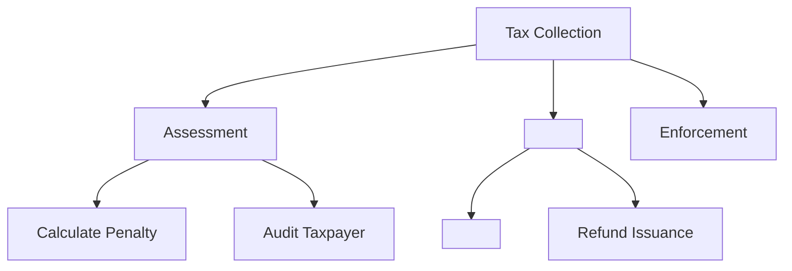

# Capability map

## When to invoke

- "Build a capability map for the domain identified by the team."
- "Where do two teams overlap in ownership?"
- "Which capabilities are core, which are commodity?"

## Concept

A **capability** describes *what* the business does, not *how* it does it. Capabilities remain stable for decades, while applications and processes change frequently.

## Structure (3 levels)

- **L1**: Top-level business area (for example, "Tax Collection" or "Customer Service").
- **L2**: Main subfunctions identified by the team.
- **L3**: Specific capabilities confirmed by evidence.

Rule of thumb: 8-12 L1 capabilities for a medium-sized enterprise.

## Steps

1. **Start with outcomes**, not the organizational chart. "What does this business do for its customers?"
2. **Decompose from the top down** to L3. Stop when a capability maps to one accountable owner.
3. **Tag each capability**:

- **Core**: differentiating, build internally.
- **Supporting**: necessary, buy or configure.
- **Commodity**: undifferentiated, outsource or use SaaS.

4. **Overlay systems**: identify which applications deliver each L3 capability. Look for:

- Duplication (two systems doing the same thing)
- Gaps (a capability without an owner)
- Monoliths (one system covering many L1 capabilities)

5. **Overlay investment**: compare where the money is going with where differentiation occurs.

## Mermaid example



## Output template

```markdown
## Capability Map - <Domain>

### L1: <Top area>
#### L2: <Sub-function>
- **<L3 capability>** [Core|Supporting|Commodity]
 - Owner: <team>
 - Systems: <app1>, <app2>
 - Maturity: 1-5
 - Investment: $$$
```

## Quality gate

- [ ] Every L3 capability has exactly one accountable owner.
- [ ] Every L3 capability is tagged Core, Supporting, or Commodity.
- [ ] Each L3 capability is overlaid with the systems that deliver it.
- [ ] Duplications, gaps, and monoliths are flagged for follow-up.
