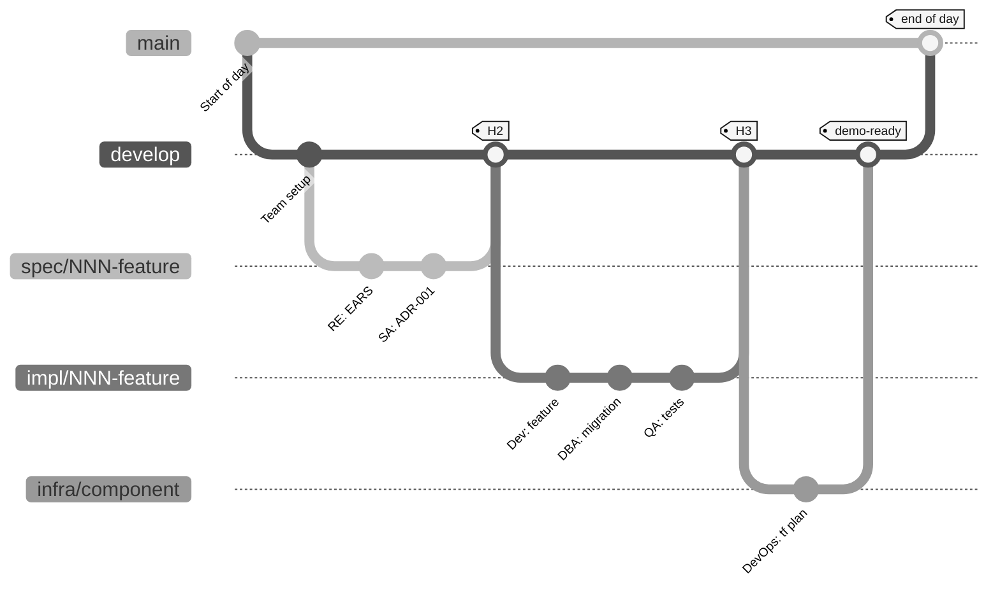

# Team Git workflow: each persona on its own branch

> **Track:** [Team kit](README.md) › **Git workflow**

**Complete Git guide for the workshop: branches, commits, Pull Requests, and handoffs between pairs.**

  

| Field | Value |
|---|---|
| **Target audience** | The whole team, especially anyone who has never used one branch per feature |
| **Prerequisites** | Git installed, repository cloned, `develop` created |
| **Estimated time** | 10 minutes of reading |
| **Expected result** | You know how to create a branch, commit, open a PR, and hand work off |

---

## Language branches and integration branches

The published kit keeps `main` as its English default branch and `develop` as its English integration branch.
The permanent `portugues-br` and `espanol` branches contain Brazilian Portuguese and Spanish documentation and Copilot instructions, not feature work.
Use the [language selector](README.md#repository-languages) to open either edition.

Feature branches follow the `develop` -> `main` workflow below. Merges into `main` require passing CI and at least one peer review.
For a shared correction, integrate the English change through `develop`, then port and translate the relevant change to `portugues-br` and `espanol`.
Keep language-specific corrections on their language branch. Never merge the entire Portuguese documentation tree into `main` or `develop`.

## What each concept means (quick reference)

| Git concept | Practical meaning |
|---|---|
| `main` | Stable, demo-ready version; protected from direct push |
| `develop` | Integrated version for the day; starting point for new branches |
| `spec/<NNN>-<feature>` | Branch where you work during Stage 2 |
| `git commit` | Saves a local version (only you can see it) |
| `git push` | Sends it to GitHub (teammates can see it) |
| **Pull Request (PR)** | Requests review before merging your branch into `develop` |
| `git merge` | Integrates your branch into `develop` after review approval |
| **CI green** | Continuous integration pipeline passed; required before merge |
| **CI red** | Something broke - fix it before merge |
| **Merge conflict** | Two branches changed the same section, and you need to resolve it manually |

---

## The day's branch tree (visual)



---

## How to name your branch (persona convention)

| Who | Stage | Branch prefix | Origin | Example |
|---|---|---|---|---|
| RE + SA | 2 - Spec | `spec/<NNN>-<feature>` | `develop` | `spec/001-calculo-beneficio` |
| Dev + DBA | 3 - Impl | `impl/<NNN>-<feature>` | `develop` | `impl/001-calculo-beneficio` |
| QA | 3 - Tests | `impl/<NNN>-<feature>` | `develop` | `impl/001-calculo-beneficio` |
| DevOps | 4 - Infra | `infra/<componente>` | `develop` | `infra/azure-postgres` |
| Tech Writer | Cross-cutting | `docs/<topico>` | `develop` | `docs/glossario-sifap` |
| Agent mode | 4 - Delegation | `agent/<issue-NN>` | `develop` | `agent/issue-42` |

> [!IMPORTANT]
> The flow is `spec/<NNN>-<feature>` -> `develop` -> `main`. There is no `stage` branch.
> Every `impl/<NNN>-<feature>` branch starts from `develop`, never from `spec/*`.

> [!TIP]
> Commit message pattern: always cite the REQ-ID or Issue. Example: `feat: Implements REQ-XXX: describes the behavior`.

---

## Merge sequence: step by step

### Step 1: Create your branch from `develop`

- [ ] **Update `develop` and create the branch.**

```bash
git checkout develop && git pull        # updates the starting point
git checkout -b spec/001-feature-name  # creates your branch
```

### Step 2: Work (commit after each meaningful step)

- [ ] **Commit often - one idea per commit.**

```bash
git add .
git commit -m "Implements REQ-XXX: behavior"
git push -u origin spec/001-feature-name   # sends it to GitHub
```

> [!NOTE]
> Make small, frequent commits. Each commit = one idea. Do not pile five hours of work into a single commit.

### Step 3: Open a PR to `develop`

- [ ] **Open the Pull Request.**

```bash
gh pr create \
  --base develop \
  --head spec/001-feature-name \
  --title "spec/001: feature name" \
  --body "Implements REQ-XXX.

  ## What changes
  - EARS spec
  - Team-recorded decisions

  ## Source legacy
  - <legacy-file:lines>

  ## How to test
  - See the 'acceptance' section for each REQ-ID"
```

### Step 4: CI runs

- [ ] **Check the CI status on the PR.**
- CI green -> move to Step 5
- CI red -> read the error, fix it, make a new commit, and wait for CI to run again

### Step 5: The downstream receiving pair reviews

| You are in pair... | Who reviews your PR |
|---|---|
| 1 (Vision) | Pair 2 (Architecture) |
| 2 (Architecture) | Pair 3 (Implementation) |
| 3 (Implementation) | Pair 4 (Quality) |
| 4 (Quality) | Pair 5 (Operations) |
| 5 (Operations) | Pair 1 (Vision) |

### Step 6: Merge into `develop`

- [ ] **Merge after approval.** Click **"Merge pull request"** on GitHub (or use `gh pr merge`). Use **squash merge** to keep history clean.

### Step 7: At the end of the stage, the lead opens the `develop -> main` PR

- [ ] **The lead opens the integration PR.** Only the team lead performs this merge. It is the control point for each stage.

---

## The five golden rules

> [!IMPORTANT]
> **No exceptions.**
>
> 1. Never commit directly to `main`. Always go through a PR.
> 2. Never use `git push --force` on a shared branch. Use `--force-with-lease` only if absolutely necessary.
> 3. Every commit message cites the REQ-ID: `feat: Implements REQ-XXX: ...`.
> 4. CI red does not merge. Fix it first.
> 5. A PR without a description does not merge. Describe *what* changed and *why*.

---

## Commit message templates

Copy and paste, then adapt the REQ-ID and description.

```bash
# New feature implementing a REQ-ID
git commit -m "feat: Implements REQ-XXX (behavior)"

# Bug fix
git commit -m "fix: corrects behavior for REQ-XXX"

# Documentation
git commit -m "docs: records ADR-XXXX"

# Tests
git commit -m "test: covers acceptance criteria for REQ-XXX"

# Database migration
git commit -m "db: V2__feature_change (REQ-XXX)"

# Refactor with no behavior change
git commit -m "refactor: extracts component (keeps REQ-XXX)"

# Configuration / build / CI
git commit -m "chore: adds spec-quality.yml workflow"

# Agent mode (Stage 4)
git commit -m "agent: PR #42 - implements REQ-XXX"
```

**Message rules:**

- First line has at most 72 characters
- Start with a type: `feat:` `fix:` `docs:` `test:` `db:` `refactor:` `chore:` `agent:`
- Cite the REQ-ID when it applies
- Do not use `wip` or `temp` - use only commits with a clear meaning

---

## Mini tutorial for anyone who has never used Git

If today is your first contact with Git, do this five-minute warm-up:

- [ ] **Check repository status.**

```bash
# 1. See where you are
git status

# 2. See which branch you are on
git branch --show-current

# 3. Update develop
git checkout develop
git pull

# 4. Create your first branch
git checkout -b docs/meu-primeiro-commit

# 5. Edit a file
echo "# Hello world" >> docs/playground.md

# 6. See what changed
git diff
git status

# 7. Save it (commit)
git add docs/playground.md
git commit -m "docs: first commit"

# 8. Push it to GitHub
git push -u origin docs/meu-primeiro-commit

# 9. Open a PR
gh pr create --base develop --title "docs: first commit" --body "Warm-up"
```

If you complete all nine steps, **you know enough Git for the workshop**. Everything else is a variation on the same commands.

---

## Emergency commands

| Situation | Command |
|---|---|
| I committed to `develop` without creating a branch | `git reset --soft HEAD~1 && git stash && git checkout -b nova-branch && git stash pop` |
| Rebase got stuck | `git rebase --abort` (no problem, start clean again) |
| Merge conflict | Open the file, find `<<<<<<<`, choose the right lines, `git add <file> && git rebase --continue` |
| I deleted a branch by mistake | `git reflog` -> find the SHA -> `git checkout -b name SHA` |
| I want to discard uncommitted changes | `git restore .` |
| Everything went wrong and I want to go back 30 minutes | **Stop. Call the Technical Lead. Do not try it alone.** |

---

## Definition of done: you are comfortable with Git when...

- [ ] You know how to create a branch from `develop`
- [ ] You make small commits (one idea per commit) with the REQ-ID in the message
- [ ] You know how to `git push` your branch
- [ ] You know how to open a PR with `gh pr create` or on the GitHub website
- [ ] You know how to read CI status on the PR (green/red)
- [ ] You know who reviews your PR (the downstream pair)
- [ ] You know to ask for help before trying `--force`

---

## Go deeper

- [`00-SETUP.md`](00-SETUP.md) - steps 3 and 4 about branch protection
- [`00-TEAM-FLOW.md`](00-TEAM-FLOW.md) - the three handoffs (H1, H2, H3) between pairs
- [`docs/persona-agent-matrix.md`](docs/persona-agent-matrix.md) - who depends on whom
- [GitHub: gh CLI docs](https://cli.github.com/manual/)

---

### Continue reading

| Previous | Next |
|---|---|
| [Team flow](00-TEAM-FLOW.md)<br/><sub>Day schedule, handoffs, 20-minute rule, definition of done.</sub> | [Stage 1: archaeology](01-archaeology/GUIDE.md)<br/><sub>Read the legacy system and catalog business rules.</sub> |

<sub>[Back to the kit index](README.md)</sub>
