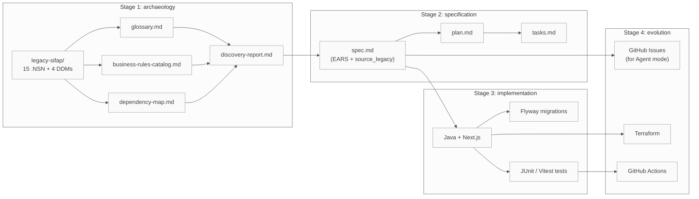

# Sitemap: visual map of the kit

> **Track:** [Team kit](README.md) › **Sitemap**

**Complete navigation map for the kit:** where each file lives, how artifacts flow between stages, and which path each persona should follow in the Payment Inspection and Administration System (SIFAP) workshop.

 

---

## Overview: flow of the four stages

```mermaid
%%{init: {'theme':'neutral','themeVariables':{'fontFamily':'ui-sans-serif, system-ui, sans-serif','primaryColor':'#F5F5F5','primaryTextColor':'#171717','primaryBorderColor':'#171717','lineColor':'#525252','secondaryColor':'#FFFFFF','tertiaryColor':'#FAFAFA','background':'#FFFFFF'}}}%%
flowchart LR
    classDef step fill:#F5F5F5,stroke:#171717,color:#171717
    classDef handoff fill:#FFFFFF,stroke:#525252,color:#171717
    classDef result fill:#FFFFFF,stroke:#171717,color:#171717,stroke-width:2px

    E1["Stage 1<br/>Archaeology<br/>@archaeologist"]:::step
    H1["Handoff H1<br/>5 min"]:::handoff
    E2["Stage 2<br/>Specification<br/>@architect"]:::step
    H2["Handoff H2<br/>5 min"]:::handoff
    E3["Stage 3<br/>Implementation<br/>@builder"]:::step
    H3["Handoff H3<br/>5 min"]:::handoff
    E4["Stage 4<br/>Evolution<br/>@evolution"]:::step
    R["SIFAP 2.0<br/>running"]:::result

    E1 --> H1 --> E2 --> H2 --> E3 --> H3 --> E4 --> R
```

---

## Ordered repository structure

| Prefix | Folder / file | When to read it |
|---|---|---|
| **00** | [`README.md`](README.md) | First arrival - workshop overview |
| **00** | [`00-START-HERE.md`](00-START-HERE.md) | 15-minute walkthrough for anyone |
| **00** | [`00-SETUP.md`](00-SETUP.md) | Set up laptop and Copilot |
| **00** | [`00-TEAM-FLOW.md`](00-TEAM-FLOW.md) | Canonical schedule for the day |
| **00** | [`00-SITEMAP.md`](00-SITEMAP.md) | This file |
| **00** | [`00-GIT-WORKFLOW.md`](00-GIT-WORKFLOW.md) | Branches, PRs, merges |
| **01** | [`01-archaeology/`](01-archaeology/) | Stage 1 - read legacy SIFAP |
| **01** | [`01-archaeology/legacy-sifap/`](01-archaeology/legacy-sifap/) | 15 `.NSN` programs + four DDMs + historical docs |
| **02** | [`02-modern-spec/`](02-modern-spec/) | Stage 2 - EARS, ADRs, C4 |
| **03** | [`03-implementation/`](03-implementation/) | Stage 3 - Java + Next.js + tests |
| **04** | [`04-evolution/`](04-evolution/) | Stage 4 - Agent mode + Terraform |
| **05** | [`05-personas/`](05-personas/) | 10 personas (pick two - your pair) |
| **06** | [`06-stage-agents/`](06-stage-agents/) | Four Copilot agents (one per stage) |
| **07** | [`07-concepts/`](07-concepts/) | Core concepts: EARS, ADR, SDD, agents |
| **09** | [`09-cheat-sheets/`](09-cheat-sheets/) | Quick reference cards (one page each) |
| `docs/` | [`docs/`](docs/) | FAQ, troubleshooting, runbook, STATUS |
| `assets/` | [`assets/`](assets/) | SVGs and diagrams |
| `specs/` | [`specs/`](specs/) | Spec-Kit artifacts created by the team during the workshop |

---

## Copilot primitives in `.github/`

The kit ships four kinds of Copilot primitive. Each has a human-readable index; Copilot itself loads the underlying files automatically.

| Primitive | Index | What it holds |
|---|---|---|
| Instructions | [`.github/instructions/README.md`](.github/instructions/README.md) | Path-scoped `*.instructions.md` rules applied by `applyTo` glob |
| Prompts | [`.github/prompts/README.md`](.github/prompts/README.md) | Slash-command `*.prompt.md` tasks for the stage and persona agents |
| Skills | [`.github/skills/README.md`](.github/skills/README.md) | 43 auto-loaded `SKILL.md` capabilities matched by `description` |
| Agents | [`.github/agents/README.md`](.github/agents/README.md) | 17 `@`-invocable agents in two layers (stage + persona) |

---

## Contents of `07-concepts/`

| File | Contents |
|---|---|
| [`00-README.md`](07-concepts/00-README.md) | Index and overview of the folder |
| [`01-spec-driven-development.md`](07-concepts/01-spec-driven-development.md) | What Spec-Driven Development is and why the workshop uses it |
| [`02-agents-and-personas.md`](07-concepts/02-agents-and-personas.md) | Difference between stage agents and individual personas |
| [`03-visual-glossary.md`](07-concepts/03-visual-glossary.md) | Glossary with 30+ domain terms |
| [`04-3-copilot-modes.md`](07-concepts/04-3-copilot-modes.md) | Ask, Plan, and Agent - when to use each mode |
| [`05-ears-notation.md`](07-concepts/05-ears-notation.md) | EARS notation for unambiguous requirements |
| [`06-architecture-decision-records.md`](07-concepts/06-architecture-decision-records.md) | ADRs - what they are, how to write them, template |

---

## Artifact flow between stages

> How to read it: arrow = dependency. The destination artifact depends on the source artifact to be created with quality.

---

## Recommended path by persona

| You are... | Start with... | Then... | Then... |
|---|---|---|---|
| **Anyone, first time here** | [00-START-HERE.md](00-START-HERE.md) | [00-TEAM-FLOW.md](00-TEAM-FLOW.md) | your `PERSONA.md` |
| **Team lead** | [00-SETUP.md](00-SETUP.md) | [00-TEAM-FLOW.md](00-TEAM-FLOW.md) | [docs/CHECKLIST-LIDER.md](docs/CHECKLIST-LIDER.md) |
| **PO or RE (Pair 1)** | [05-personas/01-product-owner/PERSONA.md](05-personas/01-product-owner/PERSONA.md) | [01-archaeology/GUIDE.md](01-archaeology/GUIDE.md) | [02-modern-spec/GUIDE.md](02-modern-spec/GUIDE.md) |
| **EA or SA (Pair 2)** | [05-personas/03-enterprise-architect/PERSONA.md](05-personas/03-enterprise-architect/PERSONA.md) | [02-modern-spec/ADR-TEMPLATE.md](02-modern-spec/ADR-TEMPLATE.md) | [02-modern-spec/GUIDE.md](02-modern-spec/GUIDE.md) |
| **TL or Dev (Pair 3)** | [05-personas/06-developer/PERSONA.md](05-personas/06-developer/PERSONA.md) | [03-implementation/GUIDE.md](03-implementation/GUIDE.md) | - |
| **DBA or QA (Pair 4)** | [05-personas/07-dba/PERSONA.md](05-personas/07-dba/PERSONA.md) | [03-implementation/GUIDE.md](03-implementation/GUIDE.md) | - |
| **DevOps or TW (Pair 5)** | [05-personas/09-devops-engineer/PERSONA.md](05-personas/09-devops-engineer/PERSONA.md) | [04-evolution/GUIDE.md](04-evolution/GUIDE.md) | - |
| **You do not read Natural** | [01-archaeology/legacy-sifap/HOW-TO-READ-NATURAL.md](01-archaeology/legacy-sifap/HOW-TO-READ-NATURAL.md) | [01-archaeology/GUIDE.md](01-archaeology/GUIDE.md) | (your persona) |
| **You found a strange term** | [07-concepts/03-visual-glossary.md](07-concepts/03-visual-glossary.md) | (go back to where you came from) | - |

---

## If you got lost

1. **Do you not know which stage you are in?** Check [`00-TEAM-FLOW.md`](00-TEAM-FLOW.md) - the schedule section.
2. **Do you not know what your persona does?** Open the persona overview: [`05-personas/OVERVIEW.md`](05-personas/OVERVIEW.md).
3. **Do you not know what to deliver?** Open the current stage `GUIDE.md` and find the "How to know you are done (DoD)" section.
4. **Did you find a strange term?** Check [`07-concepts/03-visual-glossary.md`](07-concepts/03-visual-glossary.md).
5. **Did something go wrong technically?** Check [`docs/troubleshooting.md`](docs/troubleshooting.md).
6. **Blocked for more than 20 minutes?** Signal the facilitator. The rule is described in [`00-TEAM-FLOW.md`](00-TEAM-FLOW.md).

---

### Continue reading

| Previous | Next |
|---|---|
| [Team kit](README.md) Workshop overview and main entry point. | [00 - Start here](00-START-HERE.md) 15-minute opening walkthrough for anyone. |

[Back to the kit index](README.md)
