# SIFAP — Payment Inspection and Administration System

> **Path:** [Team Kit](../../README.md) › [Stage 1](../README.md) › **SIFAP Legacy**

**Technical documentation for the legacy SIFAP system.** It contains the history, architecture, program inventory, and reading guidance for Stage 1 Archaeology.

| Field | Value |
|---|---|
| **Audience** | All pairs during Stage 1 |
| **Prerequisites** | None—the entry point to the legacy system |
| **Stage** | Stage 1—Archaeology |
| **Expected outcome** | Understand the system context before opening the `.NSN` files |

  

> **Classification:** Internal Document—the organization / SUPDE / DESIF
> **System version:** 4.1.2
> **Environment:** Production—the organization Mainframe / Brasília Regional Office
> **Language:** Natural 6.3.12 | Database: Adabas 7.4.3

---

## 1. System Purpose

**SIFAP—the Payment Inspection and Administration System** manages, controls, and inspects social-benefit payments administered by the Federal Government nationwide.

The system supports the following operational needs:

- **Registration and maintenance** of federal social-program beneficiaries;
- **Calculation and processing** of the monthly payroll;
- **Inspection and auditing** of completed payments, including cross-checking registration data;
- **Generation of remittance files** for paying financial institutions;
- **Financial reconciliation** with SIAFI (the Federal Government's Integrated Financial Administration System);
- **Issuance of management and operational reports** for governing agencies.

### 1.1. Agencies Served

| Acronym   | Agency                                             | Responsibility                                |
| --------- | -------------------------------------------------- | ---------------------------------------------- |
| MDAS      | Ministry of Development and Social Assistance      | Management of income-transfer programs         |
| SENARC    | National Secretariat of Citizenship Income         | Benefit regulation and monitoring              |
| CGPB      | General Coordination for Benefit Processing        | Direct operation of monthly processing         |
| DEFIS     | Inspection Department                              | Audit and control of improper payments         |
| CGTI/MDAS | General Coordination for Information Technology    | Technical interface with the organization      |

SIFAP is a foundational system for the benefit-payment cycle and is classified as a **mission-critical system** by the MDAS IT Governance Committee.

---

## 2. History

### 2.1. Timeline

| Year     | Event                                          | Notes                                                                                                                                                                                                               |
| -------- | ---------------------------------------------- | ------------------------------------------------------------------------------------------------------------------------------------------------------------------------------------------------------------------- |
| **1997** | Initial SIFAP development                      | Natural 4.2 / Adabas 6.1. Team of eight SUPDE/DESIF analysts coordinated by Roberto Meirelles. Original deadline: 14 months. Delivered in 18 months.                                                               |
| **1998** | Production launch (v1.0)                      | CADBENEF, CADPROG, and CONSBENF modules. Initial registration of 1.2 million beneficiaries migrated from the previous system (SIPAG/DOS).                                                                         |
| **1999** | First major update (v2.0)                     | Batch processing implemented for monthly payment cycles. BATCHPGT and BATCHREL programs. Integration with Banco do Brasil for CNAB 240 file remittance.                                                           |
| **2002** | SIAFI integration (v2.5)                      | Financial reconciliation module. BATCHCON program for automatic reconciliation of bank orders. Approved by STN.                                                                                                  |
| **2005** | Technology migration (v3.0)                   | Upgrade to Natural 6.3 / Adabas 7.4. New audit module (RELAUDIT). Creation of the AUDIT DDM. Partial refactoring of calculation programs.                                                                      |
| **2008** | Technical documentation effort               | Documentation project led by Fernanda Oliveira (business analyst). **Partially completed**—covers only registration modules. Calculation and batch modules remain without formal documentation.                    |
| **2012** | Attempt to document business rules            | CGTI/MDAS initiative. Discovery work stopped after three key analysts retired. Produced "RN-SIFAP-2012-parcial.doc" (47 pages, incomplete).                                                                        |
| **2015** | Last significant feature (v4.0)               | CALCDSCT module—calculation of legal deductions. Implemented by Marcos Antônio Ferreira, the last Natural programmer with comprehensive system knowledge.                                                         |
| **2018** | Last maintenance (v4.1.2)                     | Security fixes (Adabas patches). BATCHPGT timeout handling adjustment. Deduction-range tables updated. No new functionality added.                                                                                |

### 2.2. Continuity Note

Since 2018, SIFAP has operated in **minimal maintenance mode**. No new features are planned. The support contract covers only emergency fixes and parameter-table adjustments.

---

## 3. Original Team

The team that developed and maintained SIFAP over the years is listed below. **Most members have retired or transferred to other units**, creating a significant risk of knowledge loss.

| Name                          | Role                                      | Period    | Current Status                                                                                                                                |
| ----------------------------- | ----------------------------------------- | --------- | ---------------------------------------------------------------------------------------------------------------------------------------------- |
| Roberto Carlos Meirelles      | Senior Systems Analyst (Coordinator)      | 1997–2010 | Retired (2010). Responsible for the original architecture and data-modeling decisions.                                                        |
| Fernanda Cristina de Oliveira | Business Analyst                          | 1997–2012 | Retired (2012). The only person who partially documented the business rules. Author of "RN-SIFAP-2012-parcial.doc".                            |
| Marcos Antônio Ferreira       | Senior Natural Programmer                 | 2001–2017 | Transferred to SUPDE/DESIN (2017). Last developer with comprehensive code knowledge. Implemented CALCDSCT and the 2005 refactorings.            |
| Cláudia Regina dos Santos     | Adabas DBA                                | 1997–2008 | Retired (2008). Designed the four DDMs and the backup/recovery routines.                                                                       |
| José Aparecido Lima           | Natural Programmer                        | 1997–2005 | Retired (2005). Responsible for the original batch modules.                                                                                    |
| Patrícia Helena Moura         | Systems Analyst                           | 2003–2016 | Transferred to SUPDE/DEGED (2016). Worked on the SIAFI integration and audit module.                                                          |
| Antônio Carlos Ribeiro        | Support / Operations Analyst              | 1999–2014 | Retired (2014). Held operational knowledge of batch scheduling and monitoring.                                                                |
| Luciana Barbosa de Freitas    | Junior Natural Programmer                 | 2010–2018 | Active in SUPDE/DESIF. The only remaining team member with some system knowledge, although limited to query modules.                           |

> **WARNING:** Detailed technical knowledge of the calculation rules (CALCBENF, CALCCORR, CALCDSCT) exists **exclusively in the source code**. There is no current functional documentation for these modules.

---

## 4. System Architecture

### 4.1. Overview

```mermaid
%%{init: {'theme':'neutral','themeVariables':{'fontFamily':'ui-sans-serif, system-ui, sans-serif','primaryColor':'#F5F5F5','primaryTextColor':'#171717','primaryBorderColor':'#171717','lineColor':'#525252','secondaryColor':'#FFFFFF','tertiaryColor':'#FAFAFA','background':'#FFFFFF'}}}%%
flowchart TB
    classDef step fill:#F5F5F5,stroke:#171717,color:#171717
    classDef alt fill:#FFFFFF,stroke:#525252,color:#171717
    classDef muted fill:#FAFAFA,stroke:#A3A3A3,color:#404040
    classDef result fill:#FFFFFF,stroke:#171717,color:#171717,stroke-width:2px

    subgraph MF["Mainframe — the organization"]
        NAT["Natural 6.3<br/>Online Programs (8)<br/>Batch Programs (7)"]:::step
        ADA["Adabas 7.4<br/>DDMs (4)<br/>FDTs"]:::step
        JES["Job Scheduler<br/>JES2/CICS<br/>Jobs Batch (7)"]:::muted
        NAT <-->|"read/write"| ADA
        NAT -->|"scheduling"| JES
        NAT --> T3270["3270 Screens<br/>(Com*plete)"]:::alt
        JES --> ARQ["Files<br/>CNAB / TXT"]:::alt
    end

    T3270 --> OP["Terminals<br/>3270 Emulation<br/>(CGPB Operators)"]:::muted
    ARQ --> EXT["External Systems<br/>SIAFI (STN)<br/>Receita Federal (CPF)<br/>Banco do Brasil (CNAB)<br/>CAIXA (return)"]:::result
```



### 4.2. Natural Program Layer

SIFAP Natural programs are organized in the Natural **SIFAP** library and divided into:

- **Online programs (interactive):** Run through 3270 terminal emulation using Natural maps (screens). Accessed by CGPB and DEFIS operators.
- **Batch programs:** Run on a JES2 scheduler, monthly (payroll) or on demand (reports and reconciliation).
- **Subprograms and copycode:** Shared utility routines (CPF validation, check-digit calculation, and value formatting).

### 4.3. Database—Adabas DDMs

SIFAP uses four DDMs (Data Definition Modules) in Adabas:

| DDM                 | Adabas File (FNR)    | Description                                                                                                 | Records (2018 est.)             |
| ------------------- | -------------------- | ----------------------------------------------------------------------------------------------------------- | ------------------------------ |
| **BENEFICIARY**    | FNR 150              | Beneficiary records—personal data, documentation, address, registration status, status history             | ~4,200,000                     |
| **SOCIAL-PROGRAM** | FNR 151              | Social-program records—eligibility rules, value ranges, calculation parameters                             | ~45 (parameter records)        |
| **PAYMENT**       | FNR 152              | Payment records—gross amount, deductions, net amount, credit date, paying bank, status                      | ~180,000,000                   |
| **AUDIT**       | FNR 153              | Audit log—user actions, registration changes, inspection events                                             | ~25,000,000                    |

**Modeling notes:**

- Field names follow the **abbreviated 1990s convention** (for example, `BN-NM-BENEF` = beneficiary name, `PG-VL-BRUTO` = gross payment amount, `AU-DT-OCORR` = audit-event date).
- Value fields use packed decimal format.
- Adabas does not manage referential integrity—all validation occurs in Natural programs.
- The SOCIAL-PROGRAM DDM contains MU (multiple value) and PE (periodic group) fields to store value ranges by fiscal year.

### 4.4. Batch Processing

The monthly batch-processing cycle follows this sequence:

1. **BATCHPGT**—Main payroll processing (runs on the first business day of the month; four-hour batch window)
2. **BATCHCON**—Reconciliation with Banco do Brasil / CAIXA return files
3. **BATCHREL**—Generation of post-processing management reports

**Batch window:** 22:00 to 06:00 (Brasília time)
**Average BATCHPGT runtime:** 3h20min (reference: February 2018 cycle)
**Monthly volume processed:** ~3,800,000 payments

### 4.5. Operator Interface

SIFAP screens use **Natural maps** in 3270 format (24 rows × 80 columns), accessed through a terminal emulator. Navigation uses transaction codes (for example, `SF01` = beneficiary registration, `SF05` = query, `SF10` = audit report).

---

## 5. Program Inventory

### 5.1. Registration Module

| Program   | Description                                             | Author         | Year | Last Change    | Status     |
| --------- | ------------------------------------------------------- | -------------- | ---- | -------------- | -------- |
| CADBENEF  | Beneficiary registration—creation, update, deletion     | R. Meirelles   | 1997 | 2015           | Production |
| CADDEPEN | Dependents linked to the primary beneficiary            | J. A. Lima     | 1998 | 2008           | Production |
| CADPROG   | Social-program registration—parameters and value ranges | F. C. Oliveira | 1997 | 2015           | Production |

### 5.2. Calculation Module

| Program | Description                                            | Author         | Year | Last Change    | Status     |
| -------- | ---------------------------------------------------- | -------------- | ---- | -------------- | -------- |
| CALCBENF | Benefit amount calculation—rules by program/range     | R. Meirelles   | 1998 | 2015           | Production |
| CALCCORR | Corrections and adjustments—annual indexes           | M. A. Ferreira | 2005 | 2015           | Production |
| CALCDSCT | Legal deduction calculation (payroll deductions, IR) | M. A. Ferreira | 2015 | 2018           | Production |

### 5.3. Validation Module

| Program | Description                                                | Author         | Year | Last Change    | Status     |
| -------- | -------------------------------------------------------- | -------------- | ---- | -------------- | -------- |
| VALBENEF | Beneficiary registration-data validation (CPF, NIS)       | R. Meirelles   | 1997 | 2005           | Production |
| VALELEG  | Eligibility validation against program rules              | F. C. Oliveira | 1999 | 2012           | Production |
| VALDOCS  | Supporting-document validation—checklist by type           | P. H. Moura    | 2003 | 2008           | Production |

### 5.4. Batch Module

| Program | Description                                             | Author      | Year | Last Change    | Status     |
| -------- | ----------------------------------------------------- | ----------- | ---- | -------------- | -------- |
| BATCHPGT | Monthly payroll processing—credit generation          | J. A. Lima  | 1999 | 2018           | Production |
| BATCHREL | Batch report generation (totals, summaries)           | J. A. Lima  | 1999 | 2008           | Production |
| BATCHCON | Financial reconciliation—bank return vs. SIAFI        | P. H. Moura | 2002 | 2012           | Production |

### 5.5. Query and Reporting Module

| Program | Description                                           | Author         | Year | Last Change    | Status     |
| -------- | --------------------------------------------------- | -------------- | ---- | -------------- | -------- |
| CONSBENF | Beneficiary query—3270 screen with filters           | R. Meirelles   | 1997 | 2005           | Production |
| RELPGT   | Payment report—by period/program/UF                   | P. H. Moura    | 2003 | 2012           | Production |
| RELAUDIT | Audit report—events and discrepancies                | M. A. Ferreira | 2005 | 2015           | Production |

### 5.6. Subprograms and Copycode (Partially Documented)

| Component | Type        | Description                                        |
| ---------- | ----------- | ------------------------------------------------ |
| VALCPF     | Subprogram  | CPF validation (check digit)                       |
| VALNISN    | Subprogram  | NIS/NIT validation                                 |
| FMTVLR     | Copycode    | Monetary-value formatting                          |
| FMTDT      | Copycode    | Date formatting and validation                     |
| LOGAUDIT   | Subprogram  | Writes an audit record                             |
| CALCIDX    | Subprogram  | Applies a correction index (internal table)        |

> **Note:** Additional uncataloged subprograms may exist. The inventory above reflects the discovery work performed in 2008.

---

## 6. Data Volumes

### 6.1. Current Data Volume (Reference: March 2018)

| Metric                                        | Volume                 |
| --------------------------------------------- | ---------------------- |
| Registered beneficiaries (active + inactive)  | ~4,200,000 records     |
| Active beneficiaries                          | ~3,850,000 records     |
| Parameterized social programs                 | 45 programs            |
| Payment records (complete history)            | ~180,000,000 records   |
| Audit records                                 | ~25,000,000 records    |
| Payments processed per monthly cycle          | ~3,800,000             |
| Monthly CNAB remittance file                  | ~380 MB                |
| Total Adabas disk space (ASSO + DATA)         | ~120 GB                |

### 6.2. Processing Peaks

- **Monthly peak:** Payroll processing—the first business day of each month
- **Annual peak:** Benefit adjustment (January)—complete reprocessing with new indexes
- **Extraordinary peak:** Supplemental payments or 13th benefit (when authorized by decree)

### 6.3. Growth

The volume of records in the PAYMENT table grows by approximately **46 million records/year** (3.8M × 12 months + reversals and supplemental payments). No purge policy is implemented. The oldest records date from **1998**.

---

## 7. Operational Criticality

### 7.1. Classification

| Attribute                  | Value                                                               |
| -------------------------- | ------------------------------------------------------------------- |
| **Criticality level**      | **Level 1—Mission Critical**                                        |
| **Availability SLA**       | 99.5% (excluding the maintenance window)                            |
| **Maintenance window**     | Sundays, 02:00–06:00                                                |
| **Families affected**      | ~4,000,000 families nationwide                                     |
| **Contingency plan**       | Manual spreadsheet processing (last resort, never activated)       |

### 7.2. Impact of Unavailability

SIFAP unavailability directly causes:

- **Delayed benefit payments** to socially vulnerable families;
- **Inability to perform queries** across the service network (CRAS, MDAS offices);
- **Failure to meet legal deadlines** for account credits;
- **Institutional repercussions** with the Ministry and the press.

### 7.3. Significant Incident Log

| Date     | Incident                                                         | Impact                                     | Resolution                                                                                                              |
| -------- | ---------------------------------------------------------------- | ------------------------------------------ | ---------------------------------------------------------------------------------------------------------------------- |
| Mar/2016 | BATCHPGT timeout—cycle with unusual volume (4.1M payments)       | 18-hour payroll delay                      | Increased MAXTIME in JCL; optimized sequential reading on FNR 152. Permanent fix applied in v4.1.2 (2018).             |
| Jan/2014 | SIAFI reconciliation failure—total discrepancy                  | 3,200 duplicate payments detected          | Manual correction + BATCHCON adjustment to validate the total hash.                                                    |
| Sep/2009 | Partial Adabas index corruption (FNR 150)                       | System unavailable for 6 hours             | Recovery through ADASAV. Backup procedure reviewed by Cláudia Regina dos Santos.                                       |

---

## 8. Integrated Systems

| System                      | Agency/Entity                        | Integration Type           | Description                                                                                                                                      |
| --------------------------- | ------------------------------------ | -------------------------- | ---------------------------------------------------------------------------------------------------------------------------------------------- |
| **SIAFI**                   | National Treasury Secretariat (STN)  | Batch (TXT file)           | Sends bank orders and receives payment confirmations. Monthly reconciliation through BATCHCON.                                                |
| **CPF / Receita Federal**   | Receita Federal do Brasil            | Online (query)             | CPF validation during registration creation and update. Query through a Natural transaction with a 30-second timeout.                         |
| **Banco do Brasil**         | BB—Payment Hub                       | Batch (CNAB 240 file)      | Credit remittance for account payment. Return file with confirmations and rejections.                                                         |
| **CAIXA Econômica Federal** | CAIXA—Social Payments                | Batch (CNAB 240 file)      | Alternative payment channel for beneficiaries with CAIXA accounts. Integration added in 2004.                                                |
| **CadÚnico**                | MDAS / SENARC                        | Batch (positional file)    | Periodic receipt of registration updates from Cadastro Único. Processed through a specific job not cataloged in the main inventory.            |

> **Note:** The CadÚnico integration was implemented as an emergency measure in 2006 and **does not follow the architectural pattern** of the other modules. The responsible program is not included in the official inventory.

---

## 9. Important Notes

> **This document reflects the state of knowledge in March 2018. Much of the information below consists of recurring warnings from the support team.**

### 9.1. Partial and Outdated Documentation

- Functional documentation covers **only the registration modules** (2008 effort).
- "RN-SIFAP-2012-parcial.doc" contains business rules discovered in 2012 but is **incomplete** (47 pages out of an estimated 200+).
- No technical documentation exists for the calculation programs (CALCBENF, CALCCORR, CALCDSCT). The rules exist **exclusively in the source code**.
- Source-code comments are in Portuguese but are **sparse and frequently outdated**.

### 9.2. Business Rules in Code

- Several critical business rules were implemented directly in Natural programs **without corresponding documentation**.
- The CALCBENF program contains approximately **4,800 lines** of code, with conditional logic nested up to seven levels deep.
- Hardcoded constants represent calculation parameters whose meaning **is not evident** without knowledge of the regulatory context at the time.

### 9.3. Knowledge Loss

- Of the eight original team members, **only one remains** in DESIF (Luciana Barbosa de Freitas), with knowledge limited to query modules.
- Marcos Antônio Ferreira (transferred in 2017) is the last professional with comprehensive system knowledge but is no longer assigned to the project.
- **Recommendation recorded in 2016 (not implemented):** conduct knowledge-transfer sessions before the planned retirements.

### 9.4. Undocumented Interdependencies

- Some programs use shared **Global Data Areas (GDAs)** whose dependencies are not mapped.
- The LOGAUDIT subprogram is called by nearly every program, but its behavior varies according to undocumented parameters.
- Batch-job execution order is **critical** and is recorded only in production JCL and the team's operational memory.

### 9.5. Naming Conventions

Field names in DDMs follow the abbreviated convention typical of the 1990s:

| Prefix | Entity          | Examples                                 |
| ------- | --------------- | ---------------------------------------- |
| `BN-`   | Beneficiary     | `BN-NM-BENEF`, `BN-NR-CPF`, `BN-CD-SIT`  |
| `PS-`   | Social Program  | `PS-NM-PROG`, `PS-VL-MIN`, `PS-VL-MAX`   |
| `PG-`   | Payment         | `PG-VL-BRUTO`, `PG-VL-LIQ`, `PG-DT-CRED` |
| `AU-`   | Audit           | `AU-DT-OCORR`, `AU-CD-ACAO`, `AU-NR-USR` |

Field names are limited to **20 characters** and use standardized abbreviations: `NM` (name), `NR` (number), `CD` (code), `DT` (date), `VL` (value), `QT` (quantity), `SG` (acronym), `IN` (indicator).

---

## 10. Directory Structure for This Scenario

```
02-cenario-sifap-legado/
├── README.md ← this document
├── natural-programs/ ← Natural programs (.NSN) - source code
├── adabas-ddms/ ← DDMs (Data Definition Modules) - data definitions
├── legacy-docs/ ← Original partial documentation (2008/2012)
└── demo/ ← Interactive terminal demo (Stage 1)
```

---

## Related Documents

- [`01-archaeology/LEGACY-EXPLORATION-CHECKLIST.md`](../LEGACY-EXPLORATION-CHECKLIST.md)—mandatory gate before starting Stage 2.
- [`01-archaeology/GUIDE.md`](../GUIDE.md)—timed walkthrough for reading this legacy system.
- [`02-modern-spec/GUIDE.md`](../../02-modern-spec/GUIDE.md)—next step: modern specification (EARS) with `source_legacy:` pointing to files in this folder.

---

### Continue Reading

| Previous | Next |
|---|---|
| [Stage 1 GUIDE](../GUIDE.md)<br/><sub>Timed 90-minute walkthrough.</sub> | [How to Read Natural](HOW-TO-READ-NATURAL.md)<br/><sub>Syntax tutorial for non-developers.</sub> |

<sub>[Back to the kit index](../../README.md)</sub>
