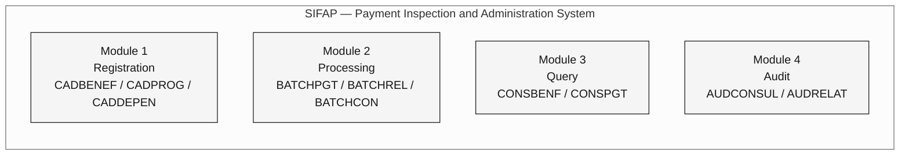
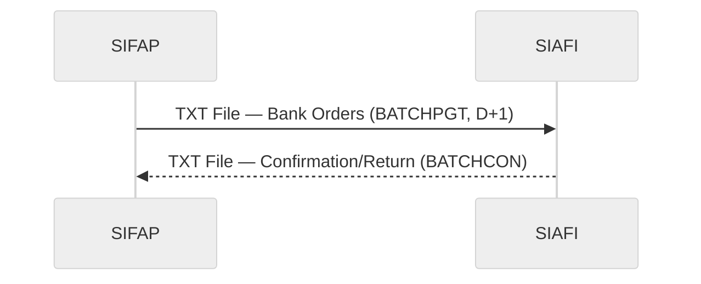
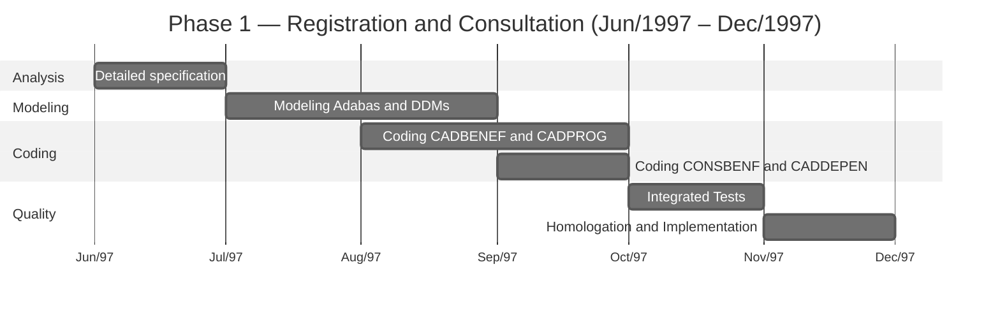
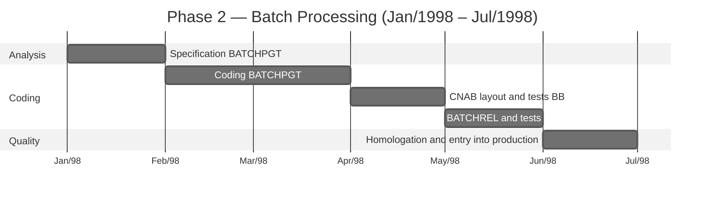

---

title: "Project SIFAP - Technical Architecture Document"
author: "Roberto Carlos Ferreira - Senior Systems Analyst"
date: "1997-05-20"
version: "1.0.0"
classification: "CONFIDENTIAL"
project: "SIFAP - Payment Inspection and Administration System"
sponsor: "SUPDE/DESIF - the organization"
client: "SAS/MPAS - Social Assistance Secretariat"
---

> [!NOTE]
> This is a historical document reconstituted for the purposes of the archaeology exercise of the SIFAP 2.0 workshop. The document simulates the original technical documentation from 1997 as it would have been produced by the SUPDE/DESIF team. The period language, the names of people and organizational units were intentionally preserved. **This document should not be used as a current system specification.** The gaps and inconsistencies noted in the comments are part of the exercise — they represent the real archaeology challenges that the team must investigate.

<!-- ====================================================================== -->
<!-- PROJECT SIFAP - TECHNICAL ARCHITECTURE DOCUMENT -->
<!-- Version 1.0.0 - May 1997 -->
<!-- the organization - the federal data processing organization -->
<!-- Development Superintendence - SUPDE -->
<!-- Fiscal Systems Development Division - DESIF -->
<!-- ====================================================================== -->

# PROJECT SIFAP - TECHNICAL ARCHITECTURE DOCUMENT

**PAYMENT INSPECTION AND ADMINISTRATION SYSTEM**

---

|                      |                                       |
| -------------------- | ------------------------------------- |
| **Document:** | ARQ-SIFAP-1997-v1.0 |
| **Classification:** | CONFIDENTIAL |
| **Issue date:** | 20/05/1997 |
| **Project:** | SIFAP - Initial Development |
| **Expected deadline:** | 14 months (Jun/1997 - Jul/1998) |
| **Team:** | 8 analysts/programmers SUPDE/DESIF |
| **Coordinator:** | Roberto Carlos Ferreira |
| **Management:** | Antônio Marcos Silva - SUPDE Manager |

---

> **Presentation**
>
> This document describes the technical architecture proposed for the SIFAP - Payment Inspection and Administration System, to be developed by the organization's SUPDE/DESIF team, in response to the demand of the Social Assistance Secretariat of the Ministry of Social Security and Assistance (SAS/MPAS).
>
> The SIFAP will replace the current SIPAG/DOS system, developed in Clipper and operated on microcomputers in the regional offices. The migration to a mainframe platform aims to ensure data centralization, information integrity and adequate processing capacity for the expected growth of federal social programs.
>
> This document was prepared during the design phase, before coding began, and represents the **planned architectural vision** for the system.

---

## 1. Introduction

### 1.1. Context

The Federal Government, through the Ministry of Social Security and Assistance, administers several income transfer programs for families in situations of social vulnerability. Currently, control of these payments is carried out by the SIPAG/DOS system, an application developed in Clipper 5.2 that operates in a decentralized manner in the organization's regions.

The decentralization of the SIPAG/DOS causes the following problems:

- Impossibility of national consolidation in a timely manner;
- Risk of duplication of registrations between regions;
- Difficulty in auditing and monitoring;
- Limitation of processing volume (maximum of 200,000 records per region);
- Lack of integration with federal financial systems (SIAFI).

### 1.2. Purpose of the SIFAP

Develop a centralized system, on a mainframe platform, capable of:

- Manage unified national register of beneficiaries;
- Process monthly payroll with a projected volume of up to 5 million beneficiaries;
- Integrate with SIAFI for automated financial reconciliation;
- Provide audit and inspection mechanisms;
- Ensure availability and security compatible with the criticality of the operation.

### 1.3. Chosen Technological Platform

After evaluating the alternatives available in the organization's infrastructure, the following platform was chosen:

| Component | Product | Version | Justification |
| ---------- | ---------- | ------- | ----------------------------------------------------------------------------------------------------------------------------- |
| Language | Natural | 4.2.6 | Standard the organization for mainframe development. Higher productivity than COBOL for registration/query applications. |
| DBMS | Adabas | 6.1.4 | Inverted DBMS, high performance for multiple descriptor queries. Standard the organization.                            |
| TP Monitor | Com\*plete | 6.1.2 | Teleprocessing monitor for 3270 screens. Integrated with Natural.                                                           |
| Scheduler | JES2 | MVS/ESA | Standard subsystem for batch processing.                                                                                   |
| S.O. | MVS/ESA | 5.2.2 | Mainframe operating system for the organization - Brasília Regional.                                                        |

> **Note:** The choice of Natural/Adabas follows the SUPDE technical guideline (NT-SUPDE-003/1996), which establishes this platform as the standard for new medium/large registration and processing systems.

---

## 2. Modular Architecture

### 2.1. Expected Modules

The SIFAP will be organized into **4 functional modules**:



#### Module 1 - REGISTRATION

Responsible for maintaining registration data on beneficiaries, dependents and social programs.

| Planned Program | Description | Priority |
| ----------------- | --------------------------------------------------------- | ---------- |
| CADBENEF | Beneficiary registration - inclusion, alteration, exclusion | Phase 1 |
| CADPROG | Registration of social programs and parameterization | Phase 1 |
| CADDEPEN | Registration of dependents of the beneficiary | Phase 1 |

#### Module 2 - PROCESSING

Responsible for batch processing of payroll and generation of files for integration.

| Planned Program | Description | Priority |
| ----------------- | ------------------------------------------- | ---------- |
| BATCHPGT | Monthly Payroll Processing | Phase 2 |
| BATCHREL | Generation of batch reports (totalizers) | Phase 2 |
| BATCHCON | Financial reconciliation with SIAFI | Phase 3 |

#### Module 3 - CONSULTATION

Responsible for online consultations regarding registration and payments.

| Planned Program | Description | Priority |
| ----------------- | ------------------------------------------------- | ---------- |
| CONSBENF | Querying beneficiaries using multiple criteria | Phase 1 |
| CONSPGT | Consultation of payments by beneficiary/period | Phase 2 |

#### Module 4 - AUDIT

Responsible for recording and consulting audit trails and inspection incidents.

| Planned Program | Description | Priority |
| ----------------- | --------------------------------------------------- | ---------- |
| AUDCONSUL | Audit trail query by period/user | Phase 3 |
| AUDRELAT | Audit Occurrence Report | Phase 3 |

> **Total expected:** 11 programs, distributed across 3 development phases.

---

## 3. Data Model

### 3.1. Planned DDMs

The SIFAP will use **3 DDMs** (Data Definition Modules) in the Adabas:

```mermaid
%%{init: {'theme':'neutral','themeVariables':{'fontFamily':'ui-sans-serif, system-ui, sans-serif','primaryColor':'#F5F5F5','primaryTextColor':'#171717','primaryBorderColor':'#171717','lineColor':'#525252','secondaryColor':'#FFFFFF','tertiaryColor':'#FAFAFA','background':'#FFFFFF'}}}%%
erDiagram
    BENEFICIARY {
        string BN-NR-CPF PK
        string BN-NM-BENEF DE
        date BN-DT-NASC
        string BN-CD-SIT DE
        string BN-CD-PROG DE
        string BN-NR-NIS
        string BN-CD-REGIAO DE
        int BN-QT-DEPEND
        decimal BN-VL-RENDA-PC
        date BN-DT-ULT-ATUAL
        string BN-CD-BANCO
        string BN-CD-AGENCIA
        string BN-NR-CONTA
    }

    SOCIAL-PROGRAM {
        string PS-CD-PROG PK
        string PS-NM-PROG
        decimal PS-VL-MIN
        decimal PS-VL-MAX
        string PS-IN-ATIVO
        date PS-DT-INICIO
        date PS-DT-FIM
        string PS-VL-FAIXAS PE
    }

    PAYMENT {
        int PG-NR-SEQ PK
        string PG-NR-CPF DE
        string PG-CD-PROG DE
        string PG-AA-MM-REF DE
        decimal PG-VL-BRUTO
        decimal PG-VL-LIQ
        date PG-DT-CRED
        string PG-CD-STATUS DE
        string PG-CD-BANCO
    }

    BENEFICIARY ||--o{ PAYMENT : "generates"
    BENEFICIARY }o--|| SOCIAL-PROGRAM : "linked to"
```

Caption: PK = primary key (super descriptor) · DE = descriptor (index Adabas) · PE = periodic group · MU = multivalued field

<!-- The DDM AUDIT (FNR 153) was not included in the original project.
 It was added in 2005, during the migration to Natural 6.3/Adabas 7.4,
 upon request from the Inspection Department (DEFIS).
 The audit programs (AUDCONSUL, AUDRELAT) provided for in this
 document were replaced by the program RELAUDIT in 2005. -->

### 3.2. Field Naming Convention

We will adopt the following convention for Adabas field names, in accordance with the SUPDE naming standard (NT-SUPDE-007/1995):

| Prefix | Entity |
| ------- | --------------- |
| `BN-` | Beneficiary |
| `PS-` | Social Program |
| `PG-` | Payment |

Suffixes indicate the data type:

| Suffix | Meaning | Example |
| ------ | ---------------------- | -------------- |
| `NM-` | Name/description | `BN-NM-BENEF` |
| `NR-` | Number/numeric code | `BN-NR-CPF` |
| `CD-` | Code/classification | `BN-CD-SIT` |
| `DT-` | Date | `PG-DT-CRED` |
| `VL-` | Monetary value | `PG-VL-BRUTO` |
| `QT-` | Quantity | `BN-QT-DEPEND` |
| `IN-` | Indicator (Y/N) | `PS-IN-ATIVO` |
| `SG-` | Acronym | (reserved) |

> **Restriction:** Field names limited to 20 characters, as per Natural 4.2 limitation.

### 3.3. Initial Volume Estimation

| DDM | Initial volume | Estimated growth/year | 5 year projection |
| --------------- | -------------------------- | ------------------------ | --------------- |
| BENEFICIARY | 1,200,000 (SIPAG migration) | 300,000 | 2,700,000 |
| SOCIAL-PROGRAM | 15 | 5 | 40 |
| PAYMENT | 0 (new) | 14,400,000 (1.2M x 12) | 72,000,000 |

> **Note on the projection:** We consider linear growth of 25% per year in the registration of beneficiaries, compatible with the expected expansion of the Federal Government's social programs. The projection may vary depending on new public policies.

---

## 4. Batch Processing Flow

### 4.1. Planned Flow Diagram

```mermaid
%%{init: {'theme':'neutral','themeVariables':{'fontFamily':'ui-sans-serif, system-ui, sans-serif','primaryColor':'#F5F5F5','primaryTextColor':'#171717','primaryBorderColor':'#171717','lineColor':'#525252','secondaryColor':'#FFFFFF','tertiaryColor':'#FAFAFA','background':'#FFFFFF'}}}%%
TB flowchart
    classDef step fill:#F5F5F5,stroke:#171717,color:#171717
    classDef artifact fill:#FAFAFA,stroke:#A3A3A3,color:#404040
    classDef result fill:#FFFFFF,stroke:#171717,color:#171717,stroke-width:2px

    START["Start of cycle<br/>(1st working day)"]:::step
    PGT["BATCHPGT<br/>1. Read BENEFICIARY<br/>2. Calculate value<br/>3. Write PAYMENT<br/>4. Generate CNAB"]:::step
    CNAB["File CNAB<br/>(shipment BB)<br/>Shipping D+1"]:::artifact
    REL["BATCHREL<br/>Reports<br/>totalizers"]:::step
    RET["Return BB<br/>(D+3)"]:::artifact
    CON["BATCHCON<br/>Conciliation<br/>CNAB x SIAFI"]:::result

    START --> PGT
    PGT --> CNAB
    PGT --> REL
    CNAB --> RET
    RET --> CON
```

### 4.2. Expected Batch Scheduling

| Job | Frequency | Opening hours | Window | Dependency |
| --------- | -------------- | ------- | ------ | ---------------------- |
| SIFAP-PGT | Monthly (1st DU) | 22:00 | 4h | None |
| SIFAP-REL | Monthly (2nd DU) | 06:00 | 1h | SIFAP-PGT (RC=0) |
| SIFAP-CON | Monthly (5th DU) | 22:00 | 2h | Receipt return BB |

<!-- In practice, the scheduling differed from what was planned. The BATCHREL became
 be executed both before (previous mode, D-1) and after (D+5) the
 BATCHPGT. BATCHCON has been brought forward to D+4. Furthermore, the program
 VALELEG started to be executed in batch mode (D-2), which was not
 foreseen in this original project. -->

### 4.3. Processing Time Estimation

Based on benchmarks carried out in the organization's approval environment (IBM 9672-R36 mainframe, 256 MB RAM):

| Job | Base volume | Estimated time | Note |
| --------- | -------------------- | -------------- | --------------------------------------- |
| SIFAP-PGT | 1,200,000 records | 1h30min | Sequential processing with I/O Adabas |
| SIFAP-REL | N/A | 20min | Totalizer reading |
| SIFAP-CON | ~1,200,000 records | 45min | Match between CNAB and PAYMENT |

> **Assumption:** These times are estimates based on initial volume. The growth of the beneficiary base will imply a proportional increase in processing time. It is recommended to review the sizing when the volume reaches 2,500,000 records.

<!-- Volume reached 4,200,000 in 2018. BATCHPGT processing time
 reached 3h20min (reference Feb/2018), with a timeout incident in
 March/2016 when it processed 4.1M records. The sizing review
 recommended in this document has never been formally carried out. -->

---

## 5. Integration with SIAFI

### 5.1. Expected Integration Model

Integration with SIAFI - Federal Government Integrated Financial Administration System will be carried out according to the following model:



**Expected format:** Positional text file, layout defined by STN (National Treasury Secretariat), according to Normative Instruction STN no. 04/1996.

**Medium of transmission:** Transfer via VTAM/SNA between the organization's mainframes and STN.

**Frequency:** Monthly, D+2 after sheet processing.

### 5.2. Integration File Fields SIAFI

| Position | Size | Field | Format |
| ------- | ------- | ---------------------------------------------------- | ------- |
| 001-002 | 02 | Record Type (01=Header, 02=Detail, 99=Trailer) | N |
| 003-016 | 14 | Beneficiary's CPF | N |
| 017-056 | 40 | Name of beneficiary | A |
| 057-069 | 13 | Bank order value (11 integers + 2 decimals) | N |
| 070-077 | 08 | Credit date (YYYMMDD) | N |
| 078-080 | 03 | Paying bank code | N |
| 081-084 | 04 | Agency code | N |
| 085-094 | 10 | Account number | N |
| 095-100 | 06 | Reference year/month (YYYYMM) | N |
| 101-110 | 10 | Bank order code SIAFI | N |
| 111-130 | 20 | Reserve for future use | A |

<!-- Integration with SIAFI has not been implemented according to this layout.
 In 2002, when the integration was effectively carried out (version 2.5),
 the layout was redefined in conjunction with the STN, with additional fields
 for hash totalizer and social program code. The program
 BATCHCON implemented reconciliation based on the revised layout.
 This original document does not reflect the implemented version. -->

---

## 6. Security and Access Control

### 6.1. Access Model

Access control to the SIFAP will be implemented at two levels:

1. **Natural Security Level:** Access control to the SIFAP library and its objects, managed by Natural Security (NATSEC). Defined profiles:

- OPERATOR: access to registration and consultation programs;
- SUPERVISOR: full access, including exclusion and parameterization;
- AUDITOR: read-only access to all modules + audit reports.

1. **Application Level:** Additional verification via session GDA (Global Data Area), containing user code, profile and region of origin.

### 6.2. Audit Trail

Every operation that changes data in the system (inclusion, change, deletion) will generate an audit record containing:

- User code;
- Date and time of the operation;
- Program that originated the operation;
- Type of operation (I=Inclusion, A=Change, E=Exclusion);
- Identification of the affected record;
- Previous and subsequent values ​​(for changes).

> **Design note:** In the initial phase, audit records will be written in fields of type MU (multiple value) in DDM BENEFIC, the Beneficiary file, using a periodic group (PE) for history. This approach simplifies implementation and avoids creating an additional DDM.

<!-- This decision was reversed in 2005, when the volume of
 audit on PE of DDM BENEFIC caused severe degradation of
 performance. DDM AUDIT (FNR 153) was then created as an entity
 separately, and the subprogram LOGAUDIT was refactored to write to this
 new DDM. DBA Cláudia Regina dos Santos led the migration of
 existing audit records for the new file Adabas. -->

---

## 7. Expected Evolution

### 7.1. Feature Roadmap

The evolution of the SIFAP is planned in the following phases, subject to approval and prioritization by the project management committee:

| Phase | Expected Deadline | Functionality | Priority |
| ---------- | -------------- | ----------------------------------------------------------------------------------------------------------------------------------------------------------------------- | ----------- |
| **Phase 1** | Jun-Dec/1997 | Registration and Query Modules (CADBENEF, CADDEPEN, CADPROG, CONSBENF) | Mandatory |
| **Phase 2** | Jan-Jul/1998 | Batch Processing Module (BATCHPGT, BATCHREL) | Mandatory |
| **Phase 3** | Aug-Dec/1998 | Audit Module (AUDCONSUL, AUDRELAT) + Conciliation SIAFI (BATCHCON) | Desirable |
| **Phase 4** | 1st half/1999 | Validation Module (VALBENEF, VALDOCS) - automated registration validation | Desirable |
| **Phase 5** | 2nd semester/1999 | Generation of advanced management reports - graphs and consolidations | Optional |
| **Phase 6** | 1st half/2000 | **Web Module** - consultation interface via Intranet for management bodies (SENARC, SAS). Expected technology: Natural Web Interface + HTTP server the organization. | Optional |
| **Phase 7** | 2nd semester/2000 | Online integration with Federal Revenue to validate CPF in real time | Optional |

<!-- Balance of real evolution (retrospective annotation):

 Phase 1: COMPLETED (Dec/1997) - as planned, with a delay of 2 months.

 Phase 2: COMPLETED (Jul/1998) - as planned. Entry into production
 from v1.0 with modules CADBENEF, CADDEPEN, CADPROG, CONSBENF, BATCHPGT,
 BATCHREL.

 Phase 3: PARTIALLY COMPLETED (2002/2005) - BATCHCON has been implemented
 in 2002 (version 2.5), with a different SIAFI layout than planned. You
 audit programs AUDCONSUL and AUDRELAT were NEVER implemented
 as designed. In 2005, they were replaced by the RELAUDIT program,
 with reduced scope.

 Phase 4: COMPLETED WITH CHANGES (1999/2003) - VALBENEF has been implemented
 in 1999 (Phase 2 of v2.0). VALDOCS was implemented in 2003 by Patrícia
 Helena Moura. Program VALELEG (validation of
 eligibility), which was NOT included in the original project.

 Phase 5: NEVER IMPLEMENTED - Advanced reporting has never been
 developed. SIFAP reports remain in text format 132
 columns for dot matrix printer.

 Phase 6: NEVER IMPLEMENTED - The "web module" planned for 2000 never
 left the paper. The Natural Web Interface technology has not been adopted by
 the organization. Access to the SIFAP remains exclusively via 3270 emulation.

 Phase 7: IMPLEMENTED DIFFERENTLY (2002) - The query of CPF in
 Federal Revenue was implemented in 2002, but via transaction CICS and not
 via direct online integration as planned.

 UNSPECIFIED FEATURES:
 - CALCCORR (calculation of corrections/adjustments) - implemented in 2005
 by Marcos Antônio Ferreira during the migration to Natural 6.3.
 - CALCDSCT (discount calculation) - implemented in 2015 on demand
 from SENARC. This module was NOT included in any previous planning.
 - RELPGT (payment report) - implemented in 2003 by Patrícia
 Helena Moura. Replaced partial functionality of the BATCHREL.
 - DDM AUDIT (FNR 153) - created in 2005. The original project provided
 audit as PE in DDM BENEFIC.
 - CadÚnico Integration - implemented as an emergency in 2006, without
 program cataloged in the official inventory. -->

### 7.2. Premises for Evolution

- Maintenance of a team of at least 4 Natural analysts/programmers dedicated to the SIFAP;
- Availability of an approval environment on the organization's mainframe;
- Support from the SAS/MPAS management committee to define requirements;
- Stability of the Natural/Adabas platform in the organization (no discontinuation expected);
- Budget for acquiring Natural Web Interface licenses (Phase 6).

### 7.3. Web Module Considerations (Phase 6)

The web module scheduled for the 1st half of 2000 will use the **Natural Web Interface** (NWI) technology, which allows the display of Natural screens as HTML pages accessible via a web browser. This technology is being evaluated by the organization and should be approved by the end of 1998.

The SIFAP web interface will allow you to:

- Consultation of beneficiaries by CPF, NIS or name (equivalent to CONSBENF);
- Consultation of payments by period;
- Issuance of statements to management bodies;
- Access via Intranet to the organization (INFOVIA network of the Federal Government).

> **Note:** The technical feasibility of the NWI depends on approval by the organization's Architecture Committee. If NWI is not approved, evaluate an alternative with **Entire X** (Natural-HTTP middleware) or separate front-end development in Java/Servlet with access to Adabas via JDBC.

---

## 8. Development Schedule

### 8.1. Phase 1 - Registration and Consultation



### 8.2. Phase 2 - Batch Processing



---

## 9. Project Team

| Name | Role in the Project | Capacity |
| ----------------------------- | -------------------------------------- | ----------- |
| Roberto Carlos Ferreira | Technical Coordinator / Architect | SUPDE/DESIF |
| Maria Helena Costa | DESIF Coordinator / Technical Sponsor | SUPDE/DESIF |
| José Aparecido Lima | Natural Programmer - Batch Module | SUPDE/DESIF |
| Fernanda Cristina de Oliveira | Business Analyst / Specification | SUPDE/DESIF |
| Cláudia Regina dos Santos | DBA Adabas - Data modeling | SUPDE/DESIF |
| Antônio Carlos Ribeiro | Support Analyst - Infrastructure | SUPDE/DESIF |
| Mário Sérgio Andrade | Natural Programmer - Registration Module | SUPDE/DESIF |
| Sandra Lúcia Pereira | Natural Programmer - Consultation Module | SUPDE/DESIF |

> **Note:** Mário Sérgio Andrade and Sandra Lúcia Pereira were dismissed from the project in December 1997 due to internal reassignment. Their activities were absorbed by the other team members, contributing to the 4-month delay in the project's original deadline (14 months planned → 18 months completed).

---

## 10. Identified Risks

| # | Risk | Probability | Impact | Mitigation |
| --- | ---------------------------------------------------------------- | ------------- | ------- | ------------------------------------------------ |
| R1 | Delay in migrating data from SIPAG/DOS | High | High | Start data mapping in parallel to Phase 1 |
| R2 | Unavailability of the approval environment | Average | High | Request an environment dedicated to SUPDE |
| R3 | Changing requirements by SAS/MPAS during development | High | Medium | Freeze requirements by phase |
| R4 | Team members leaving due to relocation | Average | High | Document and share knowledge |
| R5 | Adabas performance limitation with volumes above 2M records | Low | High | Monitor and optimize descriptors |
| R6 | Discontinuation of Natural/Adabas by the organization | Low | Critical | Follow SUPDE technical guidelines |

> **Note on R4:** This risk partially materialized with the departure of Mário Sérgio and Sandra Lúcia in December/1997. Mitigation through documentation and knowledge sharing was partially implemented, but the practice was not maintained throughout the life of the system.

---

## 11. Approvals

This document was reviewed and approved to begin development according to the signatures below:

---

**Roberto Carlos Ferreira**
Senior Systems Analyst - SUPDE/DESIF
Technical Coordinator of Project SIFAP
Brasilia, May 20, 1997

---

**Maria Helena Costa**
Coordinator - DESIF/SUPDE
Brasília, May 22, 1997

---

**Antônio Marcos Silva**
Manager - SUPDE
Development Superintendence
Brasília, May 26, 1997

---

## Appendix A - Project Glossary

| Term | Definition |
| ---------- | --------------------------------------------------------------------------------------- |
| Adabas | Adaptable Database System - Software AG's DBMS used on the organization's mainframe |
| CNAB | National Center for Banking Automation - file standard for banking transactions |
| Com\*plete | Software AG Teleprocessing Monitor for 3270 Displays |
| DDM | Data Definition Module - logical definition of file access Adabas in Natural |
| FROM | Descriptor - field indexed in Adabas, used as search criteria |
| FDT | Field Definition Table - physical definition of fields in a file Adabas |
| FNR | File Number - number that identifies a file in Adabas |
| GDA | Global Data Area - data area shared between Natural programs in the session |
| INFOVIA | Federal Government data communication network |
| JES2 | Job Entry Subsystem - batch job management subsystem in MVS |
| LDA | Local Data Area - local data area of ​​a program Natural |
| MU | Multiple Value - field that can contain multiple values ​​in Adabas |
| Natural | Software AG's 4GL programming language for mainframe environment |
| NWI | Natural Web Interface - technology for displaying Natural screens as HTML |
| PE | Periodic Group - group of fields that are repeated in Adabas (history) |
| SIAFI | Integrated Financial Administration System of the Federal Government |
| SIPAG/DOS | Payment System - Clipper application prior to SIFAP |
| SNA | Systems Network Architecture - IBM communication protocol |
| STN | National Treasury Secretariat |
| VTAM | Virtual Telecommunications Access Method - IBM communications software |

---

**the organization - the federal data processing organization**
**Confidential Document**
**Reproduction and distribution restricted to the scope of the SIFAP project**

---

[Back to legacy scenario](../README.md)
