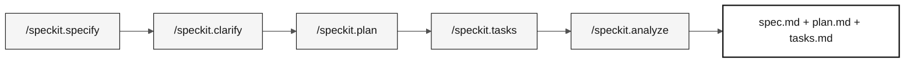

# Stage 2 — Specification (60 min)

> **Path:** [Team Kit](../README.md) › [Stage 2](README.md) › **GUIDE**

**This guide leads Pair 2 step by step through creating the Spec-Kit artifacts: traceable EARS requirements, a technical plan, and implementable tasks, from the start through the H2 handoff.**

  

| Field | Value |
|---|---|
| **Target audience** | Pair 2 (Enterprise Architect + Software Architect); Pair 1 validates the scope; Pair 5 reviews clarity |
| **Prerequisites** | H1 handoff accepted; legacy `.NSN` programs and DDMs read |
| **Estimated time** | 60 min |
| **Stage** | Stage 2 — Specification |
| **Expected outcome** | `specs/<NNN>-<feature>/spec.md`, `plan.md`, and `tasks.md` with complete traceability |

---

## Concept: Spec-Driven Development

Spec-Driven Development (SDD) is the practice of writing the feature specification, requirements, technical plan, and tasks, before writing any code. The goal is to ensure that everyone on the team understands what must be built, why, and how to verify that it was built correctly.

For SIFAP, this means that before creating the benefit calculation endpoint, the team documents exactly which rule from the original `.NSN` program is being modernized, the acceptance criteria, and the tests that validate the behavior.

GitHub Spec-Kit automates this flow with slash commands in Copilot Chat.

### Spec-Kit flow



---

## Artifact location rule

Formal GitHub Spec-Kit deliverables live exclusively in:

```text
specs/<NNN>-<feature>/
├── spec.md
├── plan.md
└── tasks.md
```

`spec.md` contains the EARS requirements, `plan.md` records the technical plan, and `tasks.md` orders the implementable work. Do not create parallel files with legacy names in `02-modern-spec/`.

`02-modern-spec/` contains supporting material for the stage. Its templates and [`scope-decisions.md`](scope-decisions.md) record scope decisions, trade-offs, and references for the conversation. They do not replace the feature's three formal artifacts.

> [!CAUTION]
> **Traceability HARD GATE.** Before drafting any EARS requirement, read the program or DDM that supports it. Every REQ-ID in `specs/<NNN>-<feature>/spec.md` needs a `source_legacy:` line pointing to `01-archaeology/legacy-sifap/.../*.NSN` or `*.ddm`. A capability with no legacy equivalent uses `[GREENFIELD]` with a rationale. Without this, CI rejects the PR.

---

## Concept: EARS notation

EARS (Easy Approach to Requirements Syntax) is a structured notation for writing unambiguous software requirements. Each requirement starts with a keyword that classifies the type of behavior.

**Why it matters:** natural-language requirements are ambiguous. "The system shall calculate the benefit" does not say when, for whom, or what happens if it fails. EARS notation removes this ambiguity.

**The 5 EARS patterns:**

| Pattern | Keyword | Structure | SIFAP example |
|---|---|---|---|
| **Ubiquitous** | (none) | The `<system>` shall `<action>`. | The system shall record the date and time of every benefit change. |
| **Event-driven** | When | When `<event>`, the `<system>` shall `<action>`. | When the payment is processed, the system shall issue a receipt. |
| **State-driven** | While | While `<state>`, the `<system>` shall `<action>`. | While the beneficiary has suspended status, the system shall block payments. |
| **Unwanted behavior** | If / Then | If `<condition>`, then the `<system>` shall `<handling action>`. | If the provided CPF does not exist in the database, then the system shall return HTTP 422 with an error message. |
| **Optional feature** | Where | Where `<feature is active>`, the `<system>` shall `<action>`. | Where advanced auditing is enabled, the system shall record the IP address of each access. |

**REQ-ID:** each requirement receives a unique identifier in the `REQ-NNN` format (for example, `REQ-001`). This ID appears in commits (`Implements REQ-001`), PRs, and tests to trace code behavior back to the specification.

---

## Concept: ADR (Architecture Decision Record)

An ADR is a short document that records an architectural decision: the selected option, the alternatives considered, and the rationale. An ADR is not bureaucracy; it is institutional memory. Without it, in six months no one will remember why PostgreSQL was selected instead of MongoDB.

**When to create an ADR in Stage 2:** only when a decision blocks `plan.md`. Use the template in [`templates/ADR.template.md`](templates/ADR.template.md) or run `/generate-adr` in Copilot Chat.

**Common mistake:** creating ADRs for obvious decisions or decisions already documented elsewhere. If the decision fits in a commit comment, it does not need an ADR.

---

## Concept: Bounded Context

A bounded context is an explicit boundary within which a domain model is valid and consistent. It is the central Domain-Driven Design concept that allows a large system to be divided into smaller, cohesive parts.

**In SIFAP:** the payments module has its own rules, entities, and vocabulary. The inspection module has its own. When the two need to communicate, they do so through a well-defined interface rather than sharing tables or internal objects.

**For the workshop:** use `/carve-bounded-contexts` in Copilot Chat and fill in [`templates/bounded-contexts.template.md`](templates/bounded-contexts.template.md) as a reference for `plan.md`.

---

## Timed schedule

| Time | Activity | Output |
|---|---|---|
| 14:00–14:05 | Confirm the H1 handoff evidence and select a thin feature. | `NNN-<feature>` name and PO-approved scope. |
| 14:05–14:25 | Run `/speckit.specify` and `/speckit.clarify`. | `specs/<NNN>-<feature>/spec.md` with traceable requirements. |
| 14:25–14:40 | Run `/speckit.plan`. | `plan.md` with decisions and risks needed for implementation. |
| 14:40–14:50 | Run `/speckit.tasks`. | Prioritized `tasks.md`, including business-rule tests. |
| 14:50–14:55 | Run `/speckit.analyze` and fix blocking gaps. | Consistent references and artifacts. |
| 14:55–15:00 | Conduct the H2 handoff. | Scope, formal files, and first task for Pairs 3 and 4. |

> [!WARNING]
> If a step consumes the available time, reduce the feature. Do not fill in requirements, contracts, architecture, or acceptance criteria based on assumptions.

---

## Step by step

- [ ] **Confirm evidence.** Reread the findings recorded in Stage 1 before selecting the feature.
- [ ] **Name the folder.** Create `specs/<NNN>-<feature>/` with a name that reflects the behavior, not the technical solution.
- [ ] **Run `/speckit.specify`.** Generate `spec.md` with REQ-IDs, EARS patterns, and `source_legacy:`.
- [ ] **Run `/speckit.clarify`.** Resolve ambiguities before planning.
- [ ] **Run `/speckit.plan`.** Document architecture, data, risks, and contracts in `plan.md`.
- [ ] **Run `/speckit.tasks`.** Break the plan into small tasks with tests in `tasks.md`.
- [ ] **Run `/speckit.analyze`.** Fix gaps between the spec, plan, and tasks.
- [ ] **Record scope decisions.** Fill in [`scope-decisions.md`](scope-decisions.md) with what was selected, deferred, or marked greenfield.
- [ ] **Conduct the H2 handoff.** Present live to Pairs 3 and 4 (see below).

---

## Scope support and decisions

- Record what was selected, deferred, or marked greenfield in [`scope-decisions.md`](scope-decisions.md), linking the decision to the folder in `specs/`.
- Use [`ADR-TEMPLATE.md`](ADR-TEMPLATE.md) only for a decision that blocks the plan. The stage has no ADR quantity target.
- A context sketch or diagram may support the conversation, but C4 L1/L2/L3 and a complete architecture are not prerequisites for the H2 handoff. The necessary technical rationale belongs in `plan.md`.

---

## H2 handoff

Pair 2 presents live to Pairs 3 and 4:

1. The `specs/<NNN>-<feature>/` folder path.
2. The selected feature, requirements, and their `source_legacy:` entries.
3. The first implementable task and expected tests.
4. Risks, scope decisions, and questions that still need answers.

---

## Completion criteria

- [ ] A small feature has `spec.md`, `plan.md`, and `tasks.md` in `specs/<NNN>-<feature>/`.
- [ ] Every requirement has a valid `source_legacy:` or a justified `[GREENFIELD]`.
- [ ] `tasks.md` includes tests alongside business-rule implementation.
- [ ] Scope decisions are recorded in `02-modern-spec/`.
- [ ] The PO confirmed the scope and the H2 handoff occurred by 15:00.

---

## Common mistakes and how to avoid them

| Symptom | Cause | Correction |
|---|---|---|
| Missing `source_legacy:` in `spec.md` | Requirement written without consulting the legacy system | Reread the corresponding `.NSN` program before writing the EARS requirement |
| `spec.md` contains vague requirements ("the system shall work correctly") | EARS notation was not used | Rewrite with one of the 5 EARS patterns |
| Empty `plan.md` or one copied from another project | Plan based on assumptions | Run `/speckit.plan` with the feature's actual context |
| ADR created for every decision | Confusion between an ADR and a code comment | Reserve ADRs for decisions that would block the plan without a record |
| CI rejects the PR | Missing or invalid `source_legacy:` | Correct the path to the corresponding `.NSN` or `.ddm` file |

---

## References

- [Spec-Kit reference card](../09-cheat-sheets/spec-kit-workflow.md)
- [EARS notation](../07-concepts/05-ears-notation.md)
- [Architecture Decision Records](../07-concepts/06-architecture-decision-records.md)
- [Official Spec-Kit](https://github.com/github/spec-kit)
- [SIFAP legacy system](../01-archaeology/legacy-sifap/)

---

### Continue reading

| Previous | Next |
|---|---|
| [Stage 1 — Archaeology](../01-archaeology/README.md)<br/><sub>Archaeology summary and links to the detailed GUIDE.</sub> | [Stage 3 — Implementation](../03-implementation/GUIDE.md)<br/><sub>15:00–16:10 · Java 21 + Spring Boot + Next.js, with tests.</sub> |

<sub>[Back to the kit index](../README.md)</sub>
