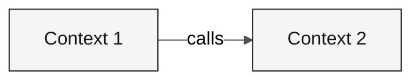

---

title: "Template: Bounded Contexts"
description: "Skeleton for bounded context definitions through /carve-bounded-contexts"
author: "Paula Silva, AI-Native Software Engineer, Americas Global Black Belt at Microsoft"
date: "2026-04-29"
version: "1.0.0"
status: "approved"
tags: ["template", "bounded-contexts", "architect", "stage-2"]
---

<!-- How to use: run /carve-bounded-contexts. Clone the context block for each context. -->

# Bounded Context Map

 

> **Path:** [Team Kit](../../README.md) › [Stage 2](../README.md) › Templates › **bounded-contexts**

> [!NOTE]
> This file is a TEMPLATE. Copy it to your team's repository and fill it with actual data. Do not edit the original.

---

## Concept: Bounded Context

A bounded context is an explicit boundary within which a domain model is valid and consistent. The term comes from Domain-Driven Design (DDD) and provides the foundation for defining the modules of a Modular Monolith.

**Why it matters:** in SIFAP, the payments module uses the term "beneficiary" in one way, while the inspection module may use the same term with different rules. Defining bounded contexts prevents a single model from being distorted to serve every context at once, which causes unwanted coupling and makes evolution difficult.

**Modular Monolith:** an architecture in which bounded contexts are independent Java modules within a single JVM. Each module has its own layers (`domain/`, `application/`, `infrastructure/`) and communicates with other modules only through defined public interfaces.

**Strangler Fig:** an incremental migration pattern in which the modern system grows around the legacy system and replaces features one at a time. SIFAP 2.0 does not need to replace everything at once. Each bounded context can be modernized independently.

---

## Hypothesis assessments

### <!-- placeholder: Name --> — <!-- placeholder: ACCEPTED / REJECTED -->

| Criterion | Assessment | Evidence |
|---|---|---|
| Cohesion | <!-- placeholder --> | <!-- placeholder --> |
| Coupling | <!-- placeholder --> | <!-- placeholder --> |
| Change frequency | <!-- placeholder --> | <!-- placeholder --> |

---

## Final bounded contexts

### <!-- placeholder: Context Name -->

| Field | Value |
|---|---|
| **Responsibility** | <!-- placeholder --> |
| **Owned data** | <!-- placeholder --> |
| **Public interface** | <!-- placeholder --> |
| **Why it is its own context** | <!-- placeholder --> |

---

## Communication between contexts

| From | To | Mechanism | Data |
|---|---|---|---|
| <!-- placeholder --> | <!-- placeholder --> | <!-- placeholder --> | <!-- placeholder --> |

---

> [!IMPORTANT]
> Definition of Done: hypotheses assessed, rejections documented, 2 to 5 contexts named, and the Mermaid diagram renders without errors.

---

### Continue reading

| Previous | Next |
|---|---|
| [Stage 2 GUIDE](../GUIDE.md) Step-by-step instructions. | [ADR Template](ADR.template.md) ADR template. |

[Back to the kit index](../../README.md)
