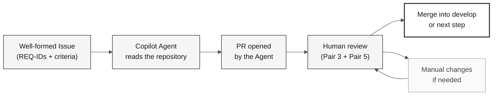

# Stage 4 — Evolution with Agents (40 min)

> **Path:** [Team Kit](../README.md) › [Stage 4](README.md) › **GUIDE**

**This guide leads Pair 5 through experimenting with GitHub Copilot Agent mode: writing a well-formed Issue, delegating it to the Agent, reviewing the resulting PR, and recording honest evidence of what worked.**

  

| Field | Value |
|---|---|
| **Target audience** | Pair 5 (DevOps + Tech Writer) leads; Pair 3 co-leads the technical review |
| **Prerequisites** | H3 handoff received; functional Stage 3 prototype; known build command |
| **Estimated time** | 40 min |
| **Stage** | Stage 4 — Evolution |
| **Expected outcome** | Issue created, delegation recorded, experience report completed |

> [!NOTE]
> Official time: 16:10–16:50 in [`00-TEAM-FLOW.md`](../00-TEAM-FLOW.md). Pair 5 leads, and Pair 3 co-leads the technical review.

---

## Concept: GitHub Copilot Agent mode

GitHub Copilot Agent mode provides autonomous delegation. You supply an Issue with enough context, and the Agent reads the repository, writes code, creates tests, and opens a pull request.

**Why it matters:** the Agent does not invent requirements. It reads what you wrote in the Issue and `spec.md`. If the Issue is vague, the PR will be vague. If the Issue is precise, the PR has a chance of approval without major changes.

**Differences between Copilot modes:**

| Mode | When to use it | Human control |
|---|---|---|
| **Ask** | Questions, explanations, and targeted inquiries | Total |
| **Plan** | Plan a change before execution | High |
| **Agent** | Delegate a well-defined task with autonomy | Post-execution review |

**Issue → Agent → PR → Review cycle:**

---

## Concept: IaC with Terraform and CI/CD with GitHub Actions

**Terraform** is the infrastructure-as-code (IaC) tool used in this workshop. It describes Azure resources (App Service, PostgreSQL, and Key Vault) in `.tf` files and creates them in a repeatable, auditable way.

> [!CAUTION]
> Never run `terraform apply` during the workshop. Validate with `terraform plan` and document the result. Actual infrastructure provisioning is outside the workshop scope.

**GitHub Actions** is the CI/CD engine. A well-configured pipeline automatically validates every PR: it compiles, tests, checks traceability (the presence of `source_legacy:`), and optionally deploys.

---

## Objective

Experiment with one small delegation and leave honest evidence of the outcome. This stage does not promise that an Agent will open a PR, that Terraform will be created, or that a merge will happen before the demo.

---

## Timed schedule

| Time | Activity | Outcome |
|---|---|---|
| 16:10–16:15 | Receive the H3 handoff, confirm the build, and select a small pending item. | Safe scope to delegate or record in the backlog. |
| 16:15–16:25 | Write an Issue with context, REQ-IDs, feature path, verifiable criteria, out-of-scope items, and test method. | Issue created or draft ready for creation. |
| 16:25–16:35 | Delegate to Copilot Agent, if available, and observe the initial status. | Delegation recorded without waiting for full implementation. |
| 16:35–16:45 | If a PR exists, conduct a human review. Otherwise, record the status and prepare a post-workshop review. | Review comments or an explicit next step. |
| 16:45–16:50 | Update the experience report and inform the team for the demo. | Factual account of what worked, failed, or remains pending. |

Use [`../.github/prompts/stage-evolution-write-github-issue.prompt.md`](../.github/prompts/stage-evolution-write-github-issue.prompt.md) as a drafting checklist. Do not ask the Agent to invent missing requirements, architecture, legacy sources, or acceptance criteria.

---

## Step by step

- [ ] **Receive the H3 handoff.** Confirm the build status and identify a small, well-bounded pending item.
- [ ] **Write the Issue.** Use the checklist in `.github/prompts/stage-evolution-write-github-issue.prompt.md`.
- [ ] **Verify that the Issue includes:** REQ-IDs with existing `source_legacy:` entries in `spec.md`, verifiable acceptance criteria, limited scope, and a test method.
- [ ] **Delegate to Copilot Agent.** Record the start time and observe the initial status.
- [ ] **Review the PR** if available, following the criteria below.
- [ ] **Record the outcome** in the experience report, regardless of the result.
- [ ] **Inform the team** of the status for the demo.

---

## Scope limits

> [!IMPORTANT]
> These limits ensure that the workshop ends with real evidence, not promises.

- The Issue references `specs/<NNN>-<feature>/spec.md`, `plan.md`, and `tasks.md` when the pending item comes from a specified feature.
- Every `impl/<NNN>-<feature>` branch starts from `develop` and opens a PR into `develop`; there is no `stage` branch.
- Review every Agent PR as a human PR. Do not merge automatically.
- CI/CD and Terraform are optional during this interval. Validate or document what already exists. Do not create infrastructure only to meet a target.

> [!CAUTION]
> Never run `terraform apply` during the workshop.

---

## Quick PR review

Before approving a PR generated by the Agent, confirm:

- [ ] The scope remains limited to the Issue and referenced REQ-IDs.
- [ ] The referenced requirements and `source_legacy:` entries already exist in `spec.md`.
- [ ] Tests, input validation, and documentation were addressed when applicable.
- [ ] There are no secrets, dependencies without a decision, or out-of-scope changes.
- [ ] The PR targets `develop` and received peer review.

---

## Completion criteria

- [ ] A small Issue was created or left as a reviewable draft.
- [ ] The delegation outcome (PR, in-progress execution, failure, or unavailability) was recorded without promises.
- [ ] An available PR received human review; if no PR exists, a next step is recorded.
- [ ] The experience report was completed.
- [ ] CI/IaC status was communicated for the demo without running `terraform apply`.

---

## References

- [Team experience report](agent-experience-report.md)
- [Report template](templates/agent-experience-report.template.md)
- [Stage agent @evolution](../06-stage-agents/04-evolution/README.md)
- [Cheat sheet: 3 Copilot modes](../09-cheat-sheets/copilot-3-modes.md)

---

### Continue reading

| Previous | Next |
|---|---|
| [Stage 3 — Implementation](../03-implementation/GUIDE.md) 15:00–16:10 · Java 21 + Spring Boot + Next.js, with tests. | [Experience report](agent-experience-report.md) Complete it at the end of the stage. |

[Back to the kit index](../README.md)
