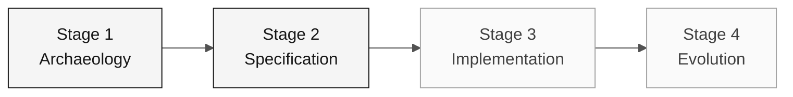

# Persona — Product Owner

> **Trail:** [Team Kit](../../README.md) › [Personas](../OVERVIEW.md) › [Product Owner](README.md) › **PERSONA**

**Complete profile for the Product Owner persona.** Defines the mission, responsibilities by stage, tools, handoff, and evaluation rubrics.

| Field | Value |
|---|---|
| **Role** | Product Owner |
| **Pair** | 1 · Vision (with the Requirements Engineer) |
| **Active stages** | Leads 1 (prioritization) and 2 (scope sign-off); supports 3 and 4 |
| **Artifacts produced** | Glossary, prioritized list, Scope/Out of Scope section, issues for the Agent |
| **Artifacts consumed** | Rule catalog (Archaeology), integration map (EA) |
| **Handoff to** | Pair 2 (Architecture) in Stage 1; Pair 3 (Implementation) through scope approval |

 

---

## Concept

The Product Owner is responsible for translating business needs into executable scope. In the software industry, the PO defines the "why" — which problem the product solves — and decides what is included in or excluded from each delivery cycle.

In a legacy modernization such as SIFAP (Payment Inspection and Administration System), this role is even more critical. Systems that are 29 years old accumulate implicit rules that only make sense when someone knows their history. The PO connects every technical decision to confirmed evidence and priorities. Without this active role, the team risks modernizing code that does not matter to the business.

**Concrete SIFAP example:** the `SIFAP001.NSN` program contains calculation logic for rural benefits. The PO decides whether the calculation rounding rule is included in the first version or goes to the backlog — based on real impact, not technical preference.

---

## Where you work in the SDLC

- **Receives from:** no one — you open the cycle
- **Hands off to:** Pair 2 (Architecture) in Stage 1; Pair 3 (Implementation) through scope approval

---

## Responsibilities by stage

| **Stage** | What you do | Deliverable that depends on you |
|---|---|---|
| **1 · Archaeology** | Lead glossary development and capture the "whys" behind the rules. Maintain a list of open business questions. | Glossary + prioritized list of points to clarify |
| **2 · Specification** | Decide what is included in v1 and what becomes backlog. Cast the final vote on scope. | "Scope and Out of Scope" section of the specification |
| **3 · Implementation** | Validate that user stories still reflect the business as the code emerges. Unblock functional questions. | Functional acceptance criteria by feature |
| **4 · Evolution** | Write the two issues the Agent will consume. Validate that the delivered PR solves the business need. | Two well-written issues in `.github/ISSUE_TEMPLATE/` |

---

## Persona kit

| **Artifact** | Purpose |
|---|---|
| `.github/agents/product-owner.agent.md` | Copilot agent configured for specification, backlog, and acceptance |
| `/spec` — `persona-product-owner-spec.prompt.md` | Writes a section of `specs/<NNN>-<feature>/spec.md` from user stories in EARS |
| `/update-spec` — `persona-product-owner-update-spec.prompt.md` | Updates the specification when a feature changes |
| `/acceptance-check` — `persona-product-owner-acceptance-check.prompt.md` | Checks whether the code meets the acceptance criteria |

---

## Tools and primitives

- **Copilot Chat** to refine user stories and acceptance criteria.
- **GitHub Spec-Kit** in Stage 2: use `/speckit.specify` and `/speckit.clarify` to turn scope into testable requirements.
- **Kit prompts and skills** — shortcuts for writing stories, scope cuts, and risk communication.

**Relevant cheat sheets:**

- [`../../09-cheat-sheets/copilot-3-modes.md`](../../09-cheat-sheets/copilot-3-modes.md) — when to use Ask, Plan, and Agent.
- [`../../09-cheat-sheets/spec-kit-workflow.md`](../../09-cheat-sheets/spec-kit-workflow.md) — `/speckit.specify` and `/speckit.clarify`.

---

## Onboarding checklist

- [ ] **Read this profile.** Mission, responsibilities, and handoff.
- [ ] **Open the kit `README.md`.** Confirm that agents and prompts appear in Copilot Chat.
- [ ] **Identify your pair.** See [00-TEAM-FLOW.md](../../00-TEAM-FLOW.md).
- [ ] **Note the handoff.** Who you receive from and who you deliver to at the end of each stage.
- [ ] **Have an example of a well-written issue.** See the template in [`../../04-evolution/GUIDE.md`](../../04-evolution/GUIDE.md).

---

## How to succeed in this role

- Say "that stays out of v1" three times a day without hesitation.
- Connect every ADR to a concrete impact on the user or operation.
- Protect the team's focus when someone suggests refactoring something that already works.
- Write the two Stage 4 issues with enough context for the Agent to work without questions.

---

## Common mistakes and how to avoid them

| **Symptom** | Cause | Correction |
|---|---|---|
| Team implementing low-value features | Scope was not explicitly cut | List out-of-scope items as clearly as in-scope items |
| Stage 4 Agent produces a generic result | Issues were written without business context | Include concrete acceptance criteria and a reference to the REQ-ID |
| Stage 3 ends incomplete | No thin feature was prioritized | Choose one complete end-to-end feature, not half of three |
| Technical discussions consume the PO's time | PO gets into implementation details | Redirect to the SA or TL and record the decision as an assumption |

---

## 3 prompt examples

1. **(Chat)** "Analyze the programs assigned to our pair and list the confirmed rules. For each one, propose a scope decision with justification."
2. **(Chat)** "Review these 3 user stories and rewrite them as GitHub issues in the format consumed by the Copilot Agent. Include context, functional requirements as a checklist, and acceptance criteria."
3. **(Chat)** "The team wants to implement more features than time allows. Help me prioritize using impact, risk, and available evidence."

---

## If you get stuck

| **Situation** | What to do |
|---|---|
| Stuck on prioritization | Compare impact, risk, dependencies, and available time; record the decision |
| Do not know how to write an issue | Copy the template from [`../../04-evolution/GUIDE.md`](../../04-evolution/GUIDE.md) and adapt it |
| Team wants everything in scope | Say: "We have 70 minutes for implementation; choose one thin feature" |
| Business question has no answer | Document it as an assumption and continue |

---

## Dependencies

| **Persona** | Relationship | Artifact |
|---|---|---|
| Requirements Engineer | Depends on you | Prioritization of rules to become EARS |
| Technical Lead | Depends on you | Defined scope to calibrate Stage 3 |
| Developer | Depends on you (Stage 4) | Well-written issues for the Agent |
| Enterprise Architect | You depend on them | Integration map for scope decisions |

---

## How you are evaluated

- **Rubric A2 (Specification Coherence):** clear scope, documented out-of-scope items.
- **Rubric A7 (Agent Experience):** issues with enough context for the Agent to produce a useful PR.
- **Rubric A6 (Collaboration):** PO who protects the team's focus.

---

### Continue reading

| Previous | Next |
|---|---|
| [OVERVIEW of the 10 personas](../OVERVIEW.md) Comparison table: pair, stage leader, emergency defaults. | [Requirements Engineer](../02-requirements-engineer/PERSONA.md) Pair 1 · Vision · writes EARS with source_legacy. |

[Back to the kit index](../../README.md)
