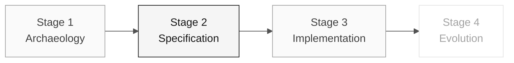

# Persona — Requirements Engineer

> **Trail:** [Team Kit](../../README.md) › [Personas](../OVERVIEW.md) › [Requirements Engineer](README.md) › **PERSONA**

**Complete profile for the Requirements Engineer persona.** Defines the mission, responsibilities by stage, tools, handoff, and evaluation rubrics.

| Field | Value |
|---|---|
| **Role** | Requirements Engineer |
| **Pair** | 1 · Vision (with the Product Owner) |
| **Active stages** | Leads 2 (EARS); supports 1 and 3 |
| **Artifacts produced** | Rule catalog, "Functional Requirements" section in EARS, living specification |
| **Artifacts consumed** | PO prioritization, Stage 1 `.NSN` programs |
| **Handoff to** | Pair 2 (Architecture) in Stage 2 |

 

---

## Concept

The Requirements Engineer transforms rules discovered in the legacy system into formal, testable requirements. In the industry, this professional ensures that the system being built solves the right problem — and that there is an objective way to verify that it was built correctly.

In SIFAP (Payment Inspection and Administration System), business rules are tacitly encoded in Natural — without up-to-date documentation, comments, or a manual. The RE extracts these rules from the `.NSN` programs, classifies them (business rule, validation, calculation, integration), and converts them to EARS (Easy Approach to Requirements Syntax) with explicit traceability through `source_legacy:`.

**Concrete SIFAP example:** the `SIFAP003.NSN` program contains a beneficiary CPF validation routine. The RE reads the Natural code, identifies the rule, assigns a REQ-ID (for example, `REQ-042`), and writes the requirement in EARS: "The system SHALL validate the beneficiary's CPF before processing the payment." With `source_legacy: 01-archaeology/legacy-sifap/natural-programs/SIFAP003.NSN`.

---

## Where you work in the SDLC

- **Receives from:** PO (prioritization) and Stage 1 (rule catalog)
- **Hands off to:** Pair 2 (Architecture) in Stage 2

---

## Responsibilities by stage

| **Stage** | What you do | Deliverable that depends on you |
|---|---|---|
| **1 · Archaeology** | Extract candidate rules from Natural programs. Classify them as business rule, validation, calculation, or integration. | Rule catalog (table) |
| **2 · Specification** | Convert the catalog into EARS requirements. Maintain legacy → requirement traceability. Structure the specification with the PO. | "Functional Requirements" section in EARS notation |
| **3 · Implementation** | Answer requirement questions during coding. Adjust wording when real ambiguity emerges. | Living, not frozen, specification |
| **4 · Evolution** | Review whether the two issues cover a new requirement or adjust an existing one. | Coherence between issues and specification |

---

## Persona kit

| **Artifact** | Purpose |
|---|---|
| `.github/agents/requirements-engineer.agent.md` | Copilot agent configured for requirements analysis |
| `/spec-sync` — `persona-requirements-engineer-spec-sync.prompt.md` | Synchronizes the specification with code changes |
| `/contradiction-check` — `persona-requirements-engineer-contradiction-check.prompt.md` | Detects conflicts between requirements |
| `/ears-convert` — `persona-requirements-engineer-ears-convert.prompt.md` | Converts free text into EARS |
| `.github/instructions/requirements.instructions.md` | Requirements documentation conventions |

---

## Tools and primitives

- **GitHub Spec-Kit** — `/speckit.specify` is the primary workspace. Specify CLI generates the specification foundation to refine in EARS.
- **Copilot Chat** to validate coherence between requirements.
- Repository **MCP/filesystem** to navigate legacy `.NSN` files and correlate them with requirements.
- Kit prompts and skills — rule extraction and conversion to EARS.

**Relevant cheat sheets:**

- [`../../09-cheat-sheets/spec-kit-workflow.md`](../../09-cheat-sheets/spec-kit-workflow.md) — `/speckit.specify` and `/speckit.clarify` with EARS examples.
- [`../../09-cheat-sheets/model-routing.md`](../../09-cheat-sheets/model-routing.md) — when to use Claude Sonnet 4.6 vs. Opus 4.6.

---

## Onboarding checklist

- [ ] **Read this profile.** Mission, responsibilities, and handoff.
- [ ] **Open the kit `README.md`.** Confirm that agents and prompts appear in Copilot Chat.
- [ ] **Review the 6 EARS patterns.** Open the "EARS Notation" section in [`../../02-modern-spec/GUIDE.md`](../../02-modern-spec/GUIDE.md).
- [ ] **Identify your pair.** See [00-TEAM-FLOW.md](../../00-TEAM-FLOW.md).
- [ ] **Note the handoff.** Who you receive from and who you deliver to at the end of each stage.

---

## How to succeed in this role

- Your requirements use active verbs and are testable.
- Every legacy rule has explicit traceability to the modern requirement through `source_legacy:`.
- You say "this is ambiguous; we need a decision" before code is written.
- Use the six EARS patterns without confusing them (ubiquitous, event-driven, state-driven, unwanted, optional, complex).

---

## Common mistakes and how to avoid them

| **Symptom** | Cause | Correction |
|---|---|---|
| Requirement has no verification criterion | Written as a paragraph, not as EARS | Rewrite with the verb "SHALL" and an explicit condition |
| Legacy rule has no counterpart | Incomplete archaeology | Review the rule catalog before closing the specification |
| Requirement duplicates ADR content | Confusion between a requirement and a design decision | A requirement describes behavior; an ADR records an architectural decision |
| "The system must use Redis" enters the specification | Confusion between a requirement and implementation | A functional requirement does not mention technology |

---

## 3 prompt examples

1. **(Chat)** "Read this rule from the legacy SIFAP and convert it to EARS notation: [paste the rule]. Identify which of the 6 EARS patterns applies and explain why."
2. **(Chat)** "Analyze these 5 EARS requirements and find: (a) ambiguities that need a PO decision, (b) dependencies among them, and (c) conflicting requirements."
3. **(Plan)** "In `spec.md`, plan EARS requirements for the confirmed rules in the catalog. Choose the EARS pattern based on the observed behavior."

---

## If you get stuck

| **Situation** | What to do |
|---|---|
| Unfamiliar with EARS | Open the "EARS Notation" section in [`../../02-modern-spec/GUIDE.md`](../../02-modern-spec/GUIDE.md) — 6 patterns with examples |
| Ambiguous requirement | Write two interpretations and ask the PO which is correct |
| Many rules, little time | Prioritize rules by the risk and impact recorded by the team |
| Spec-Kit does not work | Restore the tool before creating formal artifacts; they belong in `specs/<NNN>-<feature>/spec.md` |

---

## Dependencies

| **Persona** | Relationship | Artifact |
|---|---|---|
| Product Owner | You depend on them | Rule prioritization |
| Developer | Depends on you | Clear requirements to implement |
| QA Engineer | Depends on you | Testable requirements with verification criteria |
| Software Architect | Depends on you | Requirements for designing bounded contexts |

---

## How you are evaluated

- **Rubric A2 (Specification Coherence):** requirements in EARS, numbered, and traceable to the legacy system.
- **Rubric A1 (Archaeology):** rule catalog with classification.
- Criterion: "Every requirement has an active verb and is testable."

---

### Continue reading

| Previous | Next |
|---|---|
| [Product Owner](../01-product-owner/PERSONA.md) Pair 1 · Vision · validates scope and priorities. | [Enterprise Architect](../03-enterprise-architect/PERSONA.md) Pair 2 · Architecture · C4 + structural ADRs. |

[Back to the kit index](../../README.md)
