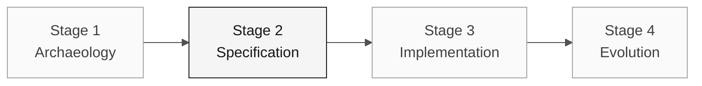

# Persona — Enterprise Architect

> **Trail:** [Team Kit](../../README.md) › [Personas](../OVERVIEW.md) › [Enterprise Architect](README.md) › **PERSONA**

**Complete profile for the Enterprise Architect persona.** Defines the mission, responsibilities by stage, tools, handoff, and evaluation rubrics.

| Field | Value |
|---|---|
| **Role** | Enterprise Architect |
| **Pair** | 2 · Architecture (with the Software Architect) |
| **Active stages** | Leads 2 (C4 + structural ADRs); supports 1 and 4 |
| **Artifacts produced** | External dependency map, topology ADRs, contract validation |
| **Artifacts consumed** | Rule catalog (Pair 1), integration requirements (RE) |
| **Handoff to** | Pair 3 (Implementation) and Pair 4 (Quality) in Stage 2; Pair 5 (Operations) for Terraform |

 

---

## Concept

The Enterprise Architect views the system within its organizational and technical ecosystem. In the industry, this role ensures that new solutions fit the existing context — contracts with external systems, corporate security standards, and governance requirements.

In SIFAP (Payment Inspection and Administration System), this means SIAFI, Banco do Brasil, INCRA, MDA, and other internal government systems. The EA knows where the contracts are, which are fragile, and which can be touched without triggering a chain of unforeseen effects. Without this mapping, the implementation team can create a service that works locally but fails in production because it breaks an integration contract.

**Concrete SIFAP example:** the `SIFAP007.NSN` program calls SIAFI synchronously to confirm payments. The EA identifies this contract, assesses the integration's fragility, and decides whether the coexistence strategy should be synchronous or asynchronous — before code is written.

---

## Where you work in the SDLC

- **Receives from:** Pair 1 (Vision) in Stage 1 — rule catalog and scope
- **Hands off to:** Pair 3 (Implementation) and Pair 4 (Quality) in Stage 2; Pair 5 (Operations) for Terraform

---

## Responsibilities by stage

| **Stage** | What you do | Deliverable that depends on you |
|---|---|---|
| **1 · Archaeology** | Identify dependencies and external contracts that affect the slice. | Relevant integration evidence |
| **2 · Specification** | Record only topology decisions that block the plan. | Topology ADR or scope decision when needed |
| **3 · Implementation** | Validate that the implementation respects the designed contracts. Support DevOps with high-level Terraform. | Validation of the deployed layout |
| **4 · Evolution** | Assess whether Stage 4 issues have architectural implications that require prior review. | Impact assessment |

---

## Persona kit

| **Artifact** | Purpose |
|---|---|
| `.github/agents/enterprise-architect.agent.md` | Copilot agent configured for architecture and security |
| `/create-constitution` — `persona-enterprise-architect-create-constitution.prompt.md` | Creates or updates `.specify/memory/constitution.md` |
| `/create-adr` — `persona-enterprise-architect-create-adr.prompt.md` | Creates an ADR from a team decision |
| `/architecture-review` — `persona-enterprise-architect-architecture-review.prompt.md` | Reviews a proposed design against contracts and risks |
| `.github/instructions/security.instructions.md` | Security conventions |
| `.github/instructions/infrastructure.instructions.md` | IaC conventions |

---

## Tools and primitives

- **Mermaid** and **C4** for context and container diagrams.
- **Copilot Chat** to pressure-test topology decisions.
- **GitHub Spec-Kit** with `/speckit.plan` — turns the specification into a technical plan, decisions, and reviewable contracts.
- Kit skills — structured prompts for dependency analysis.

**Relevant cheat sheets:**

- [`../../09-cheat-sheets/spec-kit-workflow.md`](../../09-cheat-sheets/spec-kit-workflow.md) — `/speckit.plan` and `/speckit.analyze`.
- [`../../09-cheat-sheets/model-routing.md`](../../09-cheat-sheets/model-routing.md) — use Claude Opus 4.6 for architectural impact analysis.

---

## Onboarding checklist

- [ ] **Read this profile.** Mission, responsibilities, and handoff.
- [ ] **Open the kit `README.md`.** Confirm that agents and prompts appear in Copilot Chat.
- [ ] **Identify your pair.** See [00-TEAM-FLOW.md](../../00-TEAM-FLOW.md).
- [ ] **Map external integrations.** List SIAFI, BB, INCRA, and other systems present in the assigned `.NSN` programs.
- [ ] **Note the handoff.** Know who receives the dependency map and for which artifact.

---

## How to succeed in this role

- The C4 level 1 diagram is readable by any nontechnical team member in 30 seconds.
- Your ADRs name the "path not taken" and explain why.
- You anchor the Strangler Fig strategy — coexistence of legacy SIFAP with SIFAP 2.0 — in technical reasoning, not fashion.
- You align with the Software Architect on where your scope ends and theirs begins.

---

## Common mistakes and how to avoid them

| **Symptom** | Cause | Correction |
|---|---|---|
| Diagram is incomprehensible to nontechnical people | C4 L3/L4 used where L1/L2 was enough | Use L1 first; go deeper only for a specific technical question |
| Real integrations are ignored | Excessive focus on internal structure | List SIAFI, BB, and others during Archaeology |
| Work duplicated with the Software Architect | Responsibility boundary not defined | Agree at the start: EA handles external concerns; SA handles internal concerns |
| Generic ADR with no value | "We will use Spring Boot" is not an EA decision | An EA ADR answers "how do we connect to X?" not "which framework do we use?" |

---

## 3 prompt examples

1. **(Chat)** "Create a C4 Level 1 diagram with the actors and external systems confirmed by the team."
2. **(Chat)** "For this external dependency, which availability risks must we assess? Propose alternatives and their trade-offs."
3. **(Chat)** "Compare the integration options raised by the team and structure an ADR without anticipating the decision."

---

## If you get stuck

| **Situation** | What to do |
|---|---|
| Unfamiliar with C4 | Use a simple Mermaid flowchart: boxes = systems, arrows = integrations. Label the arrows |
| Spent too much time on C4 Level 3 | Stop. Level 1 + Level 2 are sufficient for this workshop |
| Unfamiliar with Mermaid | Ask Copilot: "Create a C4 level 1 diagram in Mermaid from these confirmed actors and integrations" |
| Disagreement with the Software Architect | Write an ADR with both options and ask the team to vote |

---

## Dependencies

| **Persona** | Relationship | Artifact |
|---|---|---|
| Software Architect | Depends on you | Dependencies and decisions that affect the slice |
| DevOps Engineer | Depends on you | Topology for Terraform |
| Developer | Depends on you (indirectly) | Integration contracts |
| Requirements Engineer | You depend on them | Integration requirements |

---

## How you are evaluated

- **Rubric A1 (Archaeology):** dependency map readable by nontechnical people.
- **Rubric A2 (Specification Coherence):** ADRs name the "path not taken."
- Criterion: "Scope decisions and relevant dependencies are traceable."

---

### Continue reading

| Previous | Next |
|---|---|
| [Requirements Engineer](../02-requirements-engineer/PERSONA.md) Pair 1 · Vision · writes EARS with source_legacy. | [Software Architect](../04-software-architect/PERSONA.md) Pair 2 · Architecture · bounded contexts and modules. |

[Back to the kit index](../../README.md)
