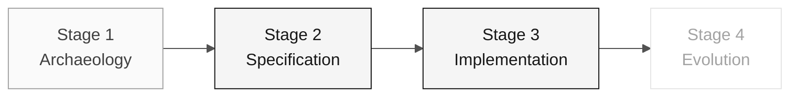

# Persona — Software Architect

> **Trail:** [Team Kit](../../README.md) › [Personas](../OVERVIEW.md) › [Software Architect](README.md) › **PERSONA**

**Complete profile for the Software Architect persona.** Defines the mission, responsibilities by stage, tools, handoff, and evaluation rubrics.

| Field | Value |
|---|---|
| **Role** | Software Architect |
| **Pair** | 2 · Architecture (with the Enterprise Architect) |
| **Active stages** | Leads 2 (bounded contexts, modules) and 3 (structural review) |
| **Artifacts produced** | `plan.md`, `CODEMAP.md`, Spring package structure, internal design ADRs |
| **Artifacts consumed** | Dependency evidence (EA), REQ-IDs (RE) |
| **Handoff to** | Pair 3 (Implementation) in Stage 2 — clear `plan.md` and first task |

 

---

## Concept

The Software Architect defines the system's internal structure: how modules are organized, where bounded contexts (a Domain-Driven Design technique for separating responsibilities) begin and end, and which contracts are exposed between parts of the system.

In the industry, this role is responsible for keeping the system truly modular — meaning that changes in one module do not unexpectedly break others. In a Modular Monolith (a single deployed process with code organized into independent modules), the SA ensures that code modularity is maintained even under deadline pressure.

In SIFAP (Payment Inspection and Administration System), the SA defines the bounded contexts of the modern system (for example, `pagamento`, `beneficiario`, `fiscalizacao`) and how each maps to the legacy Natural programs. This decision guides all of Stage 3.

**Concrete SIFAP example:** the programs `SIFAP001.NSN` through `SIFAP005.NSN` handle payment logic. The SA determines that these programs belong to the `pagamento` bounded context, creates the `br.gov.sifap.pagamento.{domain,application,infrastructure}` package structure, and documents the decision.

---

## Where you work in the SDLC

- **Receives from:** Enterprise Architect (dependency evidence) and Requirements Engineer (REQ-IDs)
- **Hands off to:** Pair 3 (Implementation) in Stage 2 — clear `plan.md` and first task

---

## Responsibilities by stage

| **Stage** | What you do | Deliverable that depends on you |
|---|---|---|
| **1 · Archaeology** | Identify recurring concepts and dependencies relevant to the slice. | Evidence for discussing context boundaries |
| **2 · Specification** | Write the feature's technical plan and record a decision only when it blocks the task. | `plan.md` and supporting ADR, if needed |
| **3 · Implementation** | Establish the initial Spring project structure (packages, layers). Review PRs that cross context boundaries. | `pom.xml` + module layout + review of structural PRs |
| **4 · Evolution** | Validate that the Agent's PR respects the boundaries. Reject merges that break modularity. | Preserved modularity |

---

## Persona kit

| **Artifact** | Purpose |
|---|---|
| `.github/agents/software-architect.agent.md` | Copilot agent configured for software architecture |
| `/codemap` — `persona-software-architect-codemap.prompt.md` | Generates or updates the project's `CODEMAP.md` |
| `/impl-plan` — `persona-software-architect-impl-plan.prompt.md` | Creates the technical implementation plan |
| `/api-validate` — `persona-software-architect-api-validate.prompt.md` | Validates API contracts against the specification |
| `.github/instructions/backend.instructions.md` | Java backend conventions |
| `.github/instructions/frontend.instructions.md` | Next.js frontend conventions |

---

## Tools and primitives

- **Copilot Plan** to design module skeletons before implementation.
- **GitHub Spec-Kit** — `/speckit.plan` and `/speckit.analyze` for plans, contracts, and consistency.
- **Mermaid / C4** for context and component diagrams.
- Kit skills — prompts for choosing between patterns (hexagonal vs. layered packages).

**Relevant cheat sheets:**

- [`../../09-cheat-sheets/spec-kit-workflow.md`](../../09-cheat-sheets/spec-kit-workflow.md) — `/speckit.plan`, `/speckit.tasks`, and `/speckit.analyze`.
- [`../../09-cheat-sheets/model-routing.md`](../../09-cheat-sheets/model-routing.md) — Claude Opus 4.6 for decisions; Sonnet 4.6 for batch editing.

---

## Onboarding checklist

- [ ] **Read this profile.** Mission, responsibilities, and handoff.
- [ ] **Open the kit `README.md`.** Confirm that agents and prompts appear in Copilot Chat.
- [ ] **Identify your pair.** See [00-TEAM-FLOW.md](../../00-TEAM-FLOW.md).
- [ ] **Align with the EA.** Define where each person's scope begins and ends.
- [ ] **Note the handoff.** Know who receives `plan.md` and what it must contain.

---

## How to succeed in this role

- The package layout reflects bounded contexts, not technical layers.
- Your ADRs are short, specific, and cite the corresponding feature in `specs/<NNN>-<feature>/` when relevant.
- The Modular Monolith remains a monolith in deployment but modular in code.
- You redraw boundaries when there is evidence, instead of "asking forgiveness later."

---

## Common mistakes and how to avoid them

| **Symptom** | Cause | Correction |
|---|---|---|
| Code organized by layers (controller/service/repository) | SA did not explicitly define bounded contexts | Create packages by business context, not technical type |
| Generic ADR with no value | "We will use Spring Boot" is not an architectural decision | An SA ADR answers "how do we organize X?" or "which pattern do we use here?" |
| Two contexts import each other's classes | Context boundary was not respected | Expose only public interfaces; never use direct imports between contexts |
| Strict hexagonal architecture where it adds no value | Pattern applied by habit | Choose the pattern that best serves the context; record the choice |

---

## 3 prompt examples

1. **(Chat)** "Based on these EARS requirements, propose context-boundary hypotheses. For each hypothesis, list evidence, entities, and dependencies."
2. **(Plan)** "In the Spring Boot project, plan the package structure for a new 'notification' bounded context following the existing pattern (domain/application/infrastructure)."
3. **(Chat)** "Review this PR and identify imports that cross bounded-context boundaries. For each violation, suggest how to isolate it."

---

## If you get stuck

| **Situation** | What to do |
|---|---|
| Bounded contexts are unclear | Start with evidence of cohesion, coupling, and frequency of change; do not assume boundaries |
| Boundary decision is blocked | Return to legacy evidence and record the question; do not create a diagram as a substitute for confirmation |
| Team organized by layers instead of contexts | Do not refactor now — document it in the ADR and fix it if time remains |
| Unsure whether something is domain or application | "If it is a pure business rule, it is domain. If it orchestrates, it is application." |

---

## Dependencies

| **Persona** | Relationship | Artifact |
|---|---|---|
| Enterprise Architect | You depend on them | Dependency evidence for the technical plan |
| Developer | Depends on you | Package structure to implement |
| Technical Lead | Depends on you | Module patterns for enforcement |
| DBA | Depends on you | Context boundaries for the data model |

---

## How you are evaluated

- **Rubric A2 (Specification):** technical plan coherent with requirements and evidence.
- **Rubric A3 (Technical Integrity):** bounded contexts respected in code.
- Criterion: "No import crosses a context boundary without justification."

---

### Continue reading

| Previous | Next |
|---|---|
| [Enterprise Architect](../03-enterprise-architect/PERSONA.md) Pair 2 · Architecture · C4 + structural ADRs. | [Technical Lead](../05-technical-lead/PERSONA.md) Pair 3 · Implementation · standards and review. |

[Back to the kit index](../../README.md)
