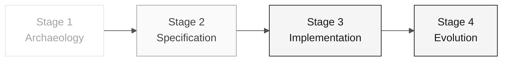

# Persona — Technical Lead

> **Trail:** [Team Kit](../../README.md) › [Personas](../OVERVIEW.md) › [Technical Lead](README.md) › **PERSONA**

**Complete profile for the Technical Lead persona.** Defines the mission, responsibilities by stage, tools, handoff, and evaluation rubrics.

| Field | Value |
|---|---|
| **Role** | Technical Lead |
| **Pair** | 3 · Implementation (with the Developer) |
| **Active stages** | Leads 3 (standards, review) and co-leads 4; supports 2 |
| **Artifacts produced** | Implementation standards, PR reviews, application running end to end |
| **Artifacts consumed** | REQ-IDs, ADRs, C4 (Pair 2) |
| **Handoff to** | Pair 5 (Operations) in Stage 3 — running code |

  

---

## Concept

The Technical Lead connects the architecture defined on paper to the code written every day. In the industry, this role defines implementation standards (coding conventions, test style, module structure), unblocks the team when someone gets stuck on a technical detail, and is accountable for the technical quality of deliveries.

In SIFAP (Payment Inspection and Administration System), the TL ensures that the application created by the team actually runs end to end by the end of Stage 3 — not merely compiles. This includes decisions such as which layer receives the `@Transactional` annotation, how errors are handled, and how integration tests are structured.

**Concrete SIFAP example:** when the Developer implements the benefit lookup endpoint, the TL reviews the PR to verify that business logic is in the correct layer, the test covers success and error paths, and no import crosses a bounded-context boundary.

---

## Where you work in the SDLC

- **Receives from:** Pair 2 (Architecture) in Stage 2 — REQ-IDs + ADRs + C4
- **Hands off to:** Pair 5 (Operations) in Stage 3 — running code

---

## Responsibilities by stage

| **Stage** | What you do | Deliverable that depends on you |
|---|---|---|
| **1 · Archaeology** | Participate in the analysis by prioritizing critical programs. Estimate complexity. | Effort-based prioritization |
| **2 · Specification** | Validate that the specification fits within Stage 3's 70 minutes. Flag "this does not fit." | Scope calibration |
| **3 · Implementation** | Unblock. Decide standards (test style, transactions, error handling). Review every PR. | Application running end to end |
| **4 · Evolution** | Review the Agent's PR line by line before merging. | Production-quality PR |

---

## Persona kit

| **Artifact** | Purpose |
|---|---|
| `.github/agents/tech-lead.agent.md` | Copilot agent configured for technical governance |
| `/setup-project` — `persona-technical-lead-setup-project.prompt.md` | Initializes the project structure |
| `/routing-table` — `persona-technical-lead-routing-table.prompt.md` | Generates a model-routing table by task |
| `/audit-context` — `persona-technical-lead-audit-context.prompt.md` | Audits the context sent to Copilot |

---

## Tools and primitives

- **Copilot Plan** for batch refactoring with a clear sequence.
- **Copilot Chat** as a pair for local design decisions.
- **GitHub Spec-Kit** — support in `/speckit.tasks`, `/speckit.analyze`, and the handoff to `/speckit.implement`.
- **Git MCP** for PR review.

**Relevant cheat sheets:**

- [`../../09-cheat-sheets/copilot-3-modes.md`](../../09-cheat-sheets/copilot-3-modes.md) — you switch among all three modes constantly.
- [`../../09-cheat-sheets/spec-kit-workflow.md`](../../09-cheat-sheets/spec-kit-workflow.md) — `/speckit.tasks` and `/speckit.implement`.
- [`../../09-cheat-sheets/model-routing.md`](../../09-cheat-sheets/model-routing.md) — model routing by task type.

---

## Onboarding checklist

- [ ] **Read this profile.** Mission, responsibilities, and handoff.
- [ ] **Open the kit `README.md`.** Confirm that agents and prompts appear in Copilot Chat.
- [ ] **Identify your pair.** See [00-TEAM-FLOW.md](../../00-TEAM-FLOW.md).
- [ ] **Define 2 key standards.** Before Stage 3 begins, choose transaction and testing conventions.
- [ ] **Note the handoff.** Know what DevOps must receive at the end of Stage 3.

---

## How to succeed in this role

- Answer a technical question in less than 5 minutes. Do not leave anyone idle.
- Write reviews that move the PR forward, not reviews that block it.
- Choose two key standards at the start of Stage 3 and keep them non-negotiable (for example, `@Transactional` only in the service layer).
- Keep `main` green at all times.

---

## Common mistakes and how to avoid them

| **Symptom** | Cause | Correction |
|---|---|---|
| Developer blocked for more than 20 minutes | TL writing code instead of unblocking | Stop what you are doing and answer the question |
| PR blocked by aesthetic details | Review focused on style, not correctness | Review the criteria: correct behavior, test present, no boundary violation |
| Standard changes midway through Stage 3 | Decision was not recorded at the start | Define standards before starting and document them in `CODEMAP.md` |
| Application does not run at the end | Bottleneck was not identified in time | Run a complete integration test every 30 minutes |

---

## 3 prompt examples

1. **(Chat)** "Review this PR: verify that it follows the 3 layers (domain/application/infrastructure), the test covers success + error paths, and no import crosses a bounded context."
2. **(Chat)** "We have 70 minutes. Help compare these features by evidence, dependencies, and effort to choose one thin feature; do not fill in missing requirements."
3. **(Chat)** "The local environment fails with this error: [paste]. Diagnose the root cause and propose a fix."

---

## If you get stuck

| **Situation** | What to do |
|---|---|
| Local environment does not start | Check: is port 5432 occupied? Are the Java/Node versions correct? Are old containers interfering? Which error appears in backend logs? |
| Team is slow | Stop and redistribute: "Dev A handles the endpoint, Dev B handles the migration, QA handles the test. Merge in 45 minutes." |
| PR has conflicts | `git pull --rebase` and resolve them. Do not let the branch diverge without aligning with your pair |
| Unsure how to choose a standard | Use the specification, ADRs, and kit instructions as sources; document the decision in the PR |

---

## Dependencies

| **Persona** | Relationship | Artifact |
|---|---|---|
| Software Architect | You depend on them | Defined package structure |
| Product Owner | You depend on them | Calibrated scope |
| Developer | Depends on you | Standards and reviews |
| QA Engineer | Depends on you | Green pipeline for running tests |
| DevOps Engineer | Depends on you | Stable build for the pipeline |

---

## How you are evaluated

- **Rubric A3 (Technical Integrity):** the application created by the team runs locally and in CI.
- **Rubric A6 (Collaboration):** no one is blocked for more than 20 minutes.
- Criterion: "`main` green at all times, PRs reviewed in less than 15 minutes."

---

### Continue reading

| Previous | Next |
|---|---|
| [Software Architect](../04-software-architect/PERSONA.md) Pair 2 · Architecture · bounded contexts and modules. | [Developer](../06-developer/PERSONA.md) Pair 3 · Implementation · Java + Next.js + tests. |

[Back to the kit index](../../README.md)
