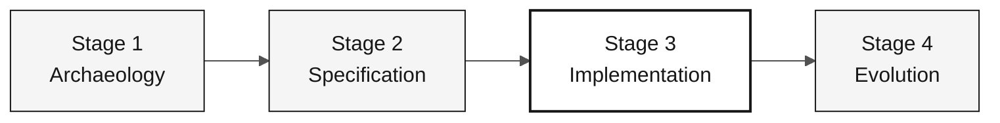

# Persona — DBA

> **Track:** [Team Kit](../../README.md) › [Personas](../OVERVIEW.md) › [DBA](README.md) › **PERSONA**

**Reference profile for the DBA persona in the SIFAP modernization workshop.**

 -404040?style=flat-square) 

| Field | Value |
|---|---|
| **Role** | DBA (Database Administrator) |
| **Pair** | Pair 4 — Quality (with QA Engineer) |
| **Active stages** | Stage 1 (DDM mapping), Stage 2 (logical model + ADR), Stage 3 (leads schema), Stage 4 (validates integrity) |
| **Artifacts produced** | DDM-to-relational-entity map, database ADR, Flyway migrations, indexes, test seed data |
| **Artifacts consumed** | Adabas DDMs (Stage 1), bounded contexts (Software Architect), EARS requirements (Requirements Engineer) |
| **Handoff to** | Developer — JPA-ready migrations; DevOps Engineer — stable schema for Terraform |

---

## What this persona is

The DBA is responsible for the SIFAP 2.0 data layer. In the legacy modernization, this means reading the 4 Adabas DDMs—which describe MU (multiple-value), PE (periodic), and FDT (File Definition Table) structures—translating them into a normalized PostgreSQL 16 relational schema, and ensuring that Flyway migrations are idempotent, reversible, and safe for continuous deployment.

Why it matters: the data model is the foundation for the Developer's JPA entities and the infrastructure provisioned by DevOps. A fragile schema or irreversible migrations compromise all of Stage 3 and create serious production risks.

Within the Agentic Legacy Modernization framework, the DBA works in the Assessment phase (Stage 1) and the data-layer Translation phase (Stage 3).

## Where you work in the SDLC

| Stage | Responsibility | Deliverable |
|---|---|---|
| **1 — Archaeology** | Read the 4 DDMs, map MU/PE fields to candidate relational entities, and identify key fields | DDM-to-relational-entity map |
| **2 — Specification** | Design the logical data model and write the PostgreSQL ADR (reference ADR 002) | Data model + ADR 002 |
| **3 — Implementation** | Write Flyway migrations, define indexes, seed test data, and answer JPA/Hibernate questions | PostgreSQL schema + seed |
| **4 — Evolution** | Verify that Copilot Agent PRs change the schema safely (new migration, never retroactive edits) | Schema integrity preserved |

## Core responsibility

Translate the Adabas model needed by the selected scope into a PostgreSQL relational schema that preserves business integrity without inheriting legacy Adabas structures. Ensure idempotent migrations and full traceability of schema changes.

## Key skills

- Reading Adabas DDMs: simple, MU (multiple-value), and PE (periodic) fields
- Normalized relational schema design in PostgreSQL 16
- Flyway migrations: naming, idempotency, and expand-contract strategy
- Indexing based on real queries identified in Natural programs
- Auditing JPA/JPQL queries to prevent N+1 and SQL injection

## Persona kit

| Artifact | Path | Use |
|---|---|---|
| DBA agent | `.github/agents/dba.agent.md` | Data modeling, migrations, and SQL auditing |
| Prompt `/migration` | `.github/prompts/persona-dba-migration.prompt.md` | Plan and write a Flyway migration |
| Prompt `/query-audit` | `.github/prompts/persona-dba-query-audit.prompt.md` | Audit queries for performance and security |
| Database instructions | `.github/instructions/database.instructions.md` | Mandatory database conventions |

## Copilot tools and modes

| Tool / Mode | When to use |
|---|---|
| **Copilot Ask** | Translate Adabas DDMs to PostgreSQL SQL; understand legacy field semantics |
| **Copilot Plan** | Plan migration batches; create several Flyway files at once |
| **PostgreSQL MCP** (if available) | Inspect the running schema and run exploratory queries |
| **Spec-Kit** (`/speckit.plan`) | Declare the data model for the Software Architect and Developer |

## Recommended cheat sheets

- [`09-cheat-sheets/spec-kit-workflow.md`](../../09-cheat-sheets/spec-kit-workflow.md) — declare the data model for `/speckit.plan` and review it with `/speckit.analyze`
- [`09-cheat-sheets/model-routing.md`](../../09-cheat-sheets/model-routing.md) — Sonnet 4.6 is sufficient for most SQL work

## How to perform well

- [ ] **Make every migration reversible.** Never edit an existing migration; create a new one: `V5__fix_xxx.sql`.
- [ ] **Document MU/PE mapping decisions.** Record why an MU field became a related table rather than a `JSONB` column.
- [ ] **Index critical monthly-cycle queries.** Rule of thumb: a field in `WHERE` or `JOIN` on a table with more than 100,000 rows needs an index.
- [ ] **Keep the audit store append-only.** No `DELETE` in the audit schema.

## Common mistakes and how to avoid them

| Symptom | Cause | Correction |
|---|---|---|
| Schema uses `JSONB` columns for structured data | Adabas flexibility habit | Normalize PE and MU fields into related tables with foreign keys |
| Migration breaks a teammate's environment | Non-idempotent migration | Never alter an existing migration file; create a higher-versioned file |
| Missing index on a critical table | Index not based on evidence | Identify queries in Natural programs before defining indexes |
| Habitual denormalization | Replicating the Adabas model | Start from the canonical relational model and denormalize only with measured performance evidence |

## Combinations with other personas

| Combination | Note |
|---|---|
| **DBA + Developer** | You write your migrations and some JPA queries |
| **DBA + DevOps Engineer** | You manage PostgreSQL and the Terraform that provisions it in Azure |

## Ready-to-use prompts

1. **(Ask)** _"Read the DDM assigned to the team and propose relational mapping alternatives, including the trade-offs we must decide."_
2. **(Plan)** _"Plan a Flyway migration for the fields, relationships, and indexes required by the prioritized EARS requirement."_
3. **(Ask)** _"Review this schema and identify constraints and indexes that need evidence before they are created."_

## Emergency defaults

| Situation | What to do |
|---|---|
| Unknown DDM format | Open `01-archaeology/legacy-sifap/adabas-ddms/`—the comments help explain each field |
| Broken migration | Never edit an existing migration. Create a new one: `V5__fix_xxx.sql` |
| Unsure which index to create | For a field in `WHERE` or `JOIN` on a table with more than 100,000 rows, create the index |
| PostgreSQL unavailable | Check whether Docker is running: `docker ps \| grep postgres` |

## Dependencies

| Persona | Relationship | Artifact |
|---|---|---|
| Software Architect | You depend on them | Context boundaries for the model |
| Developer | Depends on you | JPA-ready migrations |
| DevOps Engineer | Depends on you | Stable schema for Terraform |
| QA Engineer | Depends on you | Test seed data |

## How you are evaluated

- **Rubric A3 — Technical Integrity:** idempotent migrations, schema consistent with JPA entities
- **Rubric A1 — Archaeology:** documented DDM-to-relational-entity map
- **Criterion:** the audit store is append-only—no `DELETE` in the audit schema

---

### Continue reading

| Previous | Next |
|---|---|
| [Developer — PERSONA](../06-developer/PERSONA.md) Pair 3 — Implementation — Java 21 + Next.js 15 + tests. | [QA Engineer — PERSONA](../08-qa-engineer/PERSONA.md) Pair 4 — Quality — equivalence tests and coverage. |

[Back to the kit index](../../README.md)
