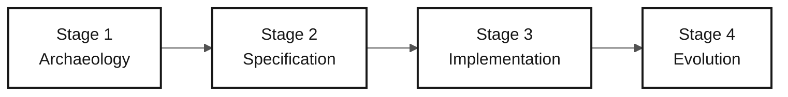

# Persona — Tech Writer

> **Track:** [Team Kit](../../README.md) › [Personas](../OVERVIEW.md) › [Tech Writer](README.md) › **PERSONA**

**Reference profile for the Tech Writer persona in the SIFAP modernization workshop.**

  

| Field | Value |
|---|---|
| **Role** | Tech Writer (Technical Writer) |
| **Pair** | Pair 5 — Operations (with DevOps Engineer) |
| **Active stages** | All stages (cross-cutting); leads Stage 4 — Evolution (Agent report) |
| **Artifacts produced** | Glossary, discovery report (Stage 1), formatted spec and ADRs (Stage 2), complete README and `docs/` (Stage 3), Agent experience report (Stage 4) |
| **Artifacts consumed** | Decisions and code from every pair |
| **Handoff to** | Facilitators—final Stage 4 report; Product Owner—readable glossary and reports |

---

## What this persona is

The Tech Writer transforms decisions and code into durable project memory. In the SIFAP (Payment Inspection and Administration System) modernization, this persona maintains the glossary of Natural/Adabas legacy terms (MU, PE, FDT, DDM, monthly cycle), formalizes architecture decisions as ADRs (Architecture Decision Records), and ensures that the README reflects the application's real state every hour of the workshop, not only at the end.

Why it matters: without a deliberate Tech Writer, ADRs remain empty files, the README stays at "TODO: add instructions," and knowledge discovered during the workshop disappears. The Tech Writer makes team learning traceable and transferable.

Within the Agentic Legacy Modernization framework, the Tech Writer works with the Documentation Agent in every phase, maintaining traceability and an audit trail of decisions.

## Where you work in the SDLC

| Stage | Responsibility | Deliverable |
|---|---|---|
| **1 — Archaeology** | Maintain the glossary and catalog in readable form; write the discovery report at the end | Stage 1 report |
| **2 — Specification** | Review the spec for consistency, terminology, and clarity; format ADRs with the template | Spec and ADRs in standard format |
| **3 — Implementation** | Turn the placeholder README into real documentation; record decisions under `docs/` as they emerge | Complete README + `docs/` |
| **4 — Evolution** | Follow the Copilot Agent and write an honest experience report covering what worked, failed, and was learned | Final Stage 4 report |

## Core responsibility

Keep documentation alive throughout the day—not only at the end. Grow the README every hour, write ADRs when decisions are made, maintain the changelog, and keep terminology consistent throughout the workshop.

## Key skills

- Technical writing in the Diátaxis style: tutorials, how-to guides, reference, explanation
- ADR formalization: context, decision, consequences—no more and no less
- Documentation-to-code traceability: real endpoints, commands, and environment variables
- Drift detection between documentation and code using `/doc-drift`
- Glossary maintenance and consistent terminology across the project

## Persona kit

| Artifact | Path | Use |
|---|---|---|
| Tech Writer agent | `.github/agents/tech-writer.agent.md` | API docs, README, `CODEMAP.md`, changelog, and drift detection |
| Prompt `/generate-docs` | `.github/prompts/persona-tech-writer-generate-docs.prompt.md` | Generate documentation from code |
| Prompt `/update-codemap` | `.github/prompts/persona-tech-writer-update-codemap.prompt.md` | Update the code map |
| Prompt `/doc-drift` | `.github/prompts/persona-tech-writer-doc-drift.prompt.md` | Detect divergence between docs and code |

## Copilot tools and modes

| Tool / Mode | When to use |
|---|---|
| **Copilot Ask** | Review style, clarity, and terminology consistency |
| **Copilot Ask (long-form writing)** | Draft long technical documentation sections |
| **Spec-Kit** (`/speckit.*`) | Keep Specify CLI-generated `spec.md`, `plan.md`, and `tasks.md` consistent with team documentation |
| **GitHub MCP** | Commit to `docs/` while other pairs work on code |

## Recommended cheat sheets

- [`09-cheat-sheets/spec-kit-workflow.md`](../../09-cheat-sheets/spec-kit-workflow.md) — Specify CLI generates `spec.md`, `plan.md`, and `tasks.md`; keep them consistent with documentation
- [`09-cheat-sheets/model-routing.md`](../../09-cheat-sheets/model-routing.md) — Haiku 4.5 for style review; Sonnet 4.6 for content writing

## Hourly checkpoints

The Tech Writer is the team's most cross-cutting persona. To avoid waiting for something to document, follow these checkpoints:

| Period | What to do | Visible deliverable |
|---|---|---|
| 11:00–12:00 | Read the programs assigned to Pair 5 and record terms supporting the selected scope | Glossary with relevant terms |
| 13:30–14:00 | Consolidate vocabulary and decisions needed for the thin feature | Support for the feature spec |
| 14:00–15:00 | Review `spec.md`, `plan.md`, and `tasks.md` for clarity; record the scope decision | Consistent formal artifacts |
| 15:00–16:10 | Document real endpoints and commands created by the prototype | Updated factual documentation |
| 16:10–16:50 | Follow the Agent and write `agent-experience-report.md` in real time | Completed honest report |

> [!NOTE]
> If you have nothing to document after 30 minutes, ask the stage-leading pair: _"What did you decide in the last 30 minutes that has not been written down yet?"_ There is almost always something.

## How to perform well

- [ ] **Give every ADR context, decision, and consequences.** No more, no less.
- [ ] **Evolve the README every hour.** Not only at the end of the day.
- [ ] **Keep terminology consistent from start to finish.** If the project uses "cycle," do not use "round" in the next paragraph.
- [ ] **Write an honest Stage 4 report.** Do not sell the Agent; document what worked and what failed.

## Common mistakes and how to avoid them

| Symptom | Cause | Correction |
|---|---|---|
| Nothing written by the end of Stage 3 | Waiting for code to be "ready" | Document in real time—capture each decision when it is made |
| One-line ADRs | Confusing a record with a note | Use the template: context, decision, consequences |
| README still says "TODO: add instructions" | Postponement | Start with: (1) what the system is, (2) how to run it, (3) available endpoints |
| Agent report contains only praise | Positive bias | Document friction, manual interventions, hallucinations, and corrections |

## Combinations with other personas

| Combination | Note |
|---|---|
| **Tech Writer + Product Owner** | Document the project's why, vision, and purpose |
| **Tech Writer + DevOps Engineer** | Document while the pipeline runs, producing a natural runbook |
| **Tech Writer + Requirements Engineer** | Strong for small teams—structure and write clear requirements |

## Ready-to-use prompts

1. **(Ask)** _"Review this README and identify TODO sections, inconsistent terminology, and outdated information such as ports, credentials, and endpoints. Propose corrections."_
2. **(Plan)** _"In ADR-001.md, plan how to complete Context, Decision, and Consequences using the template in `02-modern-spec/ADR-TEMPLATE.md`."_
3. **(Ask)** _"Create an honest Copilot Agent experience report: what worked, what surprised us, and what failed. Use the template in `04-evolution/agent-experience-report.md`."_

## Emergency defaults

| Situation | What to do |
|---|---|
| ADR format is unknown | Open `02-modern-spec/ADR-TEMPLATE.md` and copy and complete the three required sections |
| README is empty | Start with: (1) what the system is, (2) how to run it, (3) available endpoints |
| Glossary is blocked | Ask Copilot: _"List every abbreviation found in the SIFAP `.NSN` files and expand each one."_ |
| Agent report is empty | Open `04-evolution/agent-experience-report.md`; the template has ready-to-fill sections |

## Dependencies

| Persona | Relationship | Artifact |
|---|---|---|
| All pairs | You depend on them | Decisions and code to document |
| Product Owner | Depends on you | Readable glossary and reports |
| QA Engineer | Indirectly depends on you | Consistent terminology in the spec |
| Facilitators | Depend on you | Final Stage 4 report |

## How you are evaluated

- **Rubric A2 — Spec:** consistent documentation and standardized terminology
- **Rubric A7 — Agent:** honest, detailed Copilot Agent experience report
- **Criterion:** README evolved every hour; ADRs have context, decision, and consequences; no section says TODO

---

### Continue reading

| Previous | Next |
|---|---|
| [DevOps Engineer — PERSONA](../09-devops-engineer/PERSONA.md) Pair 5 — Operations — Terraform, GitHub Actions, and runbook. | [Stage 1 — Archaeology](../../01-archaeology/GUIDE.md) 11:00–12:00 — Read the legacy system and catalog business rules. |

[Back to the kit index](../../README.md)
