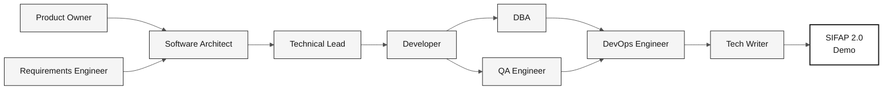

# Overview of the 10 Personas

> **Track:** [Team Kit](../README.md) › [Personas](README.md) › **OVERVIEW**

**One-page comparison of the 10 personas.** Use it to choose your pair, identify who leads each stage, and consult emergency defaults.

| Field | Value |
|---|---|
| **Target audience** | All workshop participants |
| **Prerequisites** | None |
| **Estimated time** | 5 min |
| **Expected outcome** | Pair selected and handoffs understood |

> [!TIP]
> Each team member takes on **2 personas** from the same pair. The pair stays together throughout the workshop—there is no internal handoff between its two personas.

---

## The 5 pairs

---

## Complete table of the 10 personas

| **#** | Persona | Pair | Leads stage | Supports | Primary tool | Default when stuck |
|---|---|---|---|---|---|---|
| 01 | [Product Owner](01-product-owner/PERSONA.md) | 1 · Vision | 1 (prioritization), 2 (scope sign-off) | 3, 4 | Copilot Ask + spec.prompt | "We have 3 hours of coding—choose 3 features" |
| 02 | [Requirements Engineer](02-requirements-engineer/PERSONA.md) | 1 · Vision | 2 (EARS) | 1 | `/ears-convert` + Spec-Kit | Trace every requirement to evidence |
| 03 | [Enterprise Architect](03-enterprise-architect/PERSONA.md) | 2 · Architecture | 2 (C4 + structural ADRs) | 4 | Mermaid + ADR template | Record alternatives in the template |
| 04 | [Software Architect](04-software-architect/PERSONA.md) | 2 · Architecture | 2 (bounded contexts, modules) | 3 | `/codemap` + impl-plan | Validate assumptions with the team |
| 05 | [Technical Lead](05-technical-lead/PERSONA.md) | 3 · Implementation | 3 (standards, review) | 4, 2 | Plan mode + audit-context | Implement the prioritized EARS requirement |
| 06 | [Developer](06-developer/PERSONA.md) | 3 · Implementation | 3 (code) | 4 | Plan mode + `/tdd` | Complete only 1 endpoint, including its test |
| 07 | [DBA](07-dba/PERSONA.md) | 4 · Quality | 3 (Flyway migrations) | 3 | `/migration` + query-audit | Derive the model from the DDMs |
| 08 | [QA Engineer](08-qa-engineer/PERSONA.md) | 4 · Quality | 3 (BDD tests) | 3 | Test-strategy skill | Write 1 acceptance test per critical REQ-ID |
| 09 | [DevOps Engineer](09-devops-engineer/PERSONA.md) | 5 · Operations | 4 (Terraform + CI/CD) | cross-cutting | `/iac-module` + `/pipeline` | Run `terraform plan` only, never `apply` |
| 10 | [Tech Writer](10-tech-writer/PERSONA.md) | 5 · Operations | 4 (Agent report) | cross-cutting (1, 2, 3) | Markdown skills + Copilot Ask | Consolidate the team's decisions |

---

## Who leads each stage

| **Stage** | Time | Leads | Supports |
|---|---|---|---|
| **1 · Archaeology** | 11:00–12:00 + 13:30–14:00 | All 5 pairs in parallel (3 programs each) | — |
| **2 · Specification** | 14:00–15:00 | Pair 2 (EA + SA) | Pair 1 (scope), Pair 5 (review) |
| **3 · Implementation** | 15:00–16:10 | Pairs 3 (TL + Dev) and 4 (DBA + QA) | Pair 5 (CI skeleton) |
| **4 · Evolution** | 16:10–16:50 | Pair 5 (DevOps + TW) | Pair 3 (Issues + Agent PR reviews) |

---

## Dependency chain

---

## How to choose your pair

| If your background is in… | Consider pair |
|---|---|
| Business / product | **1 · Vision** (PO + RE) |
| Systems architecture | **2 · Architecture** (EA + SA) |
| Programming / development | **3 · Implementation** (TL + Dev) |
| Data / testing | **4 · Quality** (DBA + QA) |
| Infrastructure / documentation | **5 · Operations** (DevOps + TW) |

> [!NOTE]
> Pairs 1, 4, and 5 accommodate people without a technical programming background. Pairs 2 and 3 require technical experience.

---

## Emergency defaults (summary)

Each `PERSONA.md` details a "When stuck" section. Here is one line per persona:

- **PO:** "We have 70 minutes of implementation; choose one thin feature."
- **RE:** Trace each EARS requirement to evidence and record gaps for clarification.
- **EA:** Use the ADR template to document alternatives and the team's decision.
- **SA:** Formulate architecture assumptions and validate them with the team.
- **TL:** Stop refactoring without tests; review your pair's PRs.
- **Dev:** 1 complete endpoint > 5 broken ones. Testcontainers is mandatory.
- **DBA:** Model from the DDMs and never edit an old migration.
- **QA:** 1 test per critical REQ-ID. Happy path + error path.
- **DevOps:** `terraform plan` only. Running `apply` in the workshop is high risk.
- **TW:** Ask the stage-leading pair: "What did you decide in the last 30 minutes that has not been written down yet?"

---

### Continue reading

| Previous | Next |
|---|---|
| [SETUP](../00-SETUP.md) Laptop setup: Git, VS Code, Copilot, Spec-Kit, branch protection. | [Stage 1 — Archaeology](../01-archaeology/GUIDE.md) 11:00–12:00 + 13:30–14:00 · Read the legacy system and catalog business rules. |

[Back to the kit index](../README.md)
