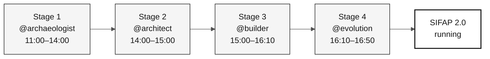

# Stage Agents — 4 Workshop Context Agents

> **Path:** [Team Kit](../README.md) › **Stage Agents**

**Stage agents are custom GitHub Copilot agents that concentrate the technical context for each workshop phase, ensuring that the entire team interacts with Copilot consistently during the same stage.**

| Field | Value |
|---|---|
| **Target audience** | Entire team, required reading before the workshop starts |
| **Prerequisites** | GitHub Copilot active in VS Code |
| **Estimated time** | 10 min |
| **Stage** | All |
| **Expected outcome** | Know which agent to use, when to use it, and its role |

---

## What is a custom Copilot agent?

A custom GitHub Copilot agent is an instruction profile configured in `.github/copilot-instructions.md` and `skills` files. It guides Copilot on the context, tools, vocabulary, and constraints of a specific task.

When you select `@archaeologist` in Copilot Chat, Copilot loads that agent's instructions and responds within that scope, without requiring you to repeat the context in every message.

**Why this matters in this workshop:** without custom agents, every team member would need to repeat the SIFAP context, traceability rules, and target stack in each conversation. Stage agents remove this repetition and create a shared ritual.

---

## Two configuration layers

This workshop uses two Copilot configuration layers that work together:

| Layer | What it does | Location |
|---|---|---|
| **Persona kit** (column) | Defines the individual role: Product Owner, Developer, QA, and others | [`05-personas/`](../05-personas/) |
| **Stage agent** (row) | Defines the phase context: archaeology, specification, implementation, evolution | This folder |

The persona answers "who am I on this team?" The agent answers "which phase are we in now?" Each person keeps their two personas throughout the day, while the stage agent changes as the schedule advances.

---

## The 4 agents and schedule

| Stage | Time | Agent | Agent approach | Purpose |
|---|---|---|---|---|
| Stage 1 — Archaeology | 11:00–12:00 + 13:30–14:00 | [@archaeologist](01-archaeologist/README.md) | Investigative | Read the legacy system, record evidence, and scope a feature |
| Stage 2 — Specification | 14:00–15:00 | [@architect](02-architect/README.md) | Analytical | Create `spec.md`, `plan.md`, and `tasks.md` with scope decisions |
| Stage 3 — Implementation | 15:00–16:10 | [@builder](03-builder/README.md) | Constructive | Build traceable Java/Next.js code, tests, migrations, and endpoints |
| Stage 4 — Evolution | 16:10–16:50 | [@evolution](04-evolution/README.md) | Operational | Delegate a small Issue and record the review outcome |

---

## How to select the agent in Copilot Chat

- [ ] **Confirm the current stage** in [00-TEAM-FLOW.md](../00-TEAM-FLOW.md).
- [ ] **Open Copilot Chat** in VS Code (`Ctrl+Alt+I` / `Cmd+Alt+I`).
- [ ] **Open the agent selector** (the at-sign icon or context menu in the message field).
- [ ] **Select the agent for the current stage** (for example, `@archaeologist`).
- [ ] **Open the agent README** from the table above and copy the opening prompt.
- [ ] **Work through the agent's Definition of Done deliverables** until the handoff gate.

> [!WARNING]
> Do not skip the handoff gate between stages. It ensures that the next agent receives explicit evidence, decisions, and pending work rather than only a chat conversation.

---

## Persona × agent responsibility matrix

The **Lead** conducts the conversation with the agent. A **Contributor** participates actively. An **Observer** follows along and answers questions when requested.

| Persona | @archaeologist | @architect | @builder | @evolution |
|---|---|---|---|---|
| Product Owner | Observer | Contributor | Observer | Contributor |
| Requirements Engineer | **Lead** | Contributor | Observer | Observer |
| Enterprise Architect | Contributor | Contributor | Observer | Observer |
| Software Architect | Observer | **Lead** | Contributor | Observer |
| Technical Lead | Observer | Contributor | Contributor | **Lead** |
| Developer | Observer | Observer | **Lead** | Contributor |
| DBA | Contributor | Observer | Contributor | Observer |
| QA Engineer | Observer | Observer | Contributor | Contributor |
| DevOps Engineer | Observer | Observer | Contributor | Contributor |
| Tech Writer | Contributor | Observer | Observer | Contributor |

For the detailed version, see [docs/persona-agent-matrix.md](../docs/persona-agent-matrix.md).

---

## Principle: the agent does not know your legacy system

The agents know **how** to modernize Natural/Adabas. They do not know **what** exists in your team's legacy system. This is intentional. Learning occurs when the team reads, discusses, and records evidence.

| Inappropriate request | Expected agent response |
|---|---|
| "Tell me everything the system does" | "Open the first file, and we will read it together." |
| "Create the architecture without reading the legacy system" | "We still lack evidence. Return to Stage 1." |
| "Implement without a REQ-ID" | "Traceability is missing. Create or identify the requirement." |

---

## Completion criteria by stage

- [ ] The team uses the same agent during the same stage.
- [ ] The lead knows which deliverable must result from the conversation.
- [ ] The stage ends with versioned repository artifacts, not only a chat conversation.
- [ ] The next handoff receives explicit evidence, decisions, and pending work.

---

### Continue reading

| Previous | Next |
|---|---|
| [Persona Kits](../05-personas/) Individual configuration by team role. | [@archaeologist](01-archaeologist/README.md) Stage 1: read the Natural/Adabas legacy system. |

[Back to the kit index](../README.md)
