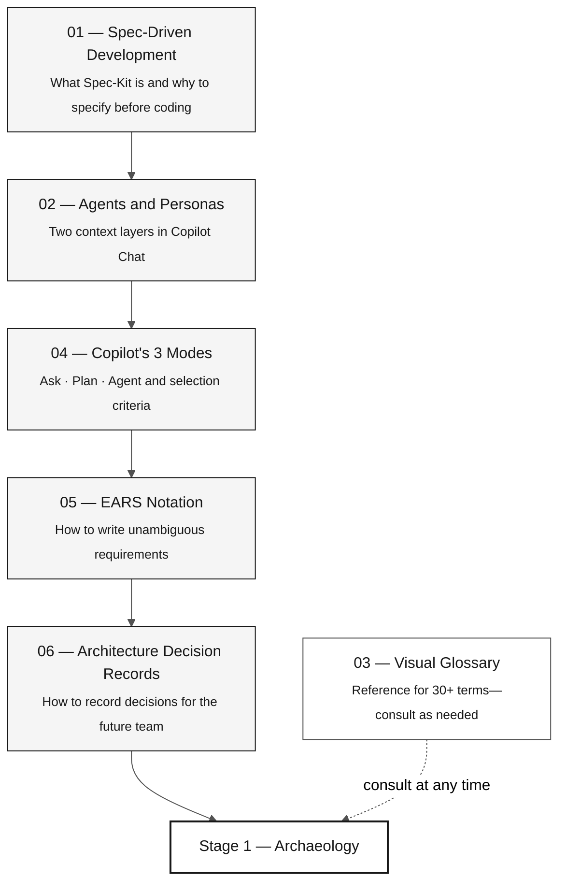

# 07 — Core Workshop Concepts

> **Path:** [Team Kit](../README.md) › **Core Concepts**

**This index introduces the essential concepts for the SIFAP modernization workshop—what you will learn, in what order, how long it takes, and how each concept connects to the four work stages.**

  

| Field | Value |
|---|---|
| **Target audience** | Anyone on the team, including non-developers |
| **Prerequisites** | None—this is the starting point |
| **Estimated time** | 60–90 min to read all documents |
| **Expected outcome** | Shared vocabulary before Stage 1 |

---

## What you will learn

Each file in this folder explains a technical concept directly, using real examples from the SIFAP (Payment Inspection and Administration System) domain: payments, benefits, and inspections. After reading them, you will be able to:

- Explain the Spec-Kit cycle without referring to documentation
- Distinguish a persona kit from a stage agent and know how to combine them in Copilot Chat
- Choose the right Copilot mode (Ask, Plan, or Agent) for each situation
- Write or review an EARS requirement with `source_legacy:`
- Write or evaluate an Architecture Decision Record (ADR)

---

## Learning path

---

## Documents in this folder

| # | Document | Core concept | Main stage |
|---|---|---|---|
| 01 | [Spec-Driven Development](01-spec-driven-development.md) | Spec-Kit cycle: specify → plan → tasks → implement | Stage 2 |
| 02 | [Agents and Personas](02-agents-and-personas.md) | Individual persona kit × shared stage agent | All |
| 03 | [Visual Glossary](03-visual-glossary.md) | 30+ terms with a definition, SIFAP example, and reference | All |
| 04 | [Copilot's 3 Modes](04-3-copilot-modes.md) | Ask · Plan · Agent—criteria and anti-patterns | All |
| 05 | [EARS Notation](05-ears-notation.md) | 6 EARS patterns (5 basic + Complex), REQ-ID, and `source_legacy:` | Stage 2 |
| 06 | [Architecture Decision Records](06-architecture-decision-records.md) | Anatomy, when to write one, and the ADR lifecycle | Stage 2 |

---

## Connection to the four stages

| Stage | Reference documents in this folder |
|---|---|
| Stage 1 — Archaeology | Glossary (legacy terms: Natural, DDM, MU, PE, BR-NNN) |
| Stage 2 — Specification | Spec-Kit, Agents, EARS, ADR, Glossary (EARS, REQ-ID, source_legacy) |
| Stage 3 — Implementation | Copilot's 3 Modes, Glossary (JPA, Flyway, Testcontainers, Controller) |
| Stage 4 — Evolution | Copilot's 3 Modes (Agent mode), Glossary (IaC, Terraform, CI/CD) |

---

## Check before continuing

Before starting Stage 1, confirm that you can answer these questions without referring to documentation:

- [ ] What is Spec-Kit, and what is the `/speckit.specify` command for?
- [ ] What is the difference between a persona kit (in `05-personas/`) and a stage agent (in `06-stage-agents/`)?
- [ ] When should you use Ask instead of Agent in Copilot?
- [ ] What is EARS, and why is the `source_legacy:` field mandatory?
- [ ] What is an ADR, and in what situation would you write one?

If you answered four out of five, continue to [`../05-personas/`](../05-personas/) and read your two `PERSONA.md` files.

---

### Continue reading

| Previous | Next |
|---|---|
| [Team Kit](../README.md) Main workshop hub. | [Spec-Driven Development](01-spec-driven-development.md) Why to specify before coding and how Spec-Kit structures the process. |

[Back to the kit index](../README.md)
