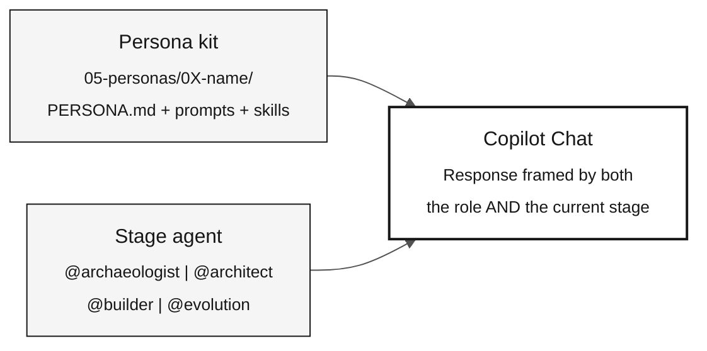

# Agents and Personas — The Two Context Layers

> **Path:** [Team Kit](../README.md) › [Concepts](00-README.md) › **Agents and Personas**

**Copilot Chat operates with two context layers at the same time: the persona, which defines each participant's individual role, and the stage agent, which defines the team's shared framing. Knowing how to combine them is essential for relevant answers during the workshop.**

  

| Field | Value |
|---|---|
| **Target audience** | All personas |
| **Prerequisites** | None—read before Stage 1 |
| **Estimated time** | 20 minutes |
| **Stage** | All stages |
| **Expected outcome** | Know how to select an agent and persona and use them together in Copilot Chat |

---

## Concept

The workshop uses **two types of agents** in Copilot:

- **Persona kit** — individual context loaded by each participant from `05-personas/`. It defines that person's role, skills, and available commands throughout the day.
- **Stage agent** — shared context selected by the whole team at the start of each stage. It defines the thematic framing for the team's Copilot conversations during that work block.

The two layers coexist. You never replace your persona with the stage agent—you use both at the same time.

---

## Why it matters

Without a selected persona, Copilot responds as a generic assistant without considering your role's skills or constraints. Without a stage agent, each team member receives answers framed differently, making consistency impossible.

With both layers active, Copilot simultaneously knows:

- **Who is asking** (role, skills, and available slash commands)
- **What context the team is in** (Stage 1: archaeology; Stage 2: specification; and so on)

---

## How they combine



---

## Layer 1 — Personas (individual kit)

Each participant chooses **two roles** (two personas) and keeps both throughout the workshop. Each persona's files are in [`05-personas/`](../05-personas/) and have already been consolidated under `.github/` at the repository root.

| Persona | Workshop role | Most active stage |
|---|---|---|
| **Product Owner** | Defines scope and validates requirements with the business | Stages 1 and 2 |
| **Requirements Engineer** | Reads the legacy system and converts rules into EARS | Stages 1 and 2 |
| **Enterprise Architect** | Provides the system-wide view (C4 L1 and L2) | Stage 2 |
| **Software Architect** | Defines bounded contexts and API contracts | Stage 2 |
| **Technical Lead** | Leads PR reviews and implementation decisions | Stages 3 and 4 |
| **Developer** | Implements Java and Next.js code | Stage 3 |
| **DBA** | Models data, writes migrations, and optimizes queries | Stage 3 |
| **QA Engineer** | Writes and validates equivalence tests | Stage 3 |
| **DevOps Engineer** | Configures CI/CD, Terraform, and Actions | Stage 4 |
| **Tech Writer** | Documents APIs, ADRs, and runbooks | Stages 2 and 4 |

### What each persona includes

The persona kit contains the following artifacts in `05-personas/0X-name/` and `.github/`:

| Artifact | Location | Purpose |
|---|---|---|
| `PERSONA.md` | `05-personas/0X-name/` | Role profile: responsibilities, deliverables, and slash commands |
| `*.prompt.md` | `.github/prompts/` | Role-specific prompts |
| `SKILL.md` | `.github/skills/*/` | Domain knowledge activated automatically |
| `*.instructions.md` | `.github/instructions/` | Rules applied automatically to specific files |
| `mcp.json` | Repository root | MCP servers available to the role |

> [!IMPORTANT]
> Read both of your `PERSONA.md` files before starting any stage. Slash commands work only when the repository context is loaded in Copilot Chat.

---

## Layer 2 — Stage agents (shared kit)

At the start of each work block, the entire team selects the same stage agent in Copilot Chat. This ensures that everyone receives answers with the same framing.

| Stage | Agent | Thematic framing | Lead roles |
|---|---|---|---|
| Stage 1 — Archaeology | [`@archaeologist`](../06-stage-agents/01-archaeologist/) | Reading and interpreting legacy Natural/Adabas code | Requirements Engineer, Tech Writer |
| Stage 2 — Specification | [`@architect`](../06-stage-agents/02-architect/) | EARS specifications, ADRs, and the C4 model | Enterprise Architect, Software Architect |
| Stage 3 — Implementation | [`@builder`](../06-stage-agents/03-builder/) | Java 21, JPA, Testcontainers, and Next.js 15 code | Developer, DBA, QA Engineer |
| Stage 4 — Evolution | [`@evolution`](../06-stage-agents/04-evolution/) | Delegation to Agent mode, IaC, and CI/CD | DevOps Engineer, Tech Writer |

### Practical difference

| Without a selected stage agent | With a selected stage agent |
|---|---|
| Copilot responds in the repository's general context | Copilot adopts the current stage's framing |
| Each person receives answers with different emphases | The team receives mutually consistent answers |
| It may suggest actions inappropriate for the moment (for example, code in Stage 1) | It remains within the current stage's scope |

---

## How to select them

### Persona

1. Open Copilot Chat in VS Code.
2. Select the agent panel (the icon in the corner of the input field).
3. Choose the persona that matches your role from the dropdown.
4. Confirm it by running a slash command from your `PERSONA.md`. If it works, the persona is active.

### Stage agent

1. At the start of each stage, the facilitator announces which agent the team will use.
2. Each participant selects the agent in Copilot Chat in the same way as the persona.
3. The individual persona remains active—the stage agent is added to the context, not substituted for it.

---

## SIFAP example

**Scenario:** You are the Requirements Engineer in Stage 2. The team has just completed Stage 1.

```
1. The facilitator announces: "Select @architect in chat."

2. You select @architect.
   Result: Copilot Chat now frames responses
   in the specification and architecture context.

3. You use Ask mode for guidance:
   "@architect, what is the recommended order for specifying
   the rules in business-rules-catalog.md?"

4. Based on the response, you run your role's slash command:
   /ears-convert BR-042: <benefit calculation rule>
   Use CALCPGTO.NSN#L120-L198 as source_legacy.

5. The EARS requirement includes a REQ-ID and source_legacy.
   CI validates traceability in the PR.
```

---

## Common mistakes and how to avoid them

| Symptom | Cause | Correction |
|---|---|---|
| Copilot suggests code during Stage 1 | Wrong or missing stage agent | Select `@archaeologist` and confirm with the team |
| Slash command is not recognized | Copilot window opened outside the repository root | Reopen VS Code at the repository root |
| Inconsistent answers across team members | Each person selected a different agent | Confirm the active agent at the start of each stage |
| Stage agent replaced the persona | Selection confusion | The persona and stage agent are independent selections in the panel |

---

## Activation checklist

- [ ] **Read both `PERSONA.md` files assigned to you.** Find them in `05-personas/`.
- [ ] **Test a persona slash command** in Copilot Chat to confirm that it is active.
- [ ] **At the start of each stage, select the correct agent** with the rest of the team.
- [ ] **Confirm the active agent before asking critical technical questions.**

---

## References

- [Complete persona list](../05-personas/OVERVIEW.md)
- [Stage agents](../06-stage-agents/)
- [Copilot's 3 Modes cheat sheet](../09-cheat-sheets/copilot-3-modes.md)

---

### Continue reading

| Previous | Next |
|---|---|
| [Spec-Driven Development](01-spec-driven-development.md)<br/><sub>Why to specify before coding and the Spec-Kit cycle.</sub> | [Visual Glossary](03-visual-glossary.md)<br/><sub>30+ terms with a definition, SIFAP example, and reference.</sub> |

<sub>[Back to the kit index](../README.md)</sub>
