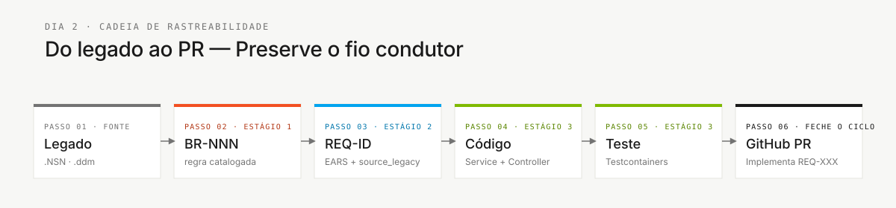

# Glossary — Workshop Jargon Decoded

> **Path:** [Team Kit](../README.md) › [Concepts](00-README.md) › **Visual Glossary**

**A reference for 30+ technical terms used in the SIFAP workshop, organized by area, with a one-sentence definition, a domain example, and a link for further reading.**

 

| Field | Value |
|---|---|
| **Target audience** | Anyone on the team, especially Product Owners, Tech Writers, and analysts |
| **How to use it** | Keep this tab open during the workshop. You do not need to memorize it—refer to it whenever you encounter an unfamiliar term. |

---

## Map by stage

| Stage | Frequently used terms |
|---|---|
| Stage 1 — Archaeology | Natural, NSN, DDM, Adabas, MU, PE, BR-NNN |
| Stage 2 — Specification | EARS, REQ-ID, source_legacy, ADR, C4, bounded context, greenfield, Spec-Kit |
| Stage 3 — Implementation | JPA, Flyway, migration, Testcontainers, controller, service, repository, Bean Validation, Server Component, Swagger |
| Stage 4 — Evolution | Agent, Issue, PR, Terraform, IaC, CI/CD, Actions |

---

## Terminology reference

| Term | Plain-English meaning | Usage context |
|---|---|---|
| handoff | transfer of responsibility | Transition between stages |
| stakeholder | interested or affected party | Product Owner and Requirements Engineer personas |
| backlog | pending work list | Task management in GitHub Projects |
| commit | recorded version | Git version control |
| push | send changes to the remote repository | Git—sharing changes with the team |
| pull request (PR) | proposed change | Code review before merge |
| merge | integrate a branch | Incorporating changes into the main branch |
| code review | peer evaluation of code changes | PR review before merge |
| CI green | successful CI pipeline | All tests passed |
| CI red | failed CI pipeline | At least one test or check failed |
| breaking change | incompatible change | A change that breaks existing API contracts |
| rollback | restore a previous version | Undoing a problematic deployment |
| feature flag | feature on/off switch | Enabling a feature without redeployment |
| deployment | release publication | Making a version available in an environment |
| production | live environment | Environment used by end users |
| staging | preproduction environment | Validation before production |
| sandbox | isolated experimental environment | Testing without risk to the live system |
| bug | software defect | Identified incorrect behavior |
| hotfix | urgent fix | A correction applied directly to production |
| refactor | restructure without changing behavior | Improving code while preserving functionality |
| technical debt | deferred engineering work | Shortcuts that will need to be corrected |
| smoke test | minimal sanity test | Quick check that the system works |
| spike | short technical investigation | Exploring a solution before committing to it |

---

## Area: Legacy

### Adabas

The mainframe database where SIFAP (Payment Inspection and Administration System) has stored data for 29 years. Unlike conventional relational databases, it supports multiple-value fields (MU) and periodic groups (PE). DDMs contain its file definitions. It appears in Stage 1 when inspecting `01-archaeology/legacy-sifap/adabas-ddms/`.

### DDM — Data Definition Module

An Adabas `.ddm` file that describes the structure of a "file" (equivalent to a table): fields, types, sizes, and occurrences. SIFAP example: `BENEFIC.ddm` defines the fields in the Beneficiary file. Location: `01-archaeology/legacy-sifap/adabas-ddms/`.

### MU — Multiple-Value field

An Adabas field that stores multiple values in a single record—for example, a `TELEFONES` field containing up to five phone numbers. The SQL equivalent would be a child table with a foreign key. The team must document in an ADR how to preserve this multiplicity in the modern model.

### Natural (programming language)

A programming language from the 1980s used with Adabas. SIFAP programs are stored in `.NSN` files. It has imperative syntax with `IF`/`END-IF` and `FOR`/`END-FOR`, without object orientation. Reading guide: [`01-archaeology/legacy-sifap/HOW-TO-READ-NATURAL.md`](../01-archaeology/legacy-sifap/HOW-TO-READ-NATURAL.md).

### NSN (`.NSN` file)

The extension for Natural programs. It is equivalent to `.java` or `.py`, but for Natural. SIFAP has 15 `.NSN` programs in `01-archaeology/legacy-sifap/natural-programs/`.

### PE — Periodic Group

An Adabas group of fields that repeats multiple times within the same record—for example, up to 12 monthly payment history entries. It is more complex than MU because each occurrence contains several correlated fields. Mapping it to the modern relational model requires a decision documented in an ADR.

### BR-NNN — Business Rule

The identifier for a business rule extracted from the legacy system during Stage 1 (for example, `BR-042`). It is used in `business-rules-catalog.md`. Without this identifier, the rule cannot be traced to the requirement that implements it.

---

## Area: Requirements

### EARS — Easy Approach to Requirements Syntax

A standardized notation for writing unambiguous requirements. It provides six syntax patterns (ubiquitous, event-driven, state-driven, optional, unwanted, and complex) that replace vague statements with fixed-format sentences and objective tests. See [05 — EARS Notation](05-ears-notation.md) for details.

### REQ-ID

A unique requirement identifier (for example, `REQ-042`). Every Stage 3 commit that implements a requirement must include `Implements REQ-042` in the message. Without a REQ-ID, there is no traceability.

### `source_legacy:`

A mandatory field in every REQ-ID that points to the source section in the legacy system. Format: `01-archaeology/legacy-sifap/natural-programs/CALCDSCT.NSP#L120-L198`. For new functionality, use `[GREENFIELD] <justification>`. If it is missing, CI rejects the change.

### Greenfield

A requirement with no equivalent in the legacy system—a genuinely new feature. It must be documented as `source_legacy: "[GREENFIELD] <reason>"` and justified with the Product Owner.

### Spec-Kit

GitHub's official tool for Spec-Driven Development. It provides the `/speckit.specify`, `/speckit.clarify`, `/speckit.plan`, `/speckit.tasks`, `/speckit.analyze`, and `/speckit.implement` commands in Copilot Chat. See [01 — Spec-Driven Development](01-spec-driven-development.md) for details.

---

## Area: Architecture

### ADR — Architecture Decision Record

A short Markdown file that records an architecture decision: its context, the decision made, alternatives considered, and consequences. It ensures that future team members understand decisions made today. Template: `02-modern-spec/ADR-TEMPLATE.md`. See [06 — Architecture Decision Records](06-architecture-decision-records.md) for details.

### Bounded Context

A clearly delimited system segment with its own vocabulary and rules. In SIFAP, "beneficiary" means different things in the Registration, Calculation, and Inspection contexts. The boundaries are hypotheses that the team validates and documents in an ADR. This concept appears in Stages 2 and 3.

### C4 (C4 model)

An approach to documenting architecture at four zoom levels: System Context (L1), Containers (L2), Components (L3), and Code (L4). The workshop uses only L1 and L2. It appears in Stage 2 as an Enterprise Architect deliverable.

### Modular Monolith

The architecture pattern adopted in this workshop: a single deployable process divided into internal modules with well-defined boundaries. It was selected instead of microservices because it is better suited to the workshop timeframe. Documented in ADR-001.

### Strangler Fig

An incremental migration pattern in which the new system gradually "wraps around" the legacy system, replacing one feature at a time without a big-bang migration. It applies when the workshop produces only part of SIFAP 2.0.

---

## Area: Implementation

### Bean Validation

Java annotations (`@NotNull`, `@Email`, `@Size`, `@Pattern`) that automatically validate input data at the controller layer. They prevent invalid data from reaching business logic.

### Controller

A Java class that receives HTTP requests and returns responses. Its responsibilities are to receive and validate input with `@Valid`, delegate to the service, and return the correct HTTP status. Code location: `infrastructure/`.

### DTO — Data Transfer Object

A Java structure with fields used to carry data through the API, without business logic. In SIFAP, a `BeneficiarioDTO` carries the data needed to create or update a beneficiary without exposing the JPA entity directly.

### Flyway

A database migration tool. It applies versioned SQL scripts in the correct order (`V1__init.sql`, `V2__add_coluna.sql`). Once run, a script is never changed—subsequent changes require a new script. Location: `src/main/resources/db/migration/`.

### JPA — Java Persistence API

The Java standard for mapping classes to database tables. A class annotated with `@Entity` maps to a table; fields annotated with `@Column` map to columns. Hibernate is the implementation used in this workshop.

### JWT — JSON Web Token

An encrypted token issued by the backend after successful authentication. The client sends the JWT with every subsequent request in the `Authorization` header. It authenticates API calls without maintaining server-side sessions.

### Repository (Spring Data)

A Java interface that provides ready-made database read and write methods (`findById`, `save`, `deleteAll`, `findByStatus`). Spring Data JPA implements it automatically. Location: `infrastructure/`.

### Server Component (Next.js)

A React component that runs on the server without sending JavaScript to the user's browser. It is ideal for fetching data and rendering static HTML. Components that need user interaction must be Client Components explicitly marked with `"use client"`.

### Service

A Java class that contains business logic. It sits between the Controller (which receives the request) and the Repository (which accesses the database). Every database transaction must be managed in the service layer with `@Transactional`. Location: `application/`.

### Swagger UI

A web interface generated automatically by SpringDoc that documents and lets users test API endpoints. It is available at `http://localhost:8080/swagger-ui.html` during local development.

### Testcontainers

A Java library that starts a Docker container running a real PostgreSQL instance during tests. It eliminates database mocks and ensures that integration tests reflect real system behavior. Docker must be running.

---

## Area: Operations

### CI/CD — Continuous Integration and Continuous Delivery

CI (Continuous Integration): automatically runs tests on every commit. CD (Continuous Delivery): automatically deploys after CI succeeds. In the workshop, it is configured in `.github/workflows/`. A successful CI pipeline is required before merging into `main`.

### DoD — Definition of Done

A list of verifiable criteria proving that a deliverable is complete. Each stage's `GUIDE.md` ends with that stage's DoD. Finishing the code is not enough—the entire DoD must be checked.

### IaC — Infrastructure as Code

The practice of describing servers, databases, and networks in code files (Terraform) instead of configuring them manually in the Azure portal. It makes infrastructure reproducible and auditable. In the workshop, `.tf` files are created under `infra/` when the team reaches Stage 4.

### Issue (GitHub Issue)

A GitHub ticket describing a task, feature, or defect. In Stage 4, well-written Issues—with context, acceptance criteria, and traceability—are delegated to Copilot Agent mode for automatic PR generation.

### PR — Pull Request

A request to incorporate changes from one branch into the main branch. Every PR requires at least one peer review before merging into `main`. CI must be green before the merge.

### Terraform

An IaC tool that describes Azure infrastructure in `.tf` files. The `terraform plan` command shows what would be created without making changes; `terraform apply` creates the resources. During workshop demonstrations, run only `terraform plan`—never run a real `apply` without approval.

---

## Traceability chain

This chain is what CI verifies in every PR. Whenever you are unsure about what you are doing, return to the previous link in the chain.

---

### Continue reading

| Previous | Next |
|---|---|
| [Agents and Personas](02-agents-and-personas.md) The two context layers in Copilot Chat. | [Copilot's 3 Modes](04-3-copilot-modes.md) Ask, Plan, and Agent—objective selection criteria. |

[Back to the kit index](../README.md)
