# EARS Notation — Unambiguous Requirements

> **Path:** [Team Kit](../README.md) › [Concepts](00-README.md) › **EARS Notation**

**EARS (Easy Approach to Requirements Syntax) is a set of six language patterns that transforms vague requirements into fixed-format statements that can be tested automatically. It is the mandatory notation for all SIFAP 2.0 requirements.**

  

| Field | Value |
|---|---|
| **Target audience** | Requirements Engineer, Software Architect, Product Owner |
| **Prerequisites** | Read the assigned `.NSN` programs and [Spec-Driven Development](01-spec-driven-development.md) |
| **Estimated time** | 25 minutes |
| **Stage** | Stage 2 — Specification |
| **Expected outcome** | Write valid EARS requirements with a REQ-ID and `source_legacy:` |

---

## Concept

A poorly written requirement is the leading cause of rework in modernization projects. Statements such as "the system must be secure" or "process data correctly" do not specify what the system does, when it does it, or how to verify the outcome.

EARS solves this problem with six syntax patterns. Each pattern maps to a type of behavior and produces a statement with an objective test. If you cannot imagine an automated test for a requirement, the requirement is vague.

---

## Why it matters in SIFAP

SIFAP contains 29 years of implicit rules distributed across 15 `.NSN` programs and four DDMs. Without EARS, each team member interprets the rules differently. With EARS, the rule extracted from line 142 of `CALCPGTO.NSN` becomes a single statement with an associated test and traceability to the legacy code that originated it.

---

## Basic requirement structure

Every workshop requirement uses this YAML format:

```yaml
REQ-NNN:
  pattern: <ubiquitous | event-driven | state-driven | optional | unwanted | complex>
  text: "<complete EARS statement>"
  source_legacy: "<path>.NSN#L<start>-L<end>"
  acceptance:
    - "<verifiable criterion 1>"
    - "<verifiable criterion 2>"
```

> [!CAUTION]
> The `source_legacy:` field is mandatory in every requirement. The `legacy-traceability` CI job rejects PRs containing REQ-IDs without this field.

---

## The 5 EARS patterns

### Pattern 1 — Ubiquitous (always applies)

**When to use:** The rule applies at all times without a condition.

**Template:**

```
The system shall <action>.
```

**SIFAP example:**

```yaml
REQ-001:
  pattern: ubiquitous
  text: "The system shall record the date and time of every change to beneficiary records."
  source_legacy: 01-archaeology/legacy-sifap/natural-programs/CADBENEF.NSP#L45-L52
  acceptance:
    - "Every modified beneficiary record contains a modification timestamp"
    - "The timestamp uses the UTC time zone"
```

**Poor example:**

```
The system shall provide complete auditing.
```

Problem: "complete auditing" is not testable.

---

### Pattern 2 — Event-driven (when something happens)

**When to use:** The rule is triggered by a specific event.

**Template:**

```
When <event>, the system shall <action>.
```

**SIFAP example:**

```yaml
REQ-042:
  pattern: event-driven
  text: "When a benefit payment is processed, the system shall calculate the net amount by deducting the current contributions."
  source_legacy: 01-archaeology/legacy-sifap/natural-programs/CALCDSCT.NSP#L120-L198
  acceptance:
    - "Given a beneficiary with a gross amount of R$ 1,000.00 and an 11% contribution rate, the calculated net amount is R$ 890.00"
    - "The result is recorded in the pagamentos table with CALCULATED status"
```

**Poor example:**

```
When there is a payment, process it.
```

Problem: "process" does not describe the expected action.

---

### Pattern 3 — State-driven (while a state persists)

**When to use:** The rule applies while the system or entity is in a particular state.

**Template:**

```
While <state condition>, the system shall <action>.
```

**SIFAP example:**

```yaml
REQ-078:
  pattern: state-driven
  text: "While the beneficiary has SUSPENDED status, the system shall block the processing of new payments for that beneficiary."
  source_legacy: 01-archaeology/legacy-sifap/natural-programs/VALELEG.NSN#L33-L41
  acceptance:
    - "An attempt to process a payment for a SUSPENDED beneficiary returns the BENEFICIARY_SUSPENSO error"
    - "No payment record is created for a SUSPENDED beneficiary"
```

---

### Pattern 4 — Optional (when the user chooses)

**When to use:** The rule applies only when the user has enabled an option or selected a configuration.

**Template:**

```
Where <selected option>, the system shall <action>.
```

**SIFAP example:**

```yaml
REQ-105:
  pattern: optional
  text: "Where the operator selects CSV export, the system shall generate the file with a header in the first row and UTF-8 encoding."
  source_legacy: 01-archaeology/legacy-sifap/natural-programs/BATCHREL.NSP#L201-L215
  acceptance:
    - "The generated file has a .csv extension"
    - "The first row contains the column names"
    - "The content uses UTF-8 encoding"
```

---

### Pattern 5 — Unwanted behavior (what must not happen)

**When to use:** Explicit prohibitions, including security, compliance, or system invariants.

**Template:**

```
The system shall not <prohibited behavior>.
```

**SIFAP example:**

```yaml
REQ-200:
  pattern: unwanted
  text: "The system shall not expose a beneficiary's complete tax ID in API responses—it shall display only the last four digits."
  source_legacy: 01-archaeology/legacy-sifap/natural-programs/CADBENEF.NSP#L88-L90
  acceptance:
    - "Endpoint GET /api/v1/beneficiarios/{id} returns the tax ID in the format ***.***.***-XX"
    - "Application logs never record the tax ID"
```

---

## Pattern 6 — Complex (combination of patterns)

The sixth EARS pattern combines state, event, and option conditions in a single requirement. It is consistent with the terminology in [`09-cheat-sheets/spec-kit-workflow.md`](../09-cheat-sheets/spec-kit-workflow.md), which lists all six EARS patterns.

**Template:**

```
While <state>, when <event>, where <option>, the system shall <action>.
```

**SIFAP example:**

```yaml
REQ-250:
  pattern: complex
  text: "While the beneficiary has ACTIVE status, when a new payment is processed, where the selected method is account credit, the system shall record the bank account number in the payment history."
  source_legacy: 01-archaeology/legacy-sifap/natural-programs/VALELEG.NSN#L55-L72
  acceptance:
    - "An ACTIVE beneficiary payment using account credit records the bank account in the history"
    - "A payment for a SUSPENDED beneficiary does not trigger this flow"
```

> [!TIP]
> Use the Complex pattern sparingly. If a requirement combines no more than two conditions without losing clarity, Complex may be appropriate. If it is difficult to read, split it into two REQ-IDs.

---

## From an EARS requirement to a test

```mermaid
%%{init: {'theme':'neutral','themeVariables':{'fontFamily':'ui-sans-serif, system-ui, sans-serif','primaryColor':'#F5F5F5','primaryTextColor':'#171717','primaryBorderColor':'#171717','lineColor':'#525252','secondaryColor':'#FFFFFF','tertiaryColor':'#FAFAFA','background':'#FFFFFF'}}}%%
flowchart LR
    classDef step fill:#F5F5F5,stroke:#171717,color:#171717
    classDef gate fill:#FFFFFF,stroke:#171717,color:#171717,stroke-width:2px
    classDef muted fill:#FAFAFA,stroke:#A3A3A3,color:#404040

    A["Legacy rule<br/><sub>.NSN or .ddm</sub>"]:::muted
    B["BR-NNN<br/><sub>business-rules-catalog.md</sub>"]:::step
    C["REQ-NNN (EARS)<br/><sub>pattern + text + source_legacy</sub>"]:::step
    D["Acceptance criteria<br/><sub>acceptance: [...]</sub>"]:::step
    E["Automated test<br/><sub>JUnit 5 + Testcontainers</sub>"]:::step
    F["Green CI<br/><sub>legacy-traceability passed</sub>"]:::gate

    A --> B --> C --> D --> E --> F
```



---

## The mirror test

Before considering an EARS requirement complete, ask:

> "How would I test this automatically?"

If the answer is vague or nonexistent, the requirement is incomplete.

| Vague requirement | Testable requirement |
|---|---|
| The system shall be secure | The system shall not expose a complete tax ID in API responses |
| Process data | When a payment is processed, calculate the net amount according to formula X |
| Complete auditing | When a beneficiary is changed, record the operator, date, previous values, and new values |
| Work well | When a request is received, respond within two seconds under normal load |

---

## EARS validation checklist

- [ ] **Unique identifier.** The REQ-ID exists and follows the `REQ-NNN` format.
- [ ] **Correct pattern.** The pattern declared in `pattern:` matches the text structure.
- [ ] **Unambiguous text.** It does not use "appropriate," "efficient," "complete," or "secure" without a quantitative definition.
- [ ] **Completed `source_legacy:`.** It points to a specific file and lines or declares `[GREENFIELD]` with a justification.
- [ ] **Verifiable acceptance criteria.** Every `acceptance:` item describes a scenario with input, action, and expected result.
- [ ] **Test can be imagined.** An automated test can be described for every acceptance criterion.
- [ ] **Appropriate size.** If the requirement covers more than one distinct behavior, split it into two REQ-IDs.

---

## Common mistakes and how to avoid them

| Symptom | Cause | Correction |
|---|---|---|
| Unsure which pattern to use | The rule has not yet been categorized | Start with event-driven (`When…`)—it covers 60% of cases |
| Cannot find `source_legacy:` | Requirement written from memory | Return to the `.NSN` and locate the section. Without evidence, there is no requirement. |
| Requirement is three paragraphs long | It contains two or more distinct requirements | Split it. One REQ-ID = one atomic behavior. |
| Team cannot agree on the text | Ambiguity in the legacy system | Run `/speckit.clarify` and record the decision in an ADR. |

---

## Useful prompts in Copilot Chat

```text
# Convert a catalog rule to EARS
/ears-convert BR-042: <text of the rule confirmed by the team>.
Use CALCPGTO.NSN#L120-L198 as source_legacy.

# Validate a written EARS requirement
"@architect, is this EARS requirement testable? How would you write the test?
REQ-042: <requirement text>"

# Identify coverage gaps
/speckit.analyze
Which confirmed catalog rules do not yet have a REQ-ID?
```

---

## References

- [Stage 2 Guide](../02-modern-spec/GUIDE.md)
- [Spec-Kit cheat sheet](../09-cheat-sheets/spec-kit-workflow.md)
- [LEGACY-EXPLORATION-CHECKLIST](../01-archaeology/LEGACY-EXPLORATION-CHECKLIST.md)

---

### Continue reading

| Previous | Next |
|---|---|
| [Copilot's 3 Modes](04-3-copilot-modes.md)<br/><sub>Ask, Plan, and Agent—selection criteria.</sub> | [Architecture Decision Records](06-architecture-decision-records.md)<br/><sub>How to record decisions for the future team.</sub> |

<sub>[Back to the kit index](../README.md)</sub>
