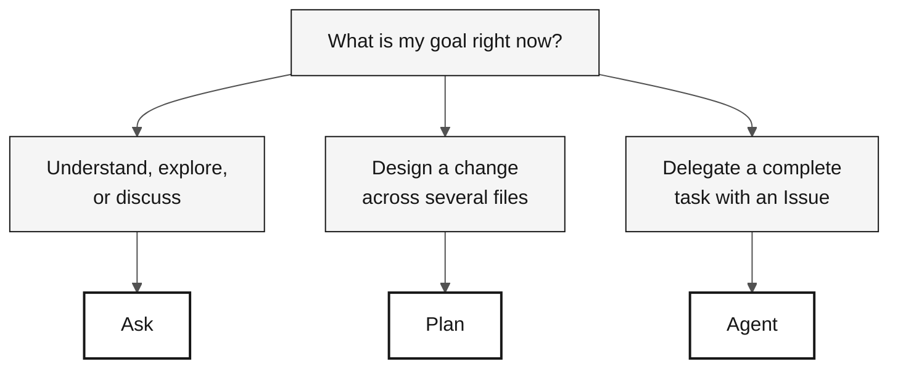

# GitHub Copilot in 3 Modes — Reference Card

> **Path:** [Team Kit](../README.md) › [Reference Cards](README.md) › **Copilot's 3 Modes**

**Choose the right Copilot mode before opening chat: Ask to explore, Plan to design changes, and Agent to delegate complete tasks.**

| Field | Value |
|---|---|
| **Target audience** | Any team member before starting a conversation with Copilot |
| **Prerequisites** | GitHub Copilot active in VS Code |
| **Estimated time** | 2 min |
| **Stage** | All |
| **Expected outcome** | Know which mode to use for the current situation |

---

## What are Copilot's 3 modes?

GitHub Copilot Chat operates in three distinct modes with different levels of autonomy and context cost:

- **Ask** — conversational mode. You ask; Copilot answers. It does not change files automatically. Ideal for understanding, exploring, and discussing.
- **Plan** — planning mode. Copilot proposes a change plan with explicit scope, files, and sequence. You validate it before execution.
- **Agent** — autonomous mode. Copilot receives a complete task, typically through an Issue, and works independently until it produces a PR. You review the result.

**Why this matters in the SIFAP workshop:** The wrong mode wastes time. Using Ask for a multi-file implementation can take hours; using Agent for a five-minute task is wasteful. The table below resolves this choice in seconds.

---

## Quick decision table

| Situation | Mode | Why |
|---|---|---|
| Understand legacy Natural/Adabas code | **Ask** | Conversational, low cost, reversible |
| Discuss design or a trade-off | **Ask** | Exploratory, without committing file changes |
| Evaluate an ADR before recording it | **Ask** | Feedback before deciding |
| Design a change across several files | **Plan** | Explicit plan with clear scope and sequence |
| List required tests before implementation | **Plan** | Visible scope before execution |
| Delegate a well-described Issue (issue → PR) | **Agent** | Works independently; you review at the end |
| Automate a long CI/IaC chain | **Agent** | Repetitive task with clear criteria |

---

## Visual decision flow

---

## Ask — Question and explore

**Use it when** you do not yet know exactly what you want, or when you want to understand, discuss, or evaluate a trade-off.

**Examples in the SIFAP context:**

- `"Explain what this Natural program does line by line."`
- `"What are the risks of using JSONB to store bank account history?"`
- `"Summarize this DDM in five lines for someone unfamiliar with Adabas."`
- `"Challenge this ADR: {paste the ADR}."`

**Common mistakes:**

- Using Ask to make changes across several files—use Plan or Agent.
- Accepting an answer without validation—Copilot can hallucinate; verify it.
- Writing a prompt that is too short ("help")—provide context: what you have, what you want, and what you have tried.

---

## Plan — Plan changes

**Use it when** you know what you want, need to involve several files, and want to validate scope, sequence, and risks before execution.

**Examples in the SIFAP context:**

- `"Plan the creation of the <feature> module using the package structure agreed by the team."`
- `"List the tests required for every public method in <Service> before implementation."`
- `"Plan the project-wide rename from <legacy-term> to <modern-term> in a safe order."`
- `"Review the existing Flyway migrations and propose a sequence for adding documented rollback."`

**Common mistakes:**

- Scope is too broad—split it into smaller stages.
- Failing to review the plan before execution—adjust it before authorizing.
- Mixing logic changes with renames—one PR per purpose.

---

## Agent — Autonomous delegation

**Use it when** you have a well-described Issue, accept that the task will take time, and are prepared to review an autonomously generated PR.

**How to prepare the Issue:**

- [ ] **Write the context**—what exists today and what should exist afterward.
- [ ] **Define acceptance criteria**—the expected verifiable behavior.
- [ ] **Set boundaries**—what Agent should and should NOT change.
- [ ] **Identify relevant files**—`"read docs/adr/001.md before starting"`.

**Monitoring:** Do not interfere while Agent is running. Let it finish. Check progress every 10 minutes if needed.

**Reviewing Agent's PR:** Review it exactly as you would a human PR. A fast review is still a review.

**Common mistakes:**

- Vague Issue—Agent delivers an out-of-scope result.
- Starting Agent for a five-minute task that Ask or Plan could handle.
- Merging without review because the PR was generated automatically.

---

## Modes by persona

| Persona | Primary mode | Secondary mode |
|---|---|---|
| Product Owner | Ask (refine stories) | Plan (prioritize scope) |
| Requirements Engineer | Ask (validate EARS) | Plan (organize requirements) |
| Software Architect | Ask (select a pattern) | Plan (design a module) |
| Developer | Plan (multi-file changes) | Ask, Agent |
| QA Engineer | Plan (coverage and scenarios) | Ask (discuss gaps) |
| DevOps Engineer | Agent (long CI chains) | Plan (Terraform) |
| Tech Writer | Ask (style review) | Plan (restructure an ADR) |

---

> [!TIP]
> **Rule of thumb.** If you did not know AI generated the code, would you accept it into your project? If not, reject or refine it. Copilot accelerates knowledgeable people; it does not replace judgment.

---

### Continue reading

| Previous | Next |
|---|---|
| [Reference Cards](README.md) Index of the three quick reference cards. | [Spec-Kit on 1 Page](spec-kit-workflow.md) Sequence: specify — clarify — plan — tasks — analyze. |

[Back to the kit index](../README.md)
