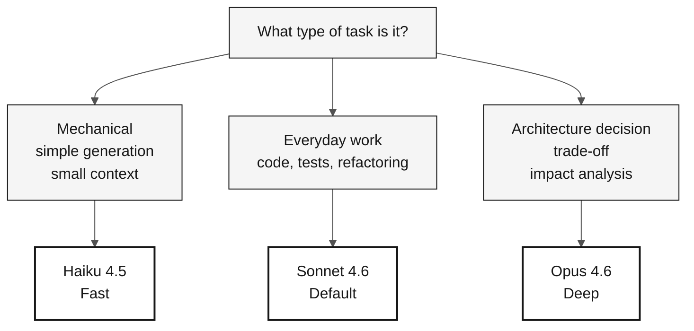

# Claude Model Routing — Reference Card

> **Path:** [Team Kit](../README.md) › [Reference Cards](README.md) › **Model Routing**

**Use the smallest model that can solve your task: Haiku for mechanical generation, Sonnet for everyday work, and Opus for project-wide architecture decisions.**

| Field | Value |
|---|---|
| **Target audience** | Any team member before sending a prompt to Copilot |
| **Prerequisites** | None |
| **Estimated time** | 2 min |
| **Stage** | All |
| **Expected outcome** | Choose the right model without wasting time or cost |

---

## Principle: the smallest sufficient model

A larger model means more capability and more latency. Switching models is less costly than waiting 30 seconds for the wrong one.

> [!IMPORTANT]
> Using Opus for a mechanical task wastes time. Using Haiku for an architecture decision creates risk. Choose by task type, not model prestige.

---

## Quick decision table

| Task type | Model | When to use |
|---|---|---|
| Mechanical generation, simple transformation, small context | **Haiku 4.5** | Generate repetitive DDL, write a simple unit test, adjust trivial YAML |
| Code, tests, refactoring, everyday explanation | **Sonnet 4.6** | Default for most workshop tasks |
| Architecture decision, impact analysis, trade-off | **Opus 4.6** | Pattern selection, bounded-context definition, risk analysis |

---

## Visual decision flow

---

## The three models

| Model | Relative cost | Speed | When to use |
|---|---|---|---|
| **Haiku 4.5** | Low | Fast | Mechanical task, simple transformation, small context |
| **Sonnet 4.6** | Medium | Medium | Everyday default: code, tests, refactoring, explanation |
| **Opus 4.6** | High | Slow | Architecture decision, impact analysis, trade-off discussion |

---

## Routing by persona and situation

### Product Owner and Requirements Engineer

| Situation | Model |
|---|---|
| Write a user story | Sonnet |
| Refine existing EARS requirements | Haiku |
| Decide whether a requirement belongs in v1 or v2 | Opus (once; decide and move forward) |

### Architects (Enterprise + Software)

| Situation | Model |
|---|---|
| Draw a C4 diagram in Mermaid | Sonnet |
| Choose between patterns (hexagonal vs. layered) | Opus |
| Generate a syntax variation of an existing diagram | Haiku |

### Technical Lead

| Situation | Model |
|---|---|
| Review a medium-sized PR | Sonnet |
| Decide a project-wide pattern | Opus initially; Sonnet to apply it |
| Check whether a snippet compiles | Haiku |

### Developer

| Situation | Model |
|---|---|
| Implement a service | Sonnet |
| Write a simple unit test | Haiku |
| Discuss class structure before writing code | Opus |

### DBA

| Situation | Model |
|---|---|
| Translate an Adabas DDM to SQL | Sonnet (Opus for complex cases) |
| Generate repetitive DDL | Haiku |
| Decide a partitioning strategy | Opus |

### QA Engineer

| Situation | Model |
|---|---|
| Generate a JUnit 5 skeleton | Haiku |
| Write a nontrivial integration test | Sonnet |
| Choose between Testcontainers and a mock | Opus |

### DevOps Engineer

| Situation | Model |
|---|---|
| Generate standard GitHub Actions YAML | Sonnet |
| Adjust trivial pipeline commands | Haiku |
| Decide the Azure topology | Opus |

### Tech Writer

| Situation | Model |
|---|---|
| Review README style | Haiku |
| Draft an ADR | Sonnet |
| Decide the overall documentation structure | Opus, once |

---

## Signs that you are using the wrong model

| Symptom | Diagnosis | Action |
|---|---|---|
| Waiting 30 seconds for a trivial response | Model is larger than necessary | Switch to a smaller model |
| Shallow response to a critical decision | Model is smaller than necessary | Move up to Opus |
| Correct response without discussion | Model is smaller than necessary | Move up to Opus |
| Stacking prompts to generate hundreds of files | Wrong model for a batch task | Switch to Sonnet or Haiku |

---

### Continue reading

| Previous | Next |
|---|---|
| [Spec-Kit on 1 Page](spec-kit-workflow.md) Sequence: specify — clarify — plan — tasks — analyze. | [Reference Cards](README.md) Index of the three quick reference cards. |

[Back to the kit index](../README.md)
