# Spec-Kit — Reference Card

> **Path:** [Team Kit](../README.md) › [Reference Cards](README.md) › **Spec-Kit Workflow**

**Spec-Kit is GitHub's official tool for Spec-Driven Development. It enforces the `specify → clarify → plan → tasks → implement` sequence and prevents the team from skipping directly to code without a specification.**

| Field | Value |
|---|---|
| **Target audience** | Requirements Engineers and Software Architects during Stage 2 |
| **Prerequisites** | Spec-Kit installed (`uv tool install specify-cli`) and `specify init` completed |
| **Estimated time** | 2 min to consult; applied throughout Stage 2 |
| **Stage** | Stage 2 — Specification (and Stage 3 for `/speckit.implement`) |
| **Expected outcome** | `spec.md`, `plan.md`, and `tasks.md` in `specs/<NNN>-<feature>/` |


> Official repository: <https://github.com/github/spec-kit>

---

## What Spec-Kit is and why it exists

Spec-Kit (Specify CLI) is a command-line tool and set of Copilot slash commands that implements the Spec-Driven Development (SDD) workflow. SDD is the practice of writing a feature's complete specification—including acceptance criteria and traceability—before writing any code.

**Why this matters in SIFAP:** Every business rule in the legacy Natural/Adabas system must be traceable from legacy code to a modern requirement. Without Spec-Kit, that traceability is lost in chat conversations. With it, every requirement includes `source_legacy:` pointing to the original code file and line.

---

## Canonical workflow

```mermaid
%%{init: {'theme':'neutral','themeVariables':{'fontFamily':'ui-sans-serif, system-ui, sans-serif','primaryColor':'#F5F5F5','primaryTextColor':'#171717','primaryBorderColor':'#171717','lineColor':'#525252','secondaryColor':'#FFFFFF','tertiaryColor':'#FAFAFA','background':'#FFFFFF'}}}%%
flowchart LR
    classDef step fill:#F5F5F5,stroke:#171717,color:#171717
    classDef result fill:#FFFFFF,stroke:#171717,color:#171717,stroke-width:2px

    P0["Constitution"]:::step --> P1["Specify"]:::step --> P2["Clarify"]:::step
    P2 --> P3["Plan"]:::step --> P4["Tasks"]:::step --> P5["Analyze"]:::step
    P5 --> P6["Implement"]:::result
```



| Point in time | Command | Expected deliverable |
|---|---|---|
| Before the first feature | `/speckit.constitution` | `.specify/memory/constitution.md` |
| Stage 2 | `/speckit.specify` | `specs/<NNN>-<feature>/spec.md` |
| Stage 2 | `/speckit.clarify` | Questions resolved in the spec |
| Stage 2 | `/speckit.plan` | `specs/<NNN>-<feature>/plan.md` |
| Stage 2 | `/speckit.tasks` | `specs/<NNN>-<feature>/tasks.md` |
| Stage 3 | `/speckit.analyze` | Gaps and inconsistencies identified before coding |
| Stage 3 | `/speckit.implement` | Code guided by spec + plan + tasks |

---

## Executable walkthrough

- [ ] **Name the feature.** Use the `NNN-feature-name` format.
- [ ] **Create the spec with `/speckit.specify`.** Include user stories, acceptance criteria, and `source_legacy:`.
- [ ] **Resolve questions with `/speckit.clarify`.** Do not continue with ambiguous fields, rules, or flows.
- [ ] **Generate the technical plan with `/speckit.plan`.** The plan must identify modules, contracts, data, and risks.
- [ ] **Break the plan into tasks with `/speckit.tasks`.** A good task is small, testable, and has a clear owner.
- [ ] **Check consistency with `/speckit.analyze`.** Correct gaps before implementation.
- [ ] **Implement with `/speckit.implement`.** The code must follow `spec.md`, `plan.md`, and `tasks.md`.

---

## Main Copilot commands

| Command | Use |
|---|---|
| `/speckit.constitution` | Creates or updates project principles and rules |
| `/speckit.specify` | Creates the feature spec with user stories and criteria |
| `/speckit.plan` | Generates the technical plan from the spec |
| `/speckit.tasks` | Breaks the plan into implementable tasks |
| `/speckit.implement` | Executes the implementation tasks |

## Useful optional commands

| Command | Use |
|---|---|
| `/speckit.clarify` | Resolves ambiguities before the technical plan |
| `/speckit.analyze` | Analyzes consistency and coverage across artifacts |
| `/speckit.checklist` | Generates a quality checklist for the spec |
| `/speckit.taskstoissues` | Converts tasks into GitHub Issues |

---

## The 6 EARS patterns

EARS (Easy Approach to Requirements Syntax) is a standardized notation for writing verifiable requirements. Each pattern defines a grammatical structure that Copilot can recognize and validate.

| # | Pattern | Template | Syntax example |
|---|---|---|---|
| 1 | Ubiquitous | The system shall `[action]` | The system shall `<verifiable action>` |
| 2 | Event-Driven | When `[X]`, the system shall `[action]` | When `<event>`, the system shall `<action>` |
| 3 | State-Driven | While `[X]`, the system shall `[action]` | While `<state>`, the system shall `<action>` |
| 4 | Optional | Where `[choice]`, the system shall `[action]` | Where `<option>`, the system shall `<action>` |
| 5 | Unwanted | The system shall not `[action]` | The system shall not `<prohibited behavior>` |
| 6 | Complex | While `[X]`, when `[Y]`, where `[Z]`, the system shall `[action]` | Combination of patterns 2, 3, and 4 |

---

## Minimum SIFAP requirement structure

```yaml
REQ-XXX:
  pattern: <EARS pattern>
  text: "<requirement>"
  source_legacy: <file:lines or [GREENFIELD] + justification>
  acceptance: "<verifiable scenario>"
```

> [!WARNING]
> A requirement without `source_legacy:` is not ready for `/speckit.plan`. The `legacy-traceability` CI job rejects PRs that violate this rule.

---

## Installation and initialization

```bash
uv tool install specify-cli --from git+https://github.com/github/spec-kit.git@vX.Y.Z
specify version
```

Replace `vX.Y.Z` with the latest version from <https://github.com/github/spec-kit/releases>.

```bash
specify init . --integration copilot
```

On macOS/Linux, scripts are stored in `.specify/scripts/bash/`. Features generated by the commands are stored in `specs/<NNN>-<feature>/`.

> [!NOTE]
> If the `/speckit.*` commands do not appear in Copilot Chat, run `specify init . --integration copilot` again and reload VS Code.

---

## How to adapt it to SIFAP

- Include `source_legacy:` in every requirement derived from an `.NSN` or `.ddm` file.
- Use `[GREENFIELD]` only when there is no legacy equivalent, and justify the decision.
- Before `/speckit.plan`, validate the scope with the Product Owner and Software Architect.
- Before `/speckit.implement`, confirm that `tasks.md` places tests before code whenever the change affects a business rule.

---

## References

- [Spec-Kit on GitHub](https://github.com/github/spec-kit)
- [Official documentation](https://github.github.io/spec-kit/)
- [Installation guide](https://github.com/github/spec-kit/blob/main/docs/installation.md)
- [Spec-Driven Development](../07-concepts/01-spec-driven-development.md)

---

### Continue reading

| Previous | Next |
|---|---|
| [Copilot in 3 Modes](copilot-3-modes.md)<br/><sub>When to use Ask, Plan, or Agent.</sub> | [Model Routing](model-routing.md)<br/><sub>When to use Haiku, Sonnet, or Opus.</sub> |

<sub>[Back to the kit index](../README.md)</sub>
