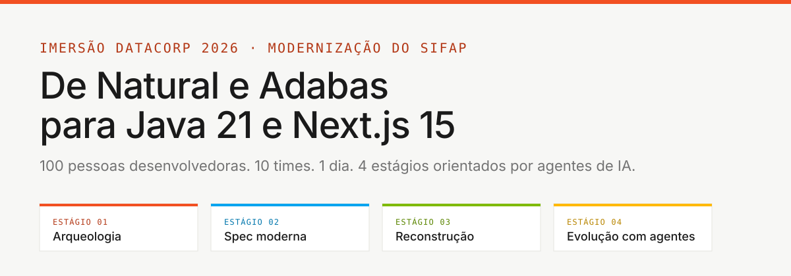
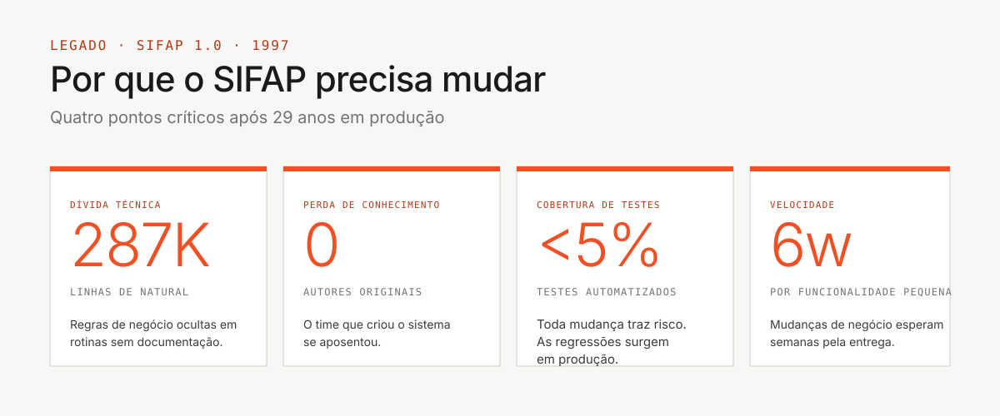

# Team kit: SIFAP 2.0 workshop

> **Track:** **Team kit** (you are here)

Start at [`00-START-HERE.md`](00-START-HERE.md).

## Repository languages

**`main` is always the English edition and the default branch.** Brazilian Portuguese lives on `portugues-br`, and Spanish on `espanol`.

| Language | Branch | Documentation | Clone |
|---|---|---|---|
| **English** | [`main`](https://github.com/workshop-gbb/datacorp-sifap-modernization-team-kit/tree/main) | [Start here](00-START-HERE.md) · [Documentation index](docs/README.md) · [Copilot instructions](.github/copilot-instructions.md) | `git clone --branch main https://github.com/workshop-gbb/datacorp-sifap-modernization-team-kit.git` |
| **Português (BR)** | [`portugues-br`](https://github.com/workshop-gbb/datacorp-sifap-modernization-team-kit/tree/portugues-br) | [Start here (pt-BR)](https://github.com/workshop-gbb/datacorp-sifap-modernization-team-kit/blob/portugues-br/00-START-HERE.md) · [Documentation index (pt-BR)](https://github.com/workshop-gbb/datacorp-sifap-modernization-team-kit/blob/portugues-br/docs/README.md) · [Copilot instructions (pt-BR)](https://github.com/workshop-gbb/datacorp-sifap-modernization-team-kit/blob/portugues-br/.github/copilot-instructions.md) | `git clone --branch portugues-br https://github.com/workshop-gbb/datacorp-sifap-modernization-team-kit.git` |
| **Español** | [`espanol`](https://github.com/workshop-gbb/datacorp-sifap-modernization-team-kit/tree/espanol) | [Start here (ES)](https://github.com/workshop-gbb/datacorp-sifap-modernization-team-kit/blob/espanol/00-START-HERE.md) · [Documentation index (ES)](https://github.com/workshop-gbb/datacorp-sifap-modernization-team-kit/blob/espanol/docs/README.md) · [Copilot instructions (ES)](https://github.com/workshop-gbb/datacorp-sifap-modernization-team-kit/blob/espanol/.github/copilot-instructions.md) | `git clone --branch espanol https://github.com/workshop-gbb/datacorp-sifap-modernization-team-kit.git` |

**Read the complete kit on the website:** [EN](https://workshop-gbb.github.io/datacorp-sifap-modernization-team-kit/en/) · [ES](https://workshop-gbb.github.io/datacorp-sifap-modernization-team-kit/es/) · [PT-BR](https://workshop-gbb.github.io/datacorp-sifap-modernization-team-kit/pt-br/).
The portal includes every Markdown document in full, a searchable file catalog, original downloads and links back to the repository. You can follow the same instructions in either place.

- Keep documentation and all Copilot primitive prose on `main` and `develop` in English, regardless of the conversation language.
- Keep Brazilian Portuguese documentation and Copilot primitive prose on `portugues-br`; do not merge the translated documentation tree into `main`.
- Keep Spanish documentation and Copilot primitive prose on `espanol`; translations never replace English on `main` or `develop`.
- Preserve file names, paths, technical identifiers, and original Natural/Adabas sources when translating.
- Add other languages to this table only after their branches exist. Native language names are allowed in the English language selector.

Relative links keep you on the selected branch. Use the table above to change the documentation language.

---



**The mission in one sentence:** you and four teammates have **eight hours** to modernize the 29-year-old **Payment Inspection and Administration System (SIFAP)**, moving from legacy Natural/Adabas to Java 21 + Next.js 15, with full traceability from the modern code back to the original business rules.

  

---

## Where to start (choose your profile)

| I am... | Start here |
|---|---|
| **First time here or non-technical profile** | [`00-START-HERE.md`](00-START-HERE.md) - 15 guided minutes |
| **Developer, I want the schedule** | [`00-TEAM-FLOW.md`](00-TEAM-FLOW.md) - 10 minutes |
| **I want to understand the concepts first** | [`07-concepts/`](07-concepts/) - core concepts |
| **I want to set up my environment** | [`00-SETUP.md`](00-SETUP.md) - laptop + Copilot |
| **How does Git work in this workshop?** | [`00-GIT-WORKFLOW.md`](00-GIT-WORKFLOW.md) - one branch per persona |
| **Something went wrong** | [`docs/troubleshooting.md`](docs/troubleshooting.md) |
| **I am the team lead** | [`docs/CHECKLIST-LIDER.md`](docs/CHECKLIST-LIDER.md) - hour by hour |
| **I want to avoid common mistakes** | [`docs/lessons-learned.md`](docs/lessons-learned.md) |
| **I will give the demo** | [`docs/demo-script.md`](docs/demo-script.md) |
| **I want to see the day's progress** | [`docs/STATUS.md`](docs/STATUS.md) |

---

## View the live legacy system

SIFAP is not only reading material. A shared environment runs the real Natural/Adabas system with synthetic data. Participants receive **viewer-only** access to the beneficiary query screen; deployment and administration are outside the team exercise.

| What | Where |
|---|---|
| **Viewer terminal** | <https://sifap-lab-438k30.eastus2.cloudapp.azure.com/terminal/> |
| **Username** | `viewer` |
| **Password** | Shared privately by the facilitator; never committed |
| **Allowed** | Query beneficiary data in the generated read-only `VIEWBENF` screen |
| **Not allowed** | Adabas administration, Natural command line, registration, batch jobs, or infrastructure access |

> [!IMPORTANT]
> Use only the viewer credential. The environment is shared, holds synthetic data, and is managed outside this public repository. If the URL does not answer, ask the facilitator; do not try to deploy or repair the lab.

Full access instructions: [`docs/legacy-system-access.md`](docs/legacy-system-access.md).

---

## How the workshop is organized

The workshop has **four sequential stages** and **five persona pairs** that work in parallel inside each stage. The final goal is a working SIFAP 2.0 demo.

```mermaid
%%{init: {'theme':'neutral','themeVariables':{'fontFamily':'ui-sans-serif, system-ui, sans-serif','primaryColor':'#F5F5F5','primaryTextColor':'#171717','primaryBorderColor':'#171717','lineColor':'#525252','secondaryColor':'#FFFFFF','tertiaryColor':'#FAFAFA','background':'#FFFFFF'}}}%%
flowchart LR
    classDef step fill:#F5F5F5,stroke:#171717,color:#171717
    classDef handoff fill:#FFFFFF,stroke:#525252,color:#171717
    classDef result fill:#FFFFFF,stroke:#171717,color:#171717,stroke-width:2px

    E1["Stage 1<br/>Archaeology<br/>@archaeologist"]:::step
    H1["Handoff H1<br/>5 min sync"]:::handoff
    E2["Stage 2<br/>Specification<br/>@architect"]:::step
    H2["Handoff H2<br/>5 min sync"]:::handoff
    E3["Stage 3<br/>Implementation<br/>@builder"]:::step
    H3["Handoff H3<br/>5 min sync"]:::handoff
    E4["Stage 4<br/>Evolution<br/>@evolution"]:::step
    R["SIFAP 2.0<br/>running"]:::result

    E1 --> H1 --> E2 --> H2 --> E3 --> H3 --> E4 --> R
```



- **Five people** = five persona pairs, each pair co-owns two SDLC roles
- **Four stages** = each stage has a dedicated Copilot agent
- **Handoffs (H1, H2, H3)** = a five-minute sync between the pair leaving the stage and the pair entering it
- **CI green** = a passing integration pipeline validates every Pull Request
- **Final goal** = a live demo of SIFAP 2.0

---

## Kit structure (recommended reading order)

```text
workspace/
├── README.md                            <- you are here
├── 00-START-HERE.md                     <- 15 min for anyone
├── 00-SETUP.md                          <- set up laptop + Copilot
├── 00-TEAM-FLOW.md                      <- canonical schedule for the day
├── 00-SITEMAP.md                        <- visual map of the kit
├── 00-GIT-WORKFLOW.md                   <- branches, PRs, merges
│
├── 01-archaeology/                      STAGE 1 - read legacy SIFAP
│   ├── GUIDE.md                         (stage walkthrough)
│   ├── LEGACY-EXPLORATION-CHECKLIST.md  (required gate before Stage 2)
│   └── legacy-sifap/                    (24 Natural members + 4 DDMs + 1 FDT)
├── 02-modern-spec/                      STAGE 2 - write EARS, ADRs, C4
├── 03-implementation/                   STAGE 3 - Java + Next.js + tests
├── 04-evolution/                        STAGE 4 - Agent mode + Terraform
│
├── 05-personas/                         10 personas (pick 2 = your pair)
├── 06-stage-agents/                     4 Copilot agents (1 per stage)
├── 07-concepts/                         core concepts (EARS, ADR, SDD, agents)
├── 09-cheat-sheets/                     3 quick reference cards
│
├── docs/                                viewer access, FAQ, troubleshooting, ADRs
├── assets/                              SVGs and diagrams
└── specs/                               Spec-Kit artifacts created by the team
```

---

## The five pairs (choose yours)

Each person takes **one pair** (two personas) and keeps it all day.

| Pair | Personas | SDLC phase |
|---|---|---|
| **1 - Vision** | Product Owner + Requirements Engineer | Discovery + Specification |
| **2 - Architecture** | Enterprise Architect + Software Architect | Specification + Design |
| **3 - Implementation** | Technical Lead + Developer | Implementation + Evolution |
| **4 - Quality** | DBA + QA Engineer | Implementation (data + tests) |
| **5 - Operations** | DevOps Engineer + Tech Writer | Cross-cutting + Evolution |

Details for each role: [`05-personas/OVERVIEW.md`](05-personas/OVERVIEW.md)

---

## Approved tools: use only these

> [!IMPORTANT]
> The workshop runs on a fixed stack. Mixing alternative tools fragments the team and breaks traceability from spec to code to tests.

| Use | Do not use |
|---|---|
| **VS Code** (or Insiders) | Cursor, Windsurf, IntelliJ, Eclipse |
| **GitHub Copilot** (Ask + Plan + Agent) | Cline, Continue, Aider, Codeium, Tabnine |
| **GitHub Copilot CLI** (optional) | Web chat UIs for code generation |
| **Official Spec-Kit** (`Specify CLI`) | Kiro, alternative SDD frameworks |
| **GitHub** (Issues, PRs, Actions) | - |
| **Docker / Docker Compose** | Legacy containerization from another repository |
| **Terraform** (Azure provider) | `terraform apply` without review (use only `plan` until Stage 4) |

The full rationale and the CI checks: [`.github/copilot-instructions.md`](.github/copilot-instructions.md)

---

## Two agent layers, both required

The kit includes **two layers** that cover different axes (role x stage). Use both.

| Layer | What it is | When to load it | How to use it |
|---|---|---|---|
| [`05-personas/`](05-personas/) | Your persona kit (responsibilities, prompts, skills) | Once during setup | Read your two `PERSONA.md` files; agents/prompts/skills are already consolidated in `.github/` |
| [`06-stage-agents/`](06-stage-agents/) | The current stage agent (`@archaeologist` -> `@evolution`) | At every stage | Use the agent picker in Copilot Chat |

**They are not duplicates.** Persona = your individual role. Agent = the stage the whole team is in right now.

Full explanation: [`07-concepts/02-agents-and-personas.md`](07-concepts/02-agents-and-personas.md)

---

## Git: each persona on its own branch

Each pair works on **its own branch**, opens a **Pull Request** to `develop`, gets a review from the downstream pair, and merges. At the end of the day, the lead merges `develop -> main`.

```text
spec/<NNN>-<feature>  <- Stage 2 (RE + SA)
impl/<NNN>-<feature>  <- Stage 3 (Dev + DBA + QA, created from develop)
infra/<componente>    <- Stage 4 (DevOps)
docs/<topico>         <- Cross-cutting (TW)
agent/<issue-NN>      <- Stage 4 (Copilot Agent)
```

Details and emergency commands: [`00-GIT-WORKFLOW.md`](00-GIT-WORKFLOW.md)

---

## How to use this kit (3 steps)

### 1. Initial setup (one time, ~45 min)

- [ ] **Set up your environment.** Follow [`00-SETUP.md`](00-SETUP.md).

```bash
# Clone and open in VS Code
cd ~/Code
git clone --branch main <YOUR-TEAM-REPOSITORY-URL> workshop-team-XX
cd workshop-team-XX
git checkout develop
code .
```

> [!NOTE]
> The kit does not include a ready-made prototype, bootstrap scripts, or inherited containerization. Each team creates `backend/`, `frontend/`, and the required container/infra files during Stage 3.

### 2. Warm-up (~30 min, each person)

- [ ] **Read the day's schedule.**

```bash
cat 00-TEAM-FLOW.md
```

- [ ] **Read the core concepts** (non-developers: start here).

```bash
cat 07-concepts/00-README.md
```

- [ ] **Read your two personas.**

```bash
cat 05-personas/XX-persona-A/PERSONA.md
cat 05-personas/YY-persona-B/PERSONA.md
```

- [ ] **Validate that the Copilot kits are consolidated.**

```bash
ls .github/agents .github/prompts .github/skills
```

### 3. Workshop day: follow the four stages

- [ ] `01-archaeology/GUIDE.md` - read the legacy code, extract rules
- [ ] `02-modern-spec/GUIDE.md` - EARS, ADRs, C4
- [ ] `03-implementation/GUIDE.md` - Java + Next.js + tests
- [ ] `04-evolution/GUIDE.md` - Agent mode + Terraform

---

## Why this matters

Most modernization projects fail not because the team does not know how to write Java, but because it writes Java for the **wrong problem**. Teams modernize the brief, not the system. They lose 29 years of business rules buried in code that nobody reads.



This kit exists to prevent that:

- The legacy code ships with the workshop (in [`01-archaeology/legacy-sifap/`](01-archaeology/legacy-sifap/))
- Traceability (`source_legacy:`) is required by CI
- H1, H2, and H3 handoffs are scheduled in the timeline
- Roles are explicit (10 `PERSONA.md` files)
- You do not need to **invent** the process, you need to **run** it

---

## Teaching principles behind this kit

Every document here follows five principles:

1. **Context first** - where the concept fits in the SDLC and why it matters
2. **Executable step by step** - commands, checklist, or a clear sequence
3. **Concrete example** - always SIFAP examples, never abstractions
4. **Definition of done** - how to know the step is complete
5. **Troubleshooting** - where there is operational risk, there is a troubleshooting section

---

## Quick glossary

| Term | Objective definition |
|---|---|
| **EARS** | Standard notation for writing unambiguous requirements; each requirement follows a fixed template with condition, subject, action, and expected result |
| **ADR** | Architecture Decision Record - a formal record of an architecture decision, including context, alternatives considered, and consequences |
| **Spec-Kit** | Official GitHub toolkit for specification-driven development; it creates `spec.md`, `plan.md`, and `tasks.md` for each feature |
| **Persona-kit** | Set of Copilot artifacts (agents, prompts, skills) that configures a persona for the workshop |
| **Agent-kit** | Copilot agent for the current stage; each stage has a dedicated agent (`@archaeologist`, `@architect`, `@builder`, `@evolution`) |
| **source_legacy** | Required field in each EARS requirement that points to the source `.NSP`/`.NSN` or `.ddm` file; CI checks it |
| **Bounded context** | Domain boundary that groups concepts with a coherent meaning (for example: Payment, Benefit, Inspection in SIFAP) |
| **CI green** | State in which the continuous integration pipeline passes all checks; required before merging a Pull Request |

Full glossary with 30+ terms: [`07-concepts/03-visual-glossary.md`](07-concepts/03-visual-glossary.md)

---

### Continue reading

| Previous | Next |
|---|---|
| - | [00 - Start here](00-START-HERE.md)<br/><sub>15-minute walkthrough for anyone.</sub> |

<sub>[Back to the kit index](README.md)</sub>
