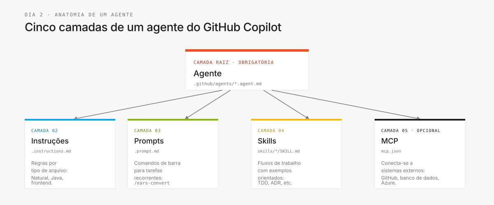

# The Four SDLC Agents — Explained


> **Path:** [Team Kit](../README.md) › [Docs](README.md) › **Four Agents Explained**

**Explains the reasoning behind the four stage agents** — read this when someone asks: "Why do we have stage agents if each persona already has its own kit?"

| Field | Value |
|---|---|
| **Target audience** | The entire team, especially people using Copilot in a team context for the first time |
| **Prerequisites** | Read the `PERSONA.md` for your role |
| **Expected outcome** | Understand the difference between a persona kit and an agent kit, and know which one to use at each point |

---

## Concept

A **persona kit** answers: "What is my role?"
An **agent kit** answers: "How is the team working right now, at this stage?"

Both are necessary and complementary. One person may assume the Developer and Technical Lead personas, but in Stage 1 that person must still use `@archaeologist`, because the entire team is reading the legacy system at that time.

---

## Why there are four agents

The workshop has four working modes. Each mode requires different Copilot behavior.

| Stage | Working mode | Agent | Primary rule |
|---|---|---|---|
| 1 — Archaeology | Observe and catalog | `@archaeologist` | Do not write code |
| 2 — Modern Specification | Structure and decide | `@architect` | Do not accept a requirement without legacy evidence |
| 3 — Implementation | Build and verify | `@builder` | Do not code without a REQ-ID and corresponding test |
| 4 — Evolution | Delegate and review | `@evolution` | Do not accept an AI-generated pull request without human review |

A single agent would have conflicting instructions: in Stage 1 it must be read-only; in Stage 3 it must edit files and run tests. Separating agents by stage makes the experience safer and easier for learners to understand.

---

## Agent anatomy



| Layer | Purpose | Example |
|---|---|---|
| Agent | Defines mission, tools, and behavior | `@builder` knows how to implement and test |
| Instructions | Rules sensitive to file type | Natural/Adabas, Java, frontend |
| Prompts | Reusable actions | `/translate-natural-to-java`, `/write-ears-spec` |
| Skills | In-depth guidance for a technique | TDD, ADR, business-rule extraction |
| MCP | Connects the agent to external systems | GitHub, databases, and Azure when configured |

---

## How to use the agents during the day

- [ ] **Start with the stage, not individual preference.** Check the schedule in [`00-TEAM-FLOW.md`](../00-TEAM-FLOW.md).
- [ ] **Select the stage agent in Copilot Chat.** Example: `@architect` in Stage 2.
- [ ] **Also read your `PERSONA.md`.** It describes what you, as a person, should observe during that stage.
- [ ] **Use the stage prompts.** They turn conversation into a verifiable artifact.
- [ ] **Stop at the gate.** Advance only when the stage's Definition of Done is satisfied.

---

## Interaction flow

During Stage 2, the Requirements Engineer can bring a confirmed finding to the Software Architect, who coordinates the stage with `@architect`.

```text
@architect
We have this rule extracted from the legacy system:
"<confirmed rule>"
Help structure it in EARS with a REQ-ID, acceptance criteria, and source_legacy.
```

The artifact must record only the team's evidence:

```yaml
REQ-XXX:
  pattern: <EARS pattern>
  text: "<requirement>"
  source_legacy: <file:lines or [GREENFIELD] + justification>
  acceptance: "<verifiable scenario>"
```

---

## Rule: no ready-made answer without evidence

The agents teach the path, but do not provide a ready-made answer without evidence. This protects learning and prevents hallucination.

| If you ask... | The agent responds... |
|---|---|
| "Tell me the bounded contexts" | "Show me the program catalog and data map." |
| "Create requirements for everything" | "Let us start with one rule that has a legacy source." |
| "Implement this feature without a specification" | "The REQ-ID, acceptance criterion, and `source_legacy` are missing." |

---

## How to know you understand

You understand the model when you can explain these three statements to someone else:

1. A persona kit defines a role; an agent kit defines a stage.
2. The stage agent changes throughout the day; your two personas remain the same.
3. Every important artifact must survive outside chat in a version-controlled file.

---

## References

- [Agent kits](../06-stage-agents/README.md)
- [Persona-agent matrix](persona-agent-matrix.md)
- [Complete SDLC flow](sdlc-flow-guide.md)
- [Persona kits](../05-personas/README.md)

---

### Continue reading

| Previous | Next |
|---|---|
| [Persona-Agent Matrix](persona-agent-matrix.md)<br/><sub>Intensity by persona and stage.</sub> | [SDLC Flow](sdlc-flow-guide.md)<br/><sub>Contracts between pairs.</sub> |

<sub>[Back to the kit index](../README.md)</sub>
