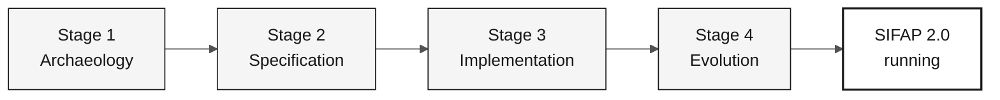

# Documentation Style Guide

> **Path:** [Team Kit](../README.md) › [Docs](README.md) › **Documentation Style Guide**

This is the **single style contract** for ALL `.md` files in the
`datacorp-mm-team-kit` repository, **except** those inside `.github/` (do not modify).

Goal: modern, educational, professional, understated documentation—with no emojis,
no Super Mario analogies, and with Mermaid diagrams in neutral tones
(white / gray / black), tables, checklists, and callout blocks.

---

## 1. Absolute rules (never violate)

| # | Rule |
|---|---|
| R1 | **Zero emojis.** Remove all emoji/pictographic characters from headings, tables, lists, callouts, ASCII blocks, and body text. Replace them with words, gray badges, or nothing. |
| R2 | **Zero Super Mario / Nintendo analogies.** Remove Mario, Luigi, Peach, Daisy, Rosalina, Toad, Yoshi, Koopa, Goomba, Bowser, princess, castle, mushroom, power-up, world 1-1, green pipe, invincibility star, mana, XP, "raid", "game over", "boss", and "co-op". See §2 for replacement vocabulary. |
| R3 | **"hackathon"/"hackaton" → "workshop".** This includes example directory names (`hackathon-team-XX` → `workshop-team-XX`), headings, and body text. |
| R4 | **This guide governs `docs/` and the numbered stage folders — not `.github/`.** Copilot primitives under `.github/` follow their own structural standard (agent, prompt, instruction, and skill templates); a documentation pass must not restructure them as prose. Links *pointing to* `.github/...` remain valid and must be preserved. |
| R5 | **Do not invent new factual content.** Preserve 100% of the existing technical information, commands, paths, REQ-IDs, file names, and data tables. Changes concern form, educational quality, and organization—not facts. |
| R6 | **Do not break links.** When renaming a file, update every link that points to it. Relative paths must remain correct. |
| R7 | Keep documentation prose in **English on `main` and `develop`**, **Brazilian Portuguese on `portugues-br`**, and **Spanish on `espanol`**. Follow the [repository language policy](../README.md#repository-languages); native language names are allowed in the selector, not duplicated translated sections on `main`. Preserve file names, paths, schemas, technical identifiers, code behavior, and original legacy sources. Copilot primitives are outside this guide's scope; their language and structure follow [`.github/PRIMITIVE-STANDARD.md`](../.github/PRIMITIVE-STANDARD.md). |

---

## 2. Replacement vocabulary (Mario → professional)

| Former term | New term |
|---|---|
| World 1 / 1-1 / Overworld | Stage 1 — Archaeology |
| World 2 / 2-1 / Underground | Stage 2 — Specification |
| World 3 / 3-1 / Athletic | Stage 3 — Implementation |
| Castle / 4-Castle / Bowser | Stage 4 — Evolution |
| Princess / rescue the princess | Final objective: SIFAP 2.0 running in the demonstration |
| Green pipe | Handoff between stages |
| Star / invincibility star | Approved CI pipeline (green CI) |
| Power-up / inventory / backpack | Persona kit (prompts, skills, instructions) |
| Playable character (Mario, Peach…) | The persona itself (Product Owner, Developer…) |
| Attack / special move / mana / XP | Copilot mode / slash command / time cost |
| Combat scene / raid / boss | Usage scenario / practical example / PR review |
| Game over / fall into a pit | Project failure / risk / antipattern |
| 5-player co-op | Team of 5 people working in 5 persona pairs |
| Mario Maker | Specification authoring tool (Spec-Kit) |
| Mushroom recipe | Requirement template |
| Letter from the princess | Formal decision record (ADR) |
| Yoshi swallows tables | (rewrite literally: data modeling and optimization) |

When an analogy was the *only* content in a section, **replace it with real
educational content**: a definition of the concept, why it matters, a concrete SIFAP
example, and a use case. Do not leave the section empty or merely rename its label.

---

## 3. Canonical document structure

Every `.md` file (except pure templates and data files) follows this order:

```markdown
# Document Title

> **Path:** [Team Kit](../README.md) › [Section](README.md) › **Current document**

**One-sentence summary.** A single, direct sentence explaining what the reader
will be able to do after reading.

| Field | Value |
|---|---|
| **Target audience** | who should read it |
| **Prerequisites** | what they need to know/have beforehand |
| **Estimated time** | 15 min |
| **Stage** | Stage 2 — Specification |
| **Expected outcome** | concrete artifact produced |

---

## Concept

Educational explanation of the concept (what it is, why it exists, which problem it solves).

## How it works

Mermaid diagram + explanation.

## Step by step

Executable checklist.

## Example applied to SIFAP

Concrete example, never abstract.

## Use cases

When to use / when not to use.

## Completion criteria

- [ ] verifiable item

## Common errors and how to avoid them

Symptom → cause → correction table.

## References

Related links.

---

### Continue reading
(navigation block—see §8)
```

Adapt the sections to the file's actual content; do not force empty sections.
What matters is: **context → concept → practice → verification → next steps**.

---

## 4. Mermaid diagrams—mandatory neutral theme

Replace ASCII-art drawings with Mermaid whenever the diagram represents a
flow, hierarchy, sequence, states, or relationships. Preserve terminal/source-code
blocks as they are (they are not diagrams).

### Single palette (use exactly these values)

| Role | fill | stroke | color |
|---|---|---|---|
| Primary / highlight | `#F5F5F5` | `#171717` | `#171717` |
| Secondary | `#FFFFFF` | `#525252` | `#171717` |
| Tertiary / supporting | `#FAFAFA` | `#A3A3A3` | `#404040` |
| Shaded / inactive | `#E5E5E5` | `#737373` | `#404040` |
| Strong outline (result) | `#FFFFFF` | `#171717` | `#171717` (stroke-width 2px) |

### Mandatory standard header in every Mermaid block



Mermaid rules:

- Always include the `%%{init: ...}%%` block above (copy it literally).
- Never use saturated colors (blue, orange, green, red, yellow).
- Enclose labels in double quotes: `A["Text"]`. Use `<br/>` for line breaks.
- No emojis inside the diagram.
- Allowed types: `flowchart`, `sequenceDiagram`, `stateDiagram-v2`,
  `journey`, `gantt`, `mindmap`, `timeline`, `erDiagram`, `classDiagram`,
  `quadrantChart`, `C4Context`.
- For large diagrams, prefer `flowchart TB` with a `subgraph` named for each area.
- Do not use `linkStyle` with a saturated color; use `stroke:#525252` if necessary.

### Replace ASCII sequences with Mermaid

Blocks such as `A ──> B ──> C` or boxes drawn with `┌─┐` must become Mermaid.
Directory trees (`├──`) **may remain** as `text` code blocks, but without emojis
in their nodes.

---

## 5. Allowed visual components

### 5.1 Callout blocks (GitHub Alerts)—use instead of emojis

```markdown
> [!NOTE]
> Useful supplementary information.

> [!TIP]
> Shortcut or good practice.

> [!IMPORTANT]
> Information required for success.

> [!WARNING]
> Risk of losing work or breaking CI.

> [!CAUTION]
> Serious negative consequence; prohibited action.
```

### 5.2 Badges—grayscale only

Use `flat-square` and only these colors: `171717`, `404040`, `737373`, `A3A3A3`, `E5E5E5`.

```markdown


```

Maximum of 3 badges per document, always immediately after the summary. Never use color.

### 5.3 Tables

Prefer a table to a list whenever there are 2+ dimensions (item × attribute).
Use **bold** headers only in the first column when it is a key.
Alignment: `|---|---|` (standard). Avoid tables with more than 5 columns.

### 5.4 Checklists

Every section that describes executable actions becomes a GFM checklist:

```markdown
## Step by step

- [ ] **Step 1 — Read the assigned programs.** Open `01-archaeology/legacy-sifap/natural-programs/`.
- [ ] **Step 2 — Record rules.** Complete `business-rules-catalog.md`.
- [ ] **Step 3 — Validate.** Run `npm run lint:docs`.
```

Item pattern: `- [ ] **Infinitive verb — short title.** Detail with path/command.`

### 5.5 `<details>` blocks for long optional content

```markdown
<details>
<summary><strong>Complete example of the generated file</strong></summary>

...content...

</details>
```

### 5.6 Separators

Use `---` between major areas of the document. Do not use more than one consecutive `---`.

### 5.7 Existing images/SVGs

Keep all existing references to `assets/*.svg`. Do not remove images.
Ensure that every `![...]` has **descriptive alternative text** (accessibility),
with no emojis.

---

## 6. Educational tone (mandatory)

Each new concept must include, in this order:

1. **Definition**—what it is, in one objective sentence.
2. **Why it matters**—which problem it solves in this workshop.
3. **How it applies to SIFAP**—a concrete domain example (`.NSP` programs,
   `.NSN` subprograms, `.ddm` DDMs, payments, benefits, inspections).
4. **Use case**—a real situation in which the reader will use it.
5. **Common error**—what usually goes wrong.

Writing guidelines:

- Use active voice and the second person ("you do," "open the file").
- Keep sentences short. One paragraph = one idea.
- Explain domain and architecture terms (`bounded context`, `pull request`,
  `packed decimal`) on first occurrence — the reader is new to at least one
  side of the legacy-to-modern divide.
- No forced humor, game jargon, or hype. Be professional and welcoming.
- Never use "simply," "just," or "it is easy."

---

## 7. Glossary and domain terms

Retain and reinforce: SIFAP (Payment Inspection and Administration System),
Natural, Adabas, DDM, FDT, EARS, REQ-ID, `source_legacy`, ADR, bounded context,
Spec-Kit, Strangler Fig, Modular Monolith, Testcontainers.

When mentioning a term for the first time in a document, provide a short
definition in parentheses or a note.

---

## 8. Standard navigation footer

Replace current footers with this format (no emojis):

```markdown
---

### Continue reading

| Previous | Next |
|---|---|
| Previous title (`previous-file.md`)<br/><sub>One-line summary.</sub> | Next title (`next-file.md`)<br/><sub>One-line summary.</sub> |

<sub>[Back to the kit index](../README.md)</sub>
```

If there is no previous or next document, use `—` in the cell.
Existing HTML `<table>` blocks must be converted to this format.

---

## 9. File header

**Do not add inline `<!-- markdownlint-disable ... -->` comments.**
The repository's `.markdownlint-cli2.jsonc` is the single source of truth for
lint configuration and already disables every rule the kit needs relaxed
(`MD003`, `MD013`, `MD025`, `MD026`, `MD028`, `MD029`, `MD033`, `MD034`,
`MD036`, `MD040`, `MD041`, `MD051`, `MD060`).

Inline pragmas are harmful for two reasons:

1. They duplicate configuration, so the two sources drift apart over time.
2. In Copilot primitives (`.github/agents/`, `.github/prompts/`,
   `.github/skills/`, `.github/instructions/`) the comment is loaded into the
   model's context window, spending tokens on content that carries no
   instructional value.

Add a pragma **only** when a single file genuinely needs a rule that is not
disabled globally, and disable only that rule. The only current example is
`docs/adr/0000-template.md`, which needs `MD024` because the template
deliberately repeats headings:

```markdown
<!-- markdownlint-disable MD024 -->
```

The first line of every file is therefore the `# H1` title (or the YAML
frontmatter, when the file is a Copilot primitive). Only one `# H1` per file.
Do not skip heading levels (`#` → `##` → `###`).

---

## 10. Agreed file renames (07-concepts)

| Current file | New name |
|---|---|
| `07-concepts/01-spec-kit-como-mario-maker.md` | `07-concepts/01-spec-driven-development.md` |
| `07-concepts/02-agentes-como-super-mario.md` | `07-concepts/02-agents-and-personas.md` |
| `07-concepts/05-ears-receita-de-cogumelo.md` | `07-concepts/05-ears-notation.md` |
| `07-concepts/06-adr-carta-da-princesa.md` | `07-concepts/06-architecture-decision-records.md` |

The other files (`00-README.md`, `03-visual-glossary.md`,
`04-3-copilot-modes.md`) keep their names.

Rename files with `git mv`. Every agent that finds links to the former names
must update them to the new names.

---

## 11. Per-file verification checklist

Before considering a file complete:

- [ ] No emojis (`grep -P '[\x{1F300}-\x{1FAFF}\x{2600}-\x{27BF}\x{2B00}-\x{2BFF}\x{FE0F}\x{2190}-\x{21FF}]'` returns no relevant results)
- [ ] No references to Mario/Nintendo/game analogies
- [ ] No occurrences of "hackathon"/"hackaton"
- [ ] Every Mermaid block has the `%%{init:...}%%` header and neutral palette
- [ ] All executable actions are in `- [ ]` checklists
- [ ] Tables are used where there are 2+ dimensions
- [ ] GFM alerts (`> [!NOTE]`) are used instead of warning emojis
- [ ] The navigation footer uses the §8 format
- [ ] Relative links are valid (the target file exists)
- [ ] Factual content is preserved

---

### Continue reading

| Previous | Next |
|---|---|
| [Documentation index](README.md)<br/><sub>All supporting documents in the kit.</sub> | [FAQ](FAQ.md)<br/><sub>Frequently asked questions about the workshop.</sub> |

<sub>[Back to the kit index](../README.md)</sub>
