# Workshop SDLC Flow and Handoffs

> **Path:** [Team Kit](../README.md) › [Docs](README.md) › **SDLC Flow**

**Guide to the contracts between pairs** — summarizes artifact handoffs without changing schedules or expanding deliverables.

| Field | Value |
|---|---|
| **Target audience** | The entire team |
| **Prerequisites** | Read [`00-TEAM-FLOW.md`](../00-TEAM-FLOW.md) |
| **Expected outcome** | Understand what each pair delivers and what the next pair receives |

---

## Flow overview

```mermaid
%%{init: {'theme':'neutral','themeVariables':{'fontFamily':'ui-sans-serif, system-ui, sans-serif','primaryColor':'#F5F5F5','primaryTextColor':'#171717','primaryBorderColor':'#171717','lineColor':'#525252','secondaryColor':'#FFFFFF','tertiaryColor':'#FAFAFA','background':'#FFFFFF'}}}%%
flowchart LR
    classDef step fill:#F5F5F5,stroke:#171717,color:#171717
    classDef hand fill:#FFFFFF,stroke:#525252,color:#171717
    classDef result fill:#FFFFFF,stroke:#171717,color:#171717,stroke-width:2px

    E1["Stage 1<br/>Archaeology<br/>11:00–14:00"]:::step
    H1["Handoff H1<br/>14:00"]:::hand
    E2["Stage 2<br/>Modern Specification<br/>14:00–15:00"]:::step
    H2["Handoff H2<br/>15:00"]:::hand
    E3["Stage 3<br/>Implementation<br/>15:00–16:10"]:::step
    H3["Handoff H3<br/>16:10"]:::hand
    E4["Stage 4<br/>Evolution<br/>16:10–16:50"]:::step
    DEMO["Demo<br/>17:00–17:30"]:::result

    E1 --> H1 --> E2 --> H2 --> E3 --> H3 --> E4 --> DEMO
```



---

## Official schedule

| Time | Stage | Agent | Expected outcome |
|---|---|---|---|
| 11:00–12:00 and 13:30–14:00 | 1 — Archaeology | `@archaeologist` | Legacy evidence and one thin feature defined |
| 14:00–15:00 | 2 — Modern Specification | `@architect` | `spec.md`, `plan.md`, and `tasks.md` |
| 15:00–16:10 | 3 — Implementation | `@builder` | First tested feature increment |
| 16:10–16:50 | 4 — Evolution | `@evolution` | One Agent delegation or a reviewable backlog |

---

## Formal artifact structure

Formal Spec-Kit artifacts for a feature live in:

```text
specs/<NNN>-<feature>/
├── spec.md
├── plan.md
└── tasks.md
```

`02-modern-spec/` stores only supporting material and scope decisions. Do not create parallel formal artifacts outside the feature folder.

---

## Handoff checklist

| Handoff | When | From → To | Minimum delivery | Confirmation question |
|---|---|---|---|---|
| **H1** | 14:00 | Pair 1 → Pair 2 | Scope slice, `.NSN`/`.ddm` evidence, and open questions | "Have we read the sources required for the feature?" |
| **H2** | 15:00 | Pair 2 → Pairs 3 and 4 | Feature path, `spec.md`, `plan.md`, `tasks.md`, and first task | "Are the first task and its tests clear?" |
| **H3** | 16:10 | Pairs 3 and 4 → Pair 5 | Increment status, tests run, and pending work | "What can be delegated without changing scope?" |

Each handoff is a five-minute synchronous conversation. A gap does not authorize inventing requirements, legacy sources, or architecture — reduce the scope or record the pending item.

---

## Traceability

Before writing EARS, the owner reads the assigned legacy source. Every REQ-ID in `spec.md` includes `source_legacy:` pointing to the corresponding `.NSN` or `.ddm` file, or `[GREENFIELD]` with a justification. CI blocks pull requests to `develop` when this contract is violated.

---

## Branches

Create `spec/<NNN>-<feature>` from `develop` and integrate it into `develop`. Then create `impl/<NNN>-<feature>`, also from `develop`. The flow is `spec/<NNN>-<feature>` → `develop` → `main`. There is no `stage` branch.

---

### Continue reading

| Previous | Next |
|---|---|
| [Persona-Agent Matrix](persona-agent-matrix.md)<br/><sub>Who leads at each stage.</sub> | [Four Agents Explained](4-agents-explained.md)<br/><sub>Why there are four agents.</sub> |

<sub>[Back to the kit index](../README.md)</sub>
