# specs/

> **Path:** [Team Kit](../README.md) › **Specs**

**This folder stores GitHub Spec-Kit artifacts. For each feature, the team records what it wants to build (`spec.md`), how to build it (`plan.md`), and in which order (`tasks.md`) before writing any code.**

  

| Field | Value |
|---|---|
| **Target audience** | All pairs; Pair 2 creates the artifacts in Stage 2 |
| **Prerequisites** | Feature selected in Stage 2; H1 handoff completed |
| **Stage** | Stage 2 — Specification |
| **Expected outcome** | An `NNN-short-name` folder with traceable `spec.md`, `plan.md`, and `tasks.md` |

---

## Concept: Spec-Driven Development

Spec-Driven Development (SDD) is the practice of fully specifying a feature, including requirements, a technical plan, and tasks, before implementation. GitHub Spec-Kit automates this flow with slash commands in Copilot Chat.

**Why it matters:** without an upfront specification, code grows without traceable direction. Workshop CI verifies that every REQ-ID has `source_legacy:` pointing to the actual legacy system. This ensures that SIFAP 2.0 implements the rules of the original SIFAP (Payment Inspection and Administration System).

**Use case:** in Stage 1, the team identifies that `CALCCORR.NSP` contains annual adjustment calculation logic. In Stage 2, that logic becomes `REQ-015` in `spec.md` with `source_legacy: 01-archaeology/legacy-sifap/natural-programs/CALCCORR.NSP`. In Stage 3, the test either passes or fails, completing the traceability chain.

---

## Folder structure

Each feature has its own folder:

```text
specs/
└── <NNN>-<feature>/
    ├── spec.md
    ├── plan.md
    └── tasks.md
```

The number (`NNN`) defines creation order. The name (`feature-name`) describes the scope in behavioral terms. Avoid generic names such as `system` or `backend`.

---

## Spec-Kit flow

```mermaid
%%{init: {'theme':'neutral','themeVariables':{'fontFamily':'ui-sans-serif, system-ui, sans-serif','primaryColor':'#F5F5F5','primaryTextColor':'#171717','primaryBorderColor':'#171717','lineColor':'#525252','secondaryColor':'#FFFFFF','tertiaryColor':'#FAFAFA','background':'#FFFFFF'}}}%%
flowchart LR
    classDef step fill:#F5F5F5,stroke:#171717,color:#171717
    classDef result fill:#FFFFFF,stroke:#171717,color:#171717,stroke-width:2px

    A["/speckit.specify"]:::step --> B["/speckit.clarify"]:::step
    B --> C["/speckit.plan"]:::step
    C --> D["/speckit.tasks"]:::step
    D --> E["/speckit.analyze"]:::step
    E --> F["/speckit.implement"]:::step
    F --> G["Code traced<br/>to REQ-IDs"]:::result
```



| Command | Generated artifact | What to verify |
|---|---|---|
| `/speckit.constitution` | `.specify/memory/constitution.md` | Non-negotiable project rules |
| `/speckit.specify` | `spec.md` | REQ-IDs, EARS patterns, acceptance criteria, and `source_legacy:` |
| `/speckit.clarify` | Questions resolved in the specification | Ambiguities closed |
| `/speckit.plan` | `plan.md` | Architecture, data, risks, and contracts |
| `/speckit.tasks` | `tasks.md` | Execution order, tests, and dependencies |
| `/speckit.analyze` | Gap report | Inconsistencies resolved |
| `/speckit.implement` | Code in `backend/` and `frontend/` | Implementation follows the specification |

---

## Step by step

- [ ] **Select a Stage 1 discovery.** The feature must have legacy evidence.
- [ ] **Create the feature folder.** Use the `NNN-short-name` pattern in `specs/`.
- [ ] **Run `/speckit.specify`.** Generate `spec.md` with user stories, EARS requirements, acceptance criteria, and `source_legacy:`.
- [ ] **Run `/speckit.clarify`.** Resolve questions before planning.
- [ ] **Run `/speckit.plan`.** Generate the technical plan, risks, data, and contracts in `plan.md`.
- [ ] **Run `/speckit.tasks`.** Break the plan into small, testable, traceable tasks in `tasks.md`.
- [ ] **Run `/speckit.analyze`.** Fix inconsistencies before implementation.
- [ ] **Run `/speckit.implement`.** Implement only after the specification, plan, and tasks are consistent.

---

## Branch convention

> [!IMPORTANT]
> The correct branch flow is `spec/<NNN>-<feature>` → `develop` → `main`. There is no `stage` branch.

- One branch per specification: `spec/<NNN>-<feature>`, created from `develop`.
- After merging the specification, create `impl/<NNN>-<feature>` implementation branches from `develop`, never from the specification branch.
- Commits that implement behavior must cite the REQ-ID: `Implements REQ-XXX`.

---

## Completion criteria

- [ ] Every feature has an `NNN-short-name` folder.
- [ ] Every legacy requirement has `source_legacy:` pointing to `.NSN` or `.ddm`.
- [ ] Every greenfield requirement has a `[GREENFIELD]` rationale.
- [ ] `tasks.md` places tests before implementation for business rules.

---

## Relationship to `02-modern-spec/`

`02-modern-spec/` does not contain a second specification. Use it to record scope decisions and Stage 2 supporting material. The feature's EARS requirements, technical plan, and tasks belong in `specs/<NNN>-<feature>/spec.md`, `plan.md`, and `tasks.md`.

---

## Common mistakes and how to avoid them

| Symptom | Cause | Correction |
|---|---|---|
| CI rejects the PR because `source_legacy:` is missing | Requirement written without consulting the legacy system | Reread the corresponding `.NSN` and add `source_legacy:` |
| `spec.md` approved without acceptance criteria | EARS requirement written without the correct patterns | Rewrite it using one of the 5 EARS patterns |
| `tasks.md` has no tests | Tasks created without considering verification | Add at least one test for each business rule |
| Folder has a generic name (`backend-features`) | Name does not reflect behavior | Rename it to reflect the actual feature |

---

## References

- [Spec-Kit reference card](../09-cheat-sheets/spec-kit-workflow.md)
- [EARS notation](../07-concepts/05-ears-notation.md)
- [Official Spec-Kit](https://github.com/github/spec-kit)
- [Spec-Driven Development](https://github.com/github/spec-kit/blob/main/spec-driven.md)

---

### Continue reading

| Previous | Next |
|---|---|
| [Spec-Kit in 1 page](../09-cheat-sheets/spec-kit-workflow.md)<br/><sub>Sequence: specify → clarify → plan → tasks → analyze.</sub> | [Stage 2 — Specification](../02-modern-spec/GUIDE.md)<br/><sub>Create the specification from the team's discovery.</sub> |

<sub>[Back to the kit index](../README.md)</sub>
